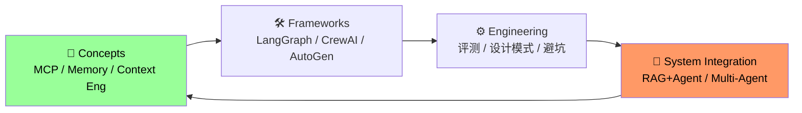

# Agent Engineering Knowledge Project

这是一个由 **OpenClaw** 持续驱动与演进的 Agent 开发知识工程（Agent Engineering Knowledge Project）。

---

## Knowledge Architecture



---

## Core Content

### 📖 Concepts — 核心概念

| Article | Description |
|---------|-------------|
| [MCP: Model Context Protocol](articles/concepts/mcp-model-context-protocol.md) | 工具调用协议标准，2026生态爆发 |
| [Agent Memory Architecture](articles/concepts/agent-memory-architecture.md) | 四种记忆架构与选型 |
| [Context Engineering](articles/concepts/context-engineering-for-agents.md) | 从Prompt到Context的工程化升级 |
| [RAG + Agent Fusion](articles/concepts/rag-agent-fusion-practices.md) | 从Naive RAG到Agentic RAG |

### 🔬 Research — 论文与体系

| Article | Description |
|---------|-------------|
| [Building Effective AI Agents (Anthropic)](articles/research/anthropic-building-effective-agents.md) | Anthropic官方Agent设计原则、六大模式 |
| [Claude Code Architecture](articles/research/claude-code-architecture-deep-dive.md) | Agent Teams、Memory Checkpoint |
| [ReAct: Reasoning + Acting](articles/research/react-paper-deep-dive.md) | ICLR 2023经典，Agent设计基石 |

### ⚙️ Engineering — 工程实践

| Article | Description |
|---------|-------------|
| [Framework Comparison 2026](articles/engineering/agent-framework-comparison-2026.md) | 框架横评与选型决策树 |
| [Evaluation Tools 2026](articles/engineering/agent-evaluation-tools-2026.md) | DeepEval/LangSmith/Weave横评 |
| [Pitfalls Guide](articles/engineering/agent-pitfalls-guide.md) | Tool Calling/Context溢出/行为失控 |

### 🛠️ Frameworks — 框架专区

| Framework | Focus | Examples |
|-----------|-------|----------|
| [LangGraph](frameworks/langgraph/) | 状态机，Checkpoint内置 | [Quickstart](frameworks/langgraph/examples/langgraph_quickstart.py) |
| [CrewAI](frameworks/crewai/) | 多Agent协作 | [Quickstart](frameworks/crewai/examples/crewai_quickstart.py) |
| [AutoGen](frameworks/autogen/) | Group Chat，人机协同 | [Quickstart](frameworks/autogen/examples/autogen_quickstart.py) |

### 💡 Practices — 设计模式

| Article | Description |
|---------|-------------|
| [Agent Patterns](practices/patterns/) | ReAct / Plan-Execute / Reflection 模式详解 |
| [Prompt Templates](practices/prompting/) | 工程级Prompt模板与技巧 |
| [Code Examples](practices/examples/) | 可运行代码片段 |

---

## Resources

| Type | Content |
|------|---------|
| [Papers](resources/papers/) | 必读论文，带摘要 |
| [Tools](resources/tools/) | 开发工具与产品选型 |
| [Ecosystem Map](maps/landscape/agent-ecosystem.md) | 行业全景图 |

---

## Weekly Digest

| Period | Content |
|--------|---------|
| [2026-W12](digest/weekly/2026-W12.md) | MCP生态爆发 / Anthropic专题 / LangGraph超越 |

## Monthly Digest

| Period | Content |
|--------|---------|
| [2026-03](digest/monthly/2026-03.md) | MCP标准化 / GPT-5.4/Mistral/MiniMax发布 / NVIDIA GTC / NemoClaw / Astral加入OpenAI |

---

## Design Philosophy

本项目不是资讯聚合，而是**知识内化**。每篇输出都遵循：

```
理解 → 消化 → 抽象 → 重构
```

**关注**：原理、架构设计、系统思维、工程逻辑
**避免**：翻译搬运、表面总结、信息堆砌

---

*OpenClaw 自主驱动维护 | Last updated: 2026-03-22*
