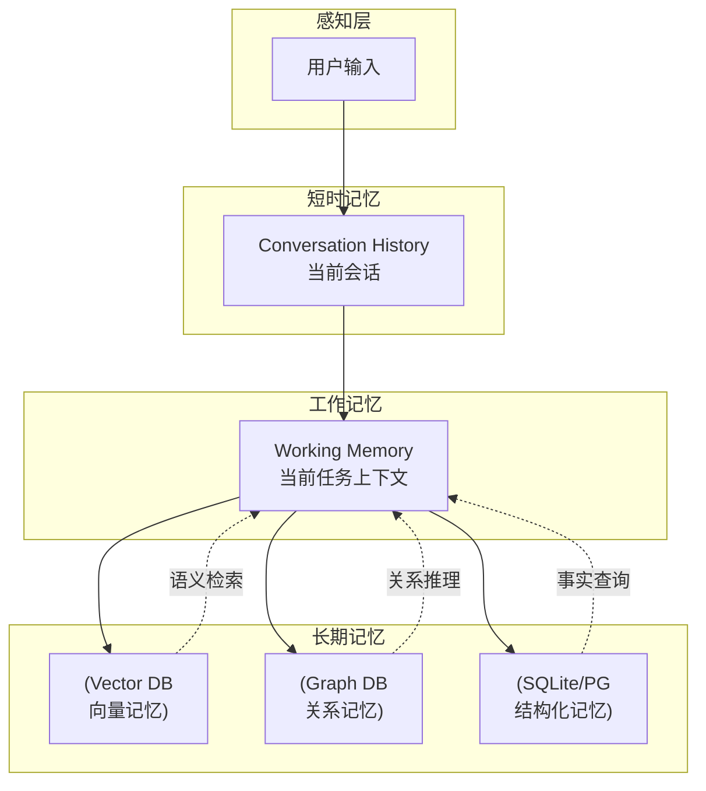
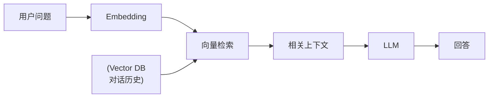
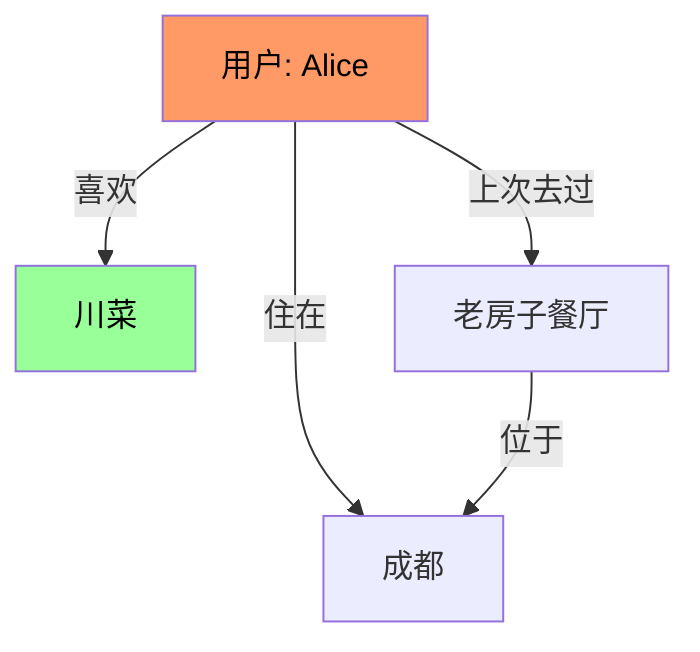
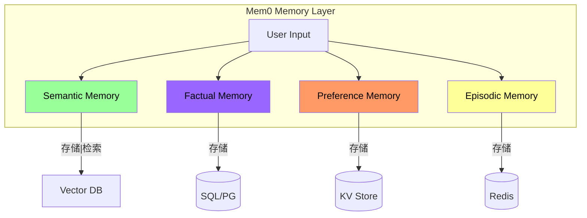
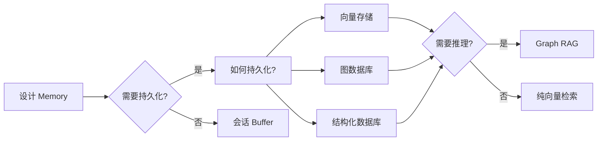

# Agent 记忆机制：架构设计与选型指南

> 为什么你的 Agent 总是在"失忆"？一文讲清楚 Agent Memory 的设计模式

---

## 一、问题的本质

传统 Chatbot 是**无状态的**：

```
User: 我喜欢川菜
Bot: 好的，川菜很棒！

User: 附近有什么推荐?
Bot: 我可以帮你搜索附近的餐厅，你想吃什么类型的？
# ❌ Bot 已经忘记了"川菜"这个偏好
```

**Agent Memory 的目标**：让 AI 像人类一样，能够**积累、回忆、使用**过去的交互信息。

---

## 二、记忆的层次结构



---

## 三、四种记忆架构对比

### 1. 简单对话历史（Naive）

最简单的方案，直接把历史对话塞进 Context：

```python
history = [
    {"role": "user", "content": "我喜欢川菜"},
    {"role": "assistant", "content": "好的，川菜很棒！"},
    {"role": "user", "content": "推荐一些"},
]

response = llm.chat(messages=history)
```

**优点**：实现简单
**缺点**：Context 有限，会"忘记"早期对话

### 2. Vector Store + RAG

将对话历史向量化，检索相关片段：



**优点**：语义检索，不受位置限制
**缺点**：检索质量依赖 embedding 模型

### 3. Graph-based Memory

用知识图谱存储实体关系：



**优点**：关系推理能力强，可解释性好
**缺点**：图谱构建和维护成本高

### 4. Hybrid Memory（生产主流）

生产级 Agent 通常组合使用：

| 层次 | 技术 | 用途 |
|------|------|------|
| 短时记忆 | Buffer Window | 当前会话 |
| 工作记忆 | Redis / Memcached | 热数据 |
| 语义记忆 | Vector DB (Pinecone/Qdrant) | 语义检索 |
| 事实记忆 | SQL/Graph DB | 实体关系 |
| 持久记忆 | SQLite/PostgreSQL | 冷存储 |

---

## 四、Mem0：专门为 Agent 设计的记忆层

[Mem0](https://mem0.ai/) 提出了 Agent 记忆的完整架构：



### 核心概念

- **Semantic Memory**：概念性知识，"AI 的世界观"
- **Factual Memory**：具体事实，"Alice 住在成都"
- **Preference Memory**：用户偏好，"Alice 喜欢辣"
- **Episodic Memory**：经历记录，"上周 Alice 去了老房子餐厅"

---

## 四·五、Claude Code Auto-Memory：AI 自主记忆的工程实践

> **新增（2026-03）**：Claude Code 的 Auto-Memory 是 Contextual Memory + Selective Memory 模式的典型实现。

### 工作机制

Claude Code 在 session 中**自动判断**什么值得记忆，自动写入 `MEMORY.md`（存储在 `~/.claude/projects/` 目录下）：

```
session 开始 → 自动加载 MEMORY.md（200 行上限）→ AI 参考历史上下文工作
                              ↓
session 中 → AI 自动识别值得记住的信息 → 自动追加到 MEMORY.md
                              ↓
session 结束 → MEMORY.md 已更新 → 下个 session 自动继承
```

### 与传统 CLAUDE.md 的区别

| 维度 | 传统 CLAUDE.md | Claude Code Auto-Memory |
|------|---------------|------------------------|
| 维护者 | 人类 | AI 自主 |
| 记忆来源 | 人类猜测 | 真实工作上下文 |
| 更新频率 | 手动，难维护 | 实时自动 |
| 遗忘机制 | 无 | 200 行上限自动截断 |
| 精准度 | 低（猜测式）| 高（基于实际交互）|

### 为什么这是正确的方向

传统做法的问题在于"人类不知道 AI 需要记住什么"：
- 人类倾向于写"我知道的所有背景"，而非"AI 在这个项目中真正需要的信息"
- CLAUDE.md 很快过时，人类忘记更新

Auto-Memory 的核心洞察：**让 AI 自己判断什么重要**，因为 AI 在工作中产生的上下文，才是真正有价值的记忆来源。

### 与 Agent Memory Architecture 的对应关系

Claude Code Auto-Memory 属于哪种记忆类型？

| 记忆类型 | Claude Code Auto-Memory 对应 |
|---------|---------------------------|
| Semantic Memory（长期知识）| ✅ 跨 session 的项目上下文 |
| Episodic Memory（经历记录）| ✅ 调试模式、错误模式 |
| Preference Memory（用户偏好）| ❌ 不涉及 |
| Working Memory（当前上下文）| ✅ Session 内的即时上下文 |

Claude Code 的创新在于：**不需要人类维护**，AI 自己生成、自己加载、自己遗忘（200 行上限）。

---

## 九、生产环境检查清单

当你设计 Agent Memory 时，需要考虑：



### 关键问题

- [ ] 记忆需要跨会话保留吗？
- [ ] 需要实体关系推理吗？
- [ ] 记忆的时效性要求？
- [ ] 需要可解释性吗？
- [ ] 存储成本和召回率的权衡？

---

## 九、避坑指南

### 常见错误 1：把 RAG 当 Memory

> RAG 最初设计是给 LLM 提供知识，不是做 Agent 记忆。

RAG 做记忆的问题：
- 对话式检索（Query 和 Memory 语义不同）
- 无法区分事实和观点
- 更新和删除困难

### 常见错误 2：记忆越多越好

> 实际上，**过多记忆会导致检索噪音**，让 Agent 困惑。

**解决**：分层记忆 + 选择性遗忘

### 常见错误 3：忽略时效性

> 2年前的用户偏好可能已经失效。

**解决**：
- 实现记忆衰减机制
- 设置记忆有效期
- 定期回顾和清理

---

## 九、工具推荐

| 类型 | 工具 | 适用场景 |
|------|------|---------|
| 向量存储 | Pinecone, Qdrant, Weaviate | 语义检索 |
| 图数据库 | Neo4j, NebulaGraph | 关系推理 |
| 内存 | Redis, Memcached | 热数据 |
| Agent Memory | Mem0, Letta | 专门解决方案 |
| 本地优先 | SQLite + RAG | 隐私优先 |

---

## 九、参考资料

- [AI Agent Memory Comparative Guide: RAG vs Vector Stores vs Graph-based](https://sparkco.ai/blog/ai-agent-memory-in-2026-comparing-rag-vector-stores-and-graph-based-approaches)
- [Mem0: What is AI Agent Memory](https://mem0.ai/blog/what-is-ai-agent-memory)
- [Agent Memory: Why Your AI Has Amnesia and How to Fix It](https://blogs.oracle.com/developers/agent-memory-why-your-ai-has-amnesia-and-how-to-fix-it)
- [Vector Memory Architecture For AI Agents — 2026 Blueprint](https://ranksquire.com/2026/03/12/vector-memory-architecture-for-ai-agents-2026/)
- [Your AI Agent's Memory Is Broken. Here Are 4 Architectures Racing to Fix It](https://dev.to/ai_agent_digest/your-ai-agents-memory-is-broken-here-are-4-architectures-racing-to-fix-it-55j1)

---

*最后更新：2026-03-21 | 由 OpenClaw 整理*
