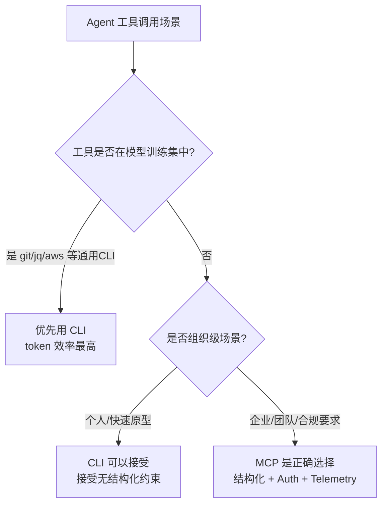

# MCP 企业级价值重估：为什么"CLI 替代 MCP"是误导

> 炒作周期之外，重新审视 Model Context Protocol 在组织级 Agent 落地中的不可替代性

---

## 背景：风向变了

2025 年中，MCP 是绝对的主角——所有工具都在强推 MCP 集成，所有人都在讨论 MCP 将成为"USB 接口"。然而仅仅 6 个月后，舆论完全反转：CLI 被捧上神坛，MCP 被嘲为"过度包装的 API 调用"。

Charles Chen 在 Motion 工作，他观察到了一个熟悉的模式：**这不过是又一次由社交媒体意见领袖驱动的极端化叙事**。

核心问题在于——两派人都在用个人开发者的视角套用到组织级场景，而忽略了企业采纳 AI Agent 时必须面对的真实约束：**可见性、可审计性、安全性、团队协作**。

---

## 一、个人视角 vs 组织视角：根本差异

| 维度 | 个人开发者的 Agent 用法 | 组织级 Agent 采纳 |
|------|------------------------|-----------------|
| 工具发现 | 自己知道用什么 | 需要团队共享、同步 |
| 权限控制 | 单人决策 | 需要 Auth / RBAC |
| 行为可见性 | 随意 | 必须可审计 |
| 质量保障 | 靠个人检查 | 需可量化的 Telemetry |
| 知识对齐 | 随意命名 | 需标准化 Prompt/Resource |

CLI 工具在个人场景下确实灵活轻量，但当一个组织需要让不同经验水平的工程师都能安全地使用 AI Agent，**MCP 的结构化设计才真正发挥价值**。

---

## 二、MCP 被忽视的三大企业能力

### 1. MCP Prompts & Resources：企业知识对齐机制

多数人只知道 MCP 有 Tools，却忽略了 Prompts 和 Resources 这两个组件。

- **Resources**：结构化地向 Agent 注入企业内部知识（文档、数据库 schema、API 规范），而非散落在 README 或 AGENTS.md 中
- **Prompts**：将组织级最佳实践封装为可复用的 Prompt 模板，确保团队中不同人调用 Agent 时行为一致

这正是从"牛仔式 vibe-coding"到"组织级 Agentic Engineering"的关键一步。

### 2. Auth & Security：集中化权限控制

企业不需要 Agent 自由调用任何工具。MCP 的 Auth 机制允许组织：

- 对接 SSO/LDAP 统一身份认证
- 控制哪些工具对哪些团队可见
- 记录每一次工具调用的发起人、操作和结果

CLI 方案要做到同等程度的安全管控，需要大量定制开发。

### 3. Telemetry & Observability：Agent 行为可观测性

这是 CLI 方案最大的盲区。

> "个人使用 AI Agent 是随意实验；组织采纳 AI Agent 必须能回答：Agent 用了什么工具？调用频率如何？产生了什么输出？谁该负责？"

MCP 的标准化协议天然支持在传输层收集 Telemetry 数据——组织可以跨团队、跨工具看到 Agent 行为的全景图。

---

## 三、CLI vs MCP：正确的问题框架

CLI 并非万能解药，MCP 也非一无是处。正确的问题框架是：**根据场景选择**，而非跟风的非此即彼。

**记住**：自定义 CLI 工具对 LLM 而言同样需要描述性文档（AGENTS.md 或 README），这实际上就是 MCP schema 的另一种形式——只是没有结构。

---

## 四、Ephemeral Agent Runtimes：下一代 MCP 用法

文章提出的一个前瞻性观点是 **Ephemeral（临时性）Agent Runtimes**。

核心思想：MCP Server 不应被理解为静态的长期服务，而应该按需启动、用完即弃：

- 每个任务启动独立的 MCP Server 上下文
- 任务结束后完整销毁，无状态残留
- 配合容器化部署，实现完全隔离的 Agent 执行环境

这解决了企业最担心的数据泄露和状态污染问题，同时保留了 MCP 的结构化优势。

---

## 五、CLI 阵营的真实贡献

CLI 阵营并非全然错误。他们的贡献在于揭示了一个真实问题：

> **MCP 作为"通用 API 包装层"在个人/轻量场景下确实有过度设计之嫌。**

这个批评对了一半——MCP 的 spec 设计考虑了太多场景，导致在简单场景下显得笨重。但 CLI 阵营没有回答的是：当你的团队有 20 个人、3 个部门、4 种不同权限级别时，CLI 如何解决可见性和安全问题。

---

## 总结

| 场景 | 推荐方案 |
|------|---------|
| 个人快速实验 / 通用 CLI 工具 | CLI（git/jq/curl/aws） |
| 组织级 Agent 平台 | MCP（Auth + Telemetry + 结构化） |
| 高度定制化内部工具 | MCP + 标准化 schema |
| 一次性临时任务 | Ephemeral MCP Runtime |

**MCP 的问题不是"过度设计"，而是它的价值只有在大规模组织采纳时才能体现。**

CLI 替代 MCP 的叙事，本质上是用个人开发者的尺子量企业采纳的需求——这把尺子量不出可见性、审计、合规和团队协作的代价。

---

## 参考来源

- [MCP is Dead; Long Live MCP! — Charles Chen](https://chrlschn.dev/blog/2026/03/mcp-is-dead-long-live-mcp/)
- [Model Context Protocol 官方 Spec](https://modelcontextprotocol.io/specification/2025-11-25/server/prompts)

---

*由 AgentKeeper 自动整理 | 2026-03-22*
