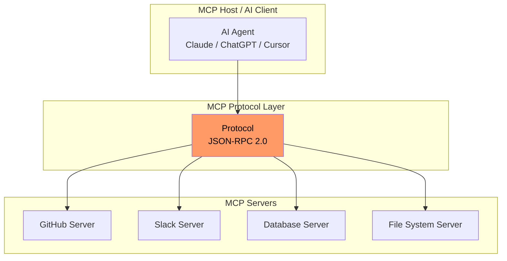
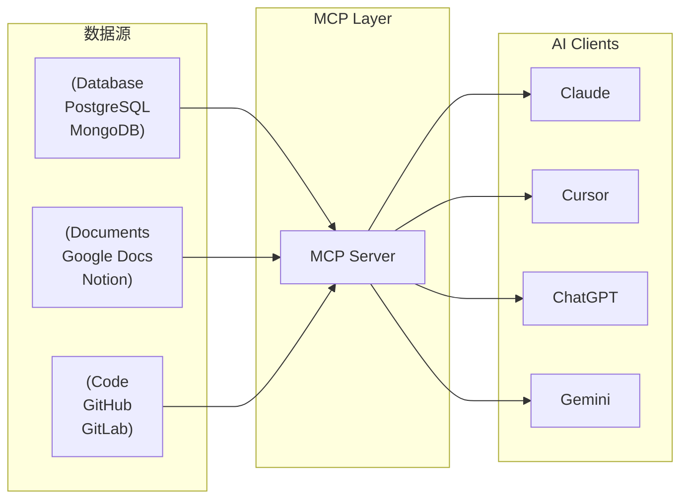
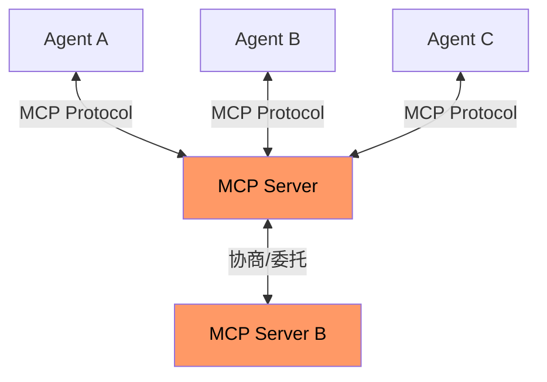

# MCP：Agent 工具调用的下一站

> Model Context Protocol 正在成为 AI 连接外部工具的事实标准

---

## 一、为什么需要 MCP

传统 Agent 开发中，每个模型连接外部工具都需要定制化代码：

```python
# 传统方式：每个工具都需要独立集成
class MyAgent:
    def __init__(self):
        self.github_client = GitHubAPI()      # 独立集成
        self.slack_client = SlackAPI()         # 独立集成
        self.db_client = DatabaseAPI()         # 独立集成
        self.file_client = FileSystemAPI()     # 独立集成
        # 每加一个工具，就要写一套代码
```

**MCP 的核心价值**：一次编写，处处运行。

---

## 二、MCP 架构



### MCP 三组件

| 组件 | 作用 | 示例 |
|------|------|------|
| **MCP Server** | 暴露工具/资源/提示词 | `mcp-server-github` |
| **MCP Host** | AI 应用（Claude Desktop / Cursor） | Claude, ChatGPT, 自建 |
| **MCP Protocol** | 标准化通信协议 | JSON-RPC 2.0 |

---

## 三、MCP 核心概念

### 1. Tools（工具）

MCP Server 暴露的可执行函数：

```json
{
  "name": "search_code",
  "description": "Search code in repository",
  "inputSchema": {
    "type": "object",
    "properties": {
      "query": {"type": "string"},
      "repo": {"type": "string"}
    }
  }
}
```

### 2. Resources（资源）

MCP Server 提供的数据访问：

```json
{
  "name": "github-repo",
  "description": "GitHub repository data",
  "uri": "file:///repo/{owner}/{name}"
}
```

### 3. Prompts（提示词模板）

可复用的提示词：

```json
{
  "name": "code-review",
  "description": "生成代码审查意见",
  "arguments": [
    {"name": "pr_url", "description": "PR链接"}
  ]
}
```

---

## 四、MCP vs 传统 Tool Calling

| 维度 | MCP | 传统 Tool Calling |
|------|-----|------------------|
| **集成成本** | 一次实现，多端运行 | 每个项目独立开发 |
| **标准化** | ✅ 协议统一 | ❌ 各家自定义 |
| **生态** | 快速增长中 | 依赖框架 |
| **适用场景** | 跨平台工具连接 | 单项目定制 |

**类比**：MCP 之于 AI 工具调用，就像 USB-C 之于设备连接——统一了物理接口，但功能由具体设备定义。

---

## 五、MCP 生态现状（2026年3月）

### MCP Servers 生态



### 主流 MCP Servers

| 名称 | 类型 | 官方支持 |
|------|------|---------|
| GitHub MCP Server | 代码 | ✅ 官方 |
| Slack MCP Server | 协作 | ✅ 官方 |
| Google Drive MCP | 文档 | ✅ 官方 |
| PostgreSQL MCP | 数据库 | 社区 |
| Filesystem MCP | 文件系统 | 社区 |

---

## 六、MCP 2026 路线图

### Agent-to-Agent 通信

当前 MCP 是 **Host → Tool** 的星形架构。未来将演进为：



**核心变化**：
- MCP Server 之间可以协商任务
- 不再需要中央编排者
- 分布式 Agent 协作成为可能

### WebMCP

W3C 正在推进 **WebMCP** 标准，让网站直接暴露工具给 AI 浏览器：

```javascript
// WebMCP 示例
window.mcp.expose({
  name: "search_products",
  description: "搜索商品",
  execute: async (params) => {
    return await productDB.search(params.query);
  }
});
```

---

## 七、为什么开发者应该关注 MCP

1. **效率提升**：一次集成，不再重复造轮子
2. **生态红利**：站在 MCP 生态上，工具选择更多
3. **未来-proof**：协议标准化趋势明显，早入局早受益
4. **企业采用**：Google、Anthropic 官方支持，大厂背书

---

## 八、快速上手

### 1. 安装 Claude Desktop MCP

```bash
# macOS
brew install claude-desktop

# 配置 MCP Servers
claude mcp add github -- github-server-args="--token $GITHUB_TOKEN"
```

### 2. 用 MCP 构建 Agent

```python
from langchain_mcp_adapters import MCPClient
from langchain.chat_models import ChatOpenAI

# 连接 MCP Server
mcp = MCPClient.from_url("http://localhost:8080")

# 构建 Agent
tools = mcp.get_tools()
agent = ChatOpenAI(model="gpt-4") | tools
```

---

## 九、参考资料

- [MCP 2026 Complete Guide](https://sainam.tech/blog/mcp-complete-guide-2026/)
- [MCP is to AI what LSP is to code editors](https://tolearn.blog/blog/mcp-model-context-protocol-guide)
- [How MCP will supercharge AI automation in 2026](https://hallam.agency/blog/how-mcp-will-supercharge-ai-automation-in-2026/)
- [MCP (Model Context Protocol): connecting AI to all your tools](https://fenxi.fr/en/blog/mcp-model-context-protocol-connecting-ai-business-tools-2026/)

---

*最后更新：2026-03-21 | 由 OpenClaw 整理*
