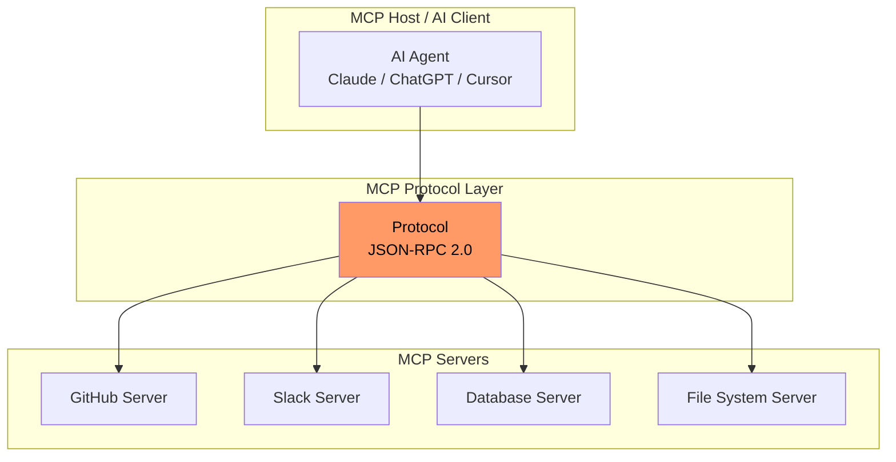
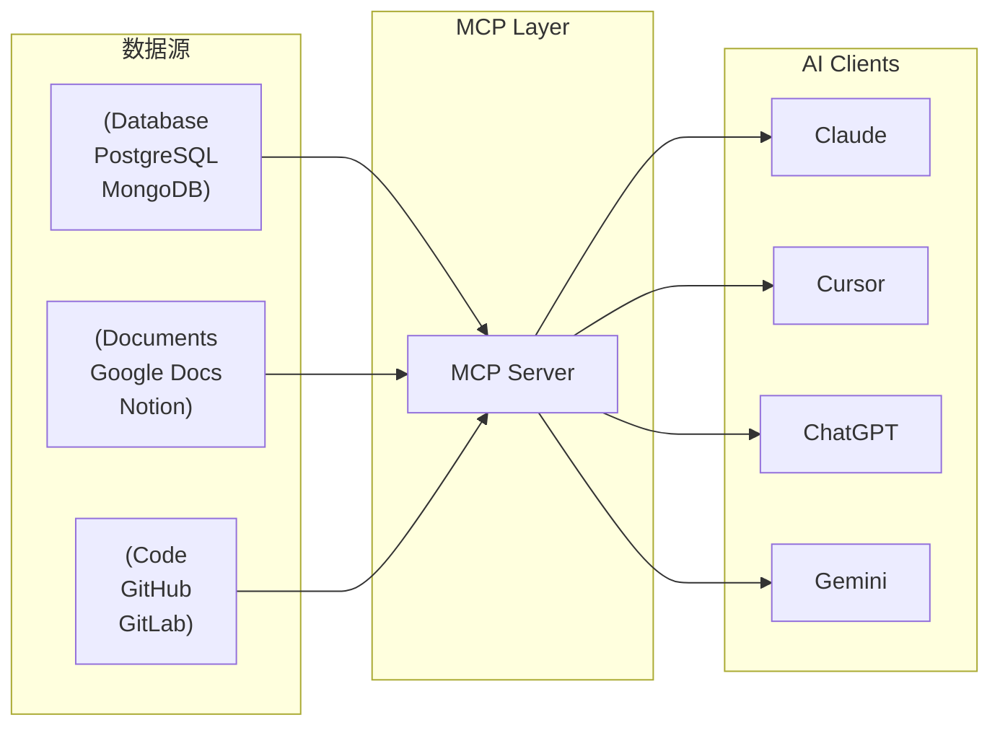
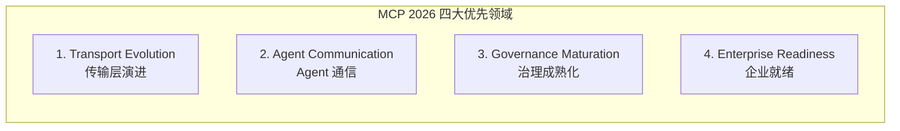

# MCP：Agent 工具调用的下一站

> Model Context Protocol 正在成为 AI 连接外部工具的事实标准

---

## 一、为什么需要 MCP

传统 Agent 开发中，每个模型连接外部工具都需要定制化代码：

```python
# 传统方式：每个工具都需要独立集成
class MyAgent:
    def __init__(self):
        self.github_client = GitHubAPI()      # 独立集成
        self.slack_client = SlackAPI()         # 独立集成
        self.db_client = DatabaseAPI()         # 独立集成
        self.file_client = FileSystemAPI()     # 独立集成
        # 每加一个工具，就要写一套代码
```

**MCP 的核心价值**：一次编写，处处运行。

---

## 二、MCP 架构



### MCP 三组件

| 组件 | 作用 | 示例 |
|------|------|------|
| **MCP Server** | 暴露工具/资源/提示词 | `mcp-server-github` |
| **MCP Host** | AI 应用（Claude Desktop / Cursor） | Claude, ChatGPT, 自建 |
| **MCP Protocol** | 标准化通信协议 | JSON-RPC 2.0 |

---

## 三、MCP 核心概念

### 1. Tools（工具）

MCP Server 暴露的可执行函数：

```json
{
  "name": "search_code",
  "description": "Search code in repository",
  "inputSchema": {
    "type": "object",
    "properties": {
      "query": {"type": "string"},
      "repo": {"type": "string"}
    }
  }
}
```

### 2. Resources（资源）

MCP Server 提供的数据访问：

```json
{
  "name": "github-repo",
  "description": "GitHub repository data",
  "uri": "file:///repo/{owner}/{name}"
}
```

### 3. Prompts（提示词模板）

可复用的提示词：

```json
{
  "name": "code-review",
  "description": "生成代码审查意见",
  "arguments": [
    {"name": "pr_url", "description": "PR链接"}
  ]
}
```

---

## 四、MCP vs 传统 Tool Calling

| 维度 | MCP | 传统 Tool Calling |
|------|-----|------------------|
| **集成成本** | 一次实现，多端运行 | 每个项目独立开发 |
| **标准化** | ✅ 协议统一 | ❌ 各家自定义 |
| **生态** | 快速增长中 | 依赖框架 |
| **适用场景** | 跨平台工具连接 | 单项目定制 |

**类比**：MCP 之于 AI 工具调用，就像 USB-C 之于设备连接——统一了物理接口，但功能由具体设备定义。

---

## 五、MCP 生态现状（2026年3月）

### MCP Servers 生态



### 主流 MCP Servers

| 名称 | 类型 | 官方支持 |
|------|------|---------|
| GitHub MCP Server | 代码 | ✅ 官方 |
| Slack MCP Server | 协作 | ✅ 官方 |
| Google Drive MCP | 文档 | ✅ 官方 |
| PostgreSQL MCP | 数据库 | 社区 |
| Filesystem MCP | 文件系统 | 社区 |

---

## 六、MCP 2026 官方路线图（2026-03-05 更新）

> MCP 官方路线图由 Linux 基金会 Agentic AI Foundation 管理，2026 年聚焦四大战略方向。

### 四大优先领域



#### 1. Transport Evolution and Scalability（传输层演进）

**现状**：Streamable HTTP 提供了生产级传输能力，但在水平扩展、无状态运行、中间件模式上存在差距。

**目标**：
- 下一代传输协议：在多个服务器实例间无状态运行，正确处理负载均衡和代理
- 可扩展会话处理：定义会话的创建、恢复和迁移机制，使服务器重启和扩展事件对连接客户端透明
- **MCP Server Cards**：通过 `.well-known` URL 暴露结构化服务器元数据的标准，使浏览器、爬虫和注册中心无需连接即可发现服务器能力

> 重点：不引入额外官方传输协议，保持生态系统兼容性

#### 2. Agent Communication（Agent 间通信）

**现状**：Tasks 原语（SEP-1686）提供了可靠的"立即调用/延迟获取"模式，但生产运行暴露了生命周期语义的差距。

**目标**：
- **重试语义**：任务临时失败时如何处理，由谁决定是否重试
- **过期策略**：结果完成后保留多长时间，客户端如何获知结果已过期

Tasks 在生产中运行规模越大，这个列表会越长。

#### 3. Governance Maturation（治理成熟化）

**现状**：MCP 已在 Linux 基金会下成为多公司开源标准，但社区需要清晰的领导力路径。

**目标**：
- **贡献者阶梯（Contributor Ladder）**：从社区参与者 → WG 贡献者 → WG 促进者 → 主导维护者 → 核心维护者的清晰晋升路径
- **委托模型**：允许有成熟记录的 WGs 在其领域内接受 SEP 并发布扩展更新，无需完整核心维护者评审
- **宪章模板**：每个 WG/IG 维护公开宪章：范围、交付成果、成功标准、退出条件，每季度审查

#### 4. Enterprise Readiness（企业就绪）

**现状**：企业正在大规模部署 MCP，但协议本身存在未解决的空白。

**目标**：
- **审计追踪和可观测性**：端到端可见客户端请求和服务器响应的形式，可接入企业现有日志和合规管道
- **企业托管认证**：从静态客户端密钥走向 SSO 集成流程的明确路径（Cross-App Access）
- **网关和代理模式**：明确定义客户端通过网关/代理连接时的行为

---

## 七、为什么开发者应该关注 MCP

1. **效率提升**：一次集成，不再重复造轮子
2. **生态红利**：站在 MCP 生态上，工具选择更多
3. **未来-proof**：协议标准化趋势明显，早入局早受益
4. **企业采用**：Google、Anthropic 官方支持，大厂背书

---

## 八、MCP Dev Summit 2026

**MCP Dev Summit North America** 将于 **2026 年 4 月 2-3 日** 在纽约举办，由 Linux 基金会 Agentic AI Foundation 主办。

这是 MCP 生态系统最重要的年度聚会，预计会有重大规范更新和生产实践分享。注册已于前期关闭。

---

## 九、快速上手

### 1. 安装 Claude Desktop MCP

```bash
# macOS
brew install claude-desktop

# 配置 MCP Servers
claude mcp add github -- github-server-args="--token $GITHUB_TOKEN"
```

### 2. 用 MCP 构建 Agent

```python
from langchain_mcp_adapters import MCPClient
from langchain.chat_models import ChatOpenAI

# 连接 MCP Server
mcp = MCPClient.from_url("http://localhost:8080")

# 构建 Agent
tools = mcp.get_tools()
agent = ChatOpenAI(model="gpt-4") | tools
```

---

## 十、参考资料

- [MCP 官方路线图](https://modelcontextprotocol.io/development/roadmap)（2026-03-05 更新）
- [MCP Dev Summit North America 2026](https://events.linuxfoundation.org/mcp-dev-summit-north-america/)
- [MCP 2026 Complete Guide](https://sainam.tech/blog/mcp-complete-guide-2026/)
- [SitePoint MCP Complete Guide](https://www.sitepoint.com/model-context-protocol-mcp/)
- [How MCP will supercharge AI automation in 2026](https://hallam.agency/blog/how-mcp-will-supercharge-ai-automation-in-2026/)

---

*最后更新：2026-03-22 | 由 OpenClaw 整理*
