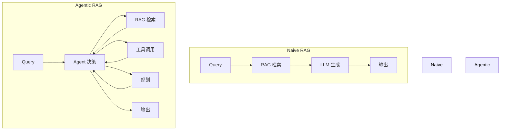
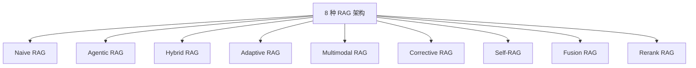
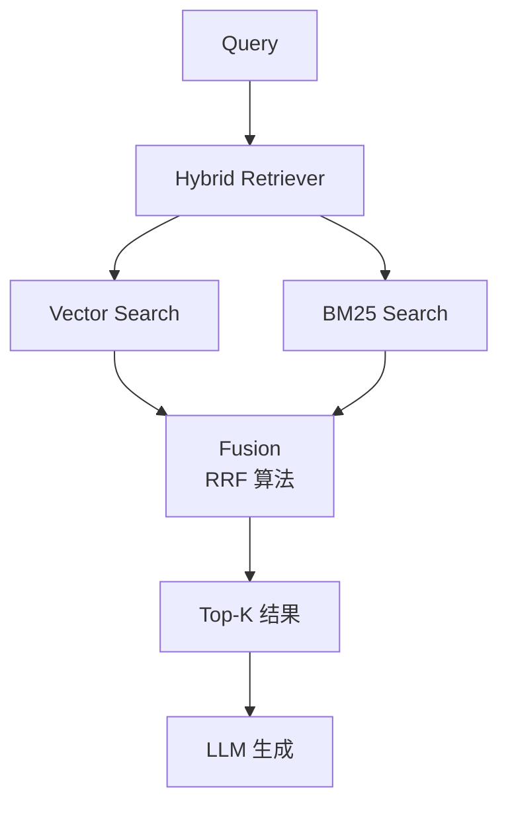
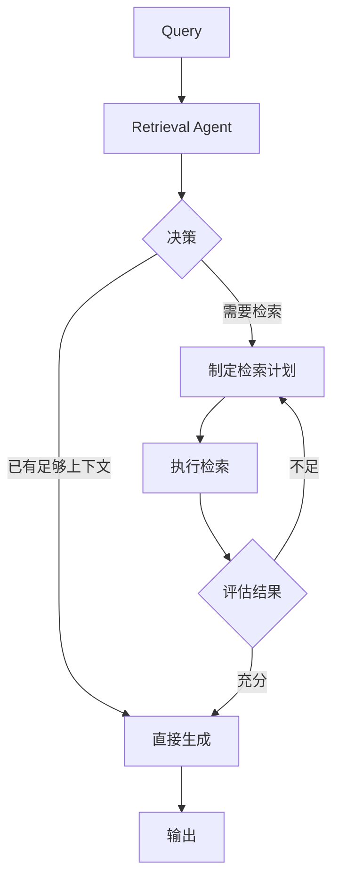
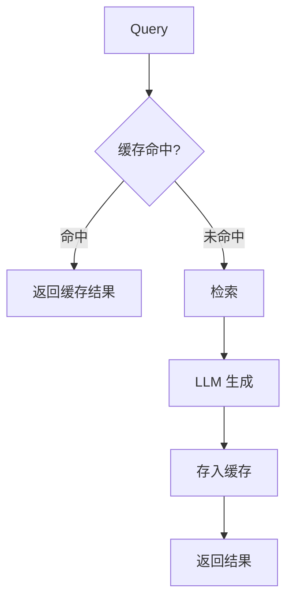
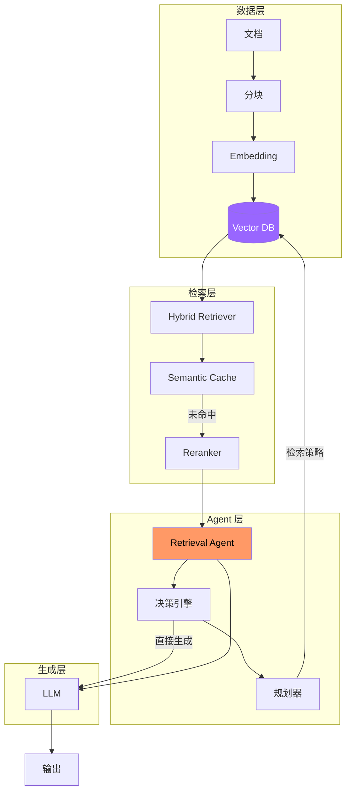

# RAG + Agent 融合实践

> 从 Naive RAG 到 Agentic RAG 的演进路径

---

## 一、RAG 与 Agent 的关系



| 模式 | 特点 | 适用场景 |
|------|------|---------|
| Naive RAG | 检索 → 生成，简单直接 | 简单问答 |
| Agentic RAG | Agent 动态决策检索路径 | 复杂多跳问题 |

---

## 二、2026 年 RAG 架构演进

### 8 种 RAG 架构类型



| 架构 | 核心特点 | 适用场景 |
|------|---------|---------|
| **Naive RAG** | 检索 + 生成，直接串联 | 简单文档问答 |
| **Agentic RAG** | Agent 动态决定检索策略 | 复杂多跳推理 |
| **Hybrid RAG** | 向量检索 + BM25 混合 | 通用场景 |
| **Adaptive RAG** | Agent 智能选择检索策略 | 成本敏感场景 |
| **Corrective RAG** | 检索结果自检修正 | 高准确性要求 |
| **Self-RAG** | 自己评估检索必要性 | 减少不必要检索 |
| **Fusion RAG** | 多路检索结果融合 | 全面覆盖需求 |
| **Rerank RAG** | 检索后重排序 | 精准排序需求 |

---

## 三、Hybrid RAG：2026 年的标准做法

### 为什么需要 Hybrid

| 检索方式 | 优点 | 缺点 |
|---------|------|------|
| **向量检索** | 语义相似 | 对关键词不敏感 |
| **BM25** | 关键词精确 | 不理解语义 |

**Hybrid = 向量 + BM25**，兼顾语义和关键词。

### 实现架构



### Redis 推荐的 Dual Pipeline

```python
# 伪代码：Dual Pipeline 实现
class HybridRetriever:
    def __init__(self, vector_db, bm25_index):
        self.vector_db = vector_db
        self.bm25_index = bm25_index

    def retrieve(self, query, k=10):
        # 并行执行两种检索
        vector_results = self.vector_db.search(query, k=k*2)
        bm25_results = self.bm25_index.search(query, k=k*2)

        # RRF Fusion（Reciprocal Rank Fusion）
        fused = self.rrf_fusion([
            vector_results,
            bm25_results
        ], k=60)

        return fused[:k]

    def rrf_fusion(self, result_sets, k=60):
        """RRF 算法"""
        scores = defaultdict(float)
        for results in result_sets:
            for rank, doc in enumerate(results):
                scores[doc.id] += 1 / (k + rank + 1)
        return sorted(scores.items(), key=lambda x: -x[1])
```

---

## 四、Agentic RAG：动态检索策略

### 核心思想

Agentic RAG 让 **Agent 决定何时检索、检索什么、如何检索**。



### 检索决策类型

| 决策 | 触发条件 | 动作 |
|------|---------|------|
| **不检索** | 上下文已包含答案 | 直接生成 |
| **单步检索** | 简单问题 | 一次检索足够 |
| **多步检索** | 复杂多跳问题 | 迭代检索 |
| **重排序** | 检索结果不精准 | rerank 后再生成 |

### 代码框架

```python
class RetrievalAgent:
    def __init__(self, retriever, llm):
        self.retriever = retriever
        self.llm = llm

    def decide(self, query, context):
        """Agent 决策：是否需要检索"""
        prompt = f"""
        用户问题：{query}
        当前上下文：{context}

        判断：是否需要检索外部知识？
        - 如果问题需要最新信息 → 需要检索
        - 如果上下文已足够 → 不需要
        """

        decision = self.llm.generate(prompt)
        return decision.action  # "retrieve" | "generate"

    def multi_hop_retrieve(self, query, max_hops=3):
        """多跳检索"""
        context = ""
        for hop in range(max_hops):
            docs = self.retriever.retrieve(query)
            context += docs

            if self.is_sufficient(context):
                break

            query = self.elaborate_query(query, context)

        return context
```

---

## 五、Semantic Caching：成本优化

### 核心价值

> Semantic Caching 可将 LLM 成本降低 **68.8%**。



### 实现要点

```python
class SemanticCache:
    def __init__(self, vector_db, threshold=0.9):
        self.vector_db = vector_db
        self.threshold = threshold

    def get(self, query):
        results = self.vector_db.search(query, k=1)
        if results and results[0].score >= self.threshold:
            return results[0].response
        return None

    def set(self, query, response):
        self.vector_db.insert({
            "query": query,
            "response": response,
            "embedding": self.embed(query)
        })
```

---

## 六、RAG + Agent 融合架构图



---

## 七、关键工程决策

### 检索评估指标

| 指标 | 说明 | 目标 |
|------|------|------|
| **Recall** | 相关文档被检索到的比例 | > 0.9 |
| **Precision** | 检索结果中相关的比例 | > 0.5 |
| **MRR** | 第一个相关结果的排名倒数的均值 | > 0.8 |
| **Latency** | 检索延迟 | < 100ms |

### Chunk 大小策略

| 场景 | Chunk 大小 | Overlap |
|------|-----------|---------|
| 问答 | 500-1000 tokens | 20% |
| 摘要 | 2000-3000 tokens | 10% |
| 代码检索 | 200-500 tokens | 30% |

---

## 八、参考资料

| 文章 | 链接 |
|------|------|
| Modern RAG Architectures Guide 2026 | https://www.linkedin.com/pulse/complete-2026-guide-modern-rag-architectures |
| RAG at Scale with Redis | https://redis.io/blog/rag-at-scale/ |
| 8 RAG Architecture Types | https://www.genaiprotos.com/blog/8-rag-architecture |
| Beyond Naive RAG | https://medium.com/@vkrishnan9074/beyond-naive-rag |

---

*最后更新：2026-03-21 | 由 OpenClaw 整理*
