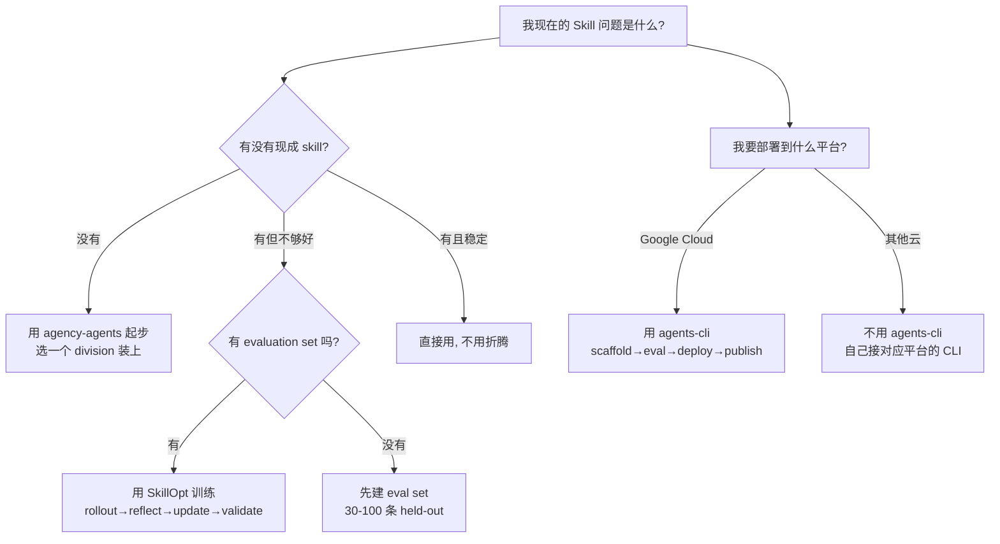

# Agent Skill 工程的三岔路口：三个明星项目的深度对比

> 横向对比：msitarzewski/agency-agents (119K⭐) · microsoft/SkillOpt (10K⭐) · google/agents-cli (3.7K⭐)
> 2026-06-30 · Deep Dive

---

## 一、为什么挑这三个项目

最近半年，**Agent Skill** 这个词从工程术语变成了产品术语。原因之一是 Stars 榜上冒出了一批"做 Skill"的项目——它们的 Stars 数量级差异巨大（119K vs 10K vs 3.7K），但都号称解决了"如何让 Agent 在特定场景下表现更好"的问题。

把它们摆在一起看，会发现一个有趣的现象：

> **Stars 数量和工程价值密度成反比。**

agency-agents 是 119K stars 的现象级项目，但本质是"prompt 内容聚合 + 模板分发"；SkillOpt 是 10K stars 的研究项目，反而把 Skill 优化推到了**可复现工程实验**的高度；agents-cli 是 Google Cloud 的官方 CLI，把 vendor skill 注入到 coding agent，Stars 只有 3.7K，但平台价值密度最高。

这不是巧合——它反映了 Agent Skill 工程化的三个独立演进路径。

---

## 二、三个项目各自在解决什么

### 2.1 agency-agents：把"好 Skill"打包分发

> **GitHub**: msitarzewski/agency-agents · MIT · 119,608 Stars
> "A complete AI agency at your fingertips - From frontend wizards to Reddit community ninjas, from whimsy injectors to reality checkers."

**本质**：一个由 16 个 divisions × 多角色组成的**预制 persona markdown 文件集合**。每个角色有 identity、personality、deliverables、success metrics，直接 install 到 Claude Code / Cursor / Codex / OpenClaw 等 13 个 coding agent。

**解决的问题**："我想让 Agent 像某类专家一样工作，但自己不会写这种 prompt。"

**思路**：社区驱动的内容聚合。Born from Reddit，迭代几个月，收集、整理、模板化，再分发给用户。

**核心机制**：
- 每个 agent = 一个 markdown 文件
- 集成靠脚本（`./scripts/install.sh --tool claude-code`）
- 还有 native desktop app（agencyagents.app），覆盖 macOS/Linux/Windows

**优点**：开箱即用、覆盖 16 个领域、所有主流 coding agent 都支持。
**缺点**：质量靠人工 review；所有人用同一份 prompt，没法个性化；没法验证"这个 skill 真有效"。

### 2.2 SkillOpt：把 Skill 文本当作神经网络训练

> **GitHub**: microsoft/SkillOpt · MIT · 10,082 Stars
> "SkillOpt is a text-space optimizer that trains reusable natural-language skills for frozen LLM agents"

**本质**：一个**Skill 文档自动训练框架**。把 skill.md 当作可训练的 state，用 rollout → reflect → aggregate → select → update → evaluate 的循环去迭代它。

**解决的问题**："我有一段 skill，但它不够好。我不知道改哪里、怎么改、改了能不能更好。"

**思路**：research-driven rigor。把深度学习的训练纪律（epoch、batch size、learning rate、validation gate）应用到 skill 文本这一层。模型权重不动，**改的是 skill 这一层**。

**核心机制**：
- **Validation-gated update**：候选编辑只在严格提升 held-out 分数时被接受
- **Textual learning-rate budget**：每次更新幅度有上限
- **Rejected-edit buffer**：被拒绝的编辑进入 buffer 避免震荡
- **SkillOpt-Sleep**：夜间 cron 自演化 companion

**关键数据**：6 benchmarks × 7 models × 3 harnesses = 52 个评估单元，**全部最佳或并列最佳**。GPT-5.5 上：直接聊天 +23.5、Codex +24.8、Claude Code +19.1 points。

**优点**：可复现、可验证、个性化（基于 trajectory 自适应）。
**缺点**：起点 seed 重要、需要 evaluation set、训练耗时。

### 2.3 google/agents-cli：把 vendor Skill 注入 coding agent

> **GitHub**: google/agents-cli · Apache-2.0 · 3,724 Stars
> "The CLI and skills that turn any coding assistant into an expert at creating, evaluating, and deploying AI agents on Google Cloud."

**本质**：Google 官方出的**CLI + skill 注入框架**。把 Google Cloud 平台上开发 Agent 的最佳实践（scaffold、eval、deploy、publish、observability）打包成 7 个 skill，install 到 coding agent。

**解决的问题**："我想在 Google Cloud 上建一个 production agent，但学不动一堆 CLI 和 service。"

**思路**：platform-driven integration。Vendor 把官方知识封装成 skill，让 coding agent 直接用这些 skill 写代码。

**核心机制**：
- **7 个 skill**（workflow / adk-code / scaffold / eval / deploy / publish / observability）
- **CLI 命令**：scaffold / eval generate / eval grade / deploy / publish / observability
- **完整 lifecycle**：create → enhance → upgrade → eval → optimize → deploy → publish

**优点**：标准化、与平台深度耦合、企业级支持。
**缺点**：vendor lock-in（绑 Google Cloud）、跨平台难、Pre-GA。

---

## 三、深度对比：八个维度

下表从工程化视角系统对比三个项目。这是本文的**核心价值**——把"哪个 stars 多"的直觉问题，转化为工程视角下的多维决策。

| 维度 | A: agency-agents | B: SkillOpt | C: agents-cli |
|------|------------------|-------------|---------------|
| **解决的本质问题** | "有没有可用的好 Skill" | "Skill 如何持续变好" | "Vendor Skill 如何触达 coding agent" |
| **方法论** | 内容收集 + 模板化分发 | 训练循环 + 验证门控 | 命令封装 + Skill 注入 |
| **部署时推理开销** | **0**（直接读 markdown） | **0**（部署时是静态 best_skill.md） | **0**（一次性 install） |
| **个性化能力** | ❌（所有人用同一份） | ✅（基于 trajectory 自适应） | ❌（所有人用同一份） |
| **质量保证机制** | ❌（依赖人工 review） | ✅（held-out validation gate） | ⚠️（vendor 责任） |
| **跨平台性** | ✅（13 个 coding agent） | ✅（6×7×3 全胜） | ❌（绑定 Google Cloud） |
| **生态信号** | 119K⭐ / Reddit 出生 | gbrain/darwin-skill 集成 | Gemini Enterprise 平台 |
| **生产可用度** | ✅ 即用 | ✅ PyPI 可装 | ⚠️ Pre-GA |

**关键发现**：

1. **三者部署时推理开销都是 0**——这是 Skill 工程和 weight-space 训练的本质区别
2. **只有 SkillOpt 有质量保证机制**——其他两个靠"用的人觉得好不好"
3. **三者的"不可替代性"** 完全不同：A 是内容生态，B 是研究范式，C 是平台能力

---

## 四、三个真相（笔者认为）

### 真相 1：Stars 数量反映"分发难度"，不是"工程深度"

agency-agents 119K stars 主要靠三件事：README 头图、brew install、`npx skills add` 一键集成、native desktop app。它的核心机制是"复制粘贴 markdown"，**没有任何工程难度**。

SkillOpt 10K stars 但有 arXiv 论文、有 52 个 cell 的严格评测、有 PyPI 完整工具链、有 webui dashboard——它的工程密度至少是 agency-agents 的 10 倍。

agents-cli 3.7K stars 是因为绑了 Google Cloud、用 Pre-GA 标识、面向企业用户——典型 vendor 项目的低调。

> **结论**：Stars 是营销指标，不是质量信号。评估 Skill 工程项目的标准应该是：有没有 held-out validation、能不能跨模型迁移、有没有 benchmark 数据。

### 真相 2：三条路径不是互斥的，是互补的

我把三个项目摆成"路径 ABC"，但它们实际上是 Skill 工程流水线的**不同阶段**：

```
[内容库: agency-agents]                ← 解决"从 0 到 1"
    ↓ 提供 seed skill
[训练框架: SkillOpt]                    ← 解决"从 1 到 100"
    ↓ 输出 best_skill.md
[平台注入: agents-cli]                  ← 解决"从 100 到 10000 用户"
    ↓ vendor 标准化分发
[用户使用]
```

任何一条路径单独做都是单点故障：

- 只有内容库：所有人用同一份 skill，质量停滞
- 只有训练框架：起点 seed 差，怎么训都差
- 只有平台注入：vendor 写什么用户用什么，无优化空间

**真正的 Skill 工程团队，三条路径都需要考虑**——具体哪条优先级最高，取决于团队规模、技能栈、目标平台。

### 真相 3：三个项目的"作者画像"反映三种工程哲学

| 项目 | 作者 | 哲学 |
|------|------|------|
| agency-agents | msitarzewski（个人开发者） | **community-driven content** |
| SkillOpt | Microsoft Research（Yang et al.） | **research-driven rigor** |
| agents-cli | Google Cloud 团队 | **platform-driven integration** |

这三种哲学分别对应：

- **社区内容**：低门槛、广覆盖、靠规模取胜——做"消费品"
- **研究严谨**：高质量、有 benchmark、可复现——做"硬通货"
- **平台整合**：标准化、深度耦合、生态绑定——做"基础设施"

> **结论**：选项目其实是选哲学。你的团队是"消费品路线"、"硬通货路线"还是"基础设施路线"，决定了你应该深度投入哪个方向。

---

## 五、一张决策图：怎么选



**关键决策点**：
1. **起点问题** → agency-agents 起步
2. **质量问题** → SkillOpt 训练
3. **平台问题** → agents-cli（仅 Google Cloud）
4. **三阶段全部走一遍** = 成熟的 Skill 流水线

---

## 六、行动建议：分角色

### 如果你是个体开发者 / 小团队（< 5 人）

1. **今晚**：跑 `npx skills add google/agents-cli` 装一个起点 skill
2. **这周**：浏览 agency-agents 找 1-2 个角色文件，读它的 prompt 写法
3. **一个月**：当你有了 30+ 真实任务案例，准备 evaluation set，考虑 SkillOpt

### 如果你是中型团队（5-50 人）

1. **评估**：决定主战场平台（Google Cloud / AWS / 自建）
2. **第一阶段**：用对应平台的 vendor CLI（agents-cli / 自建）
3. **第二阶段**：当团队里 Skill 数量 > 10 个时，开始引入 SkillOpt 做集中优化
4. **第三阶段**：建立内部 "skill 库 + 训练 pipeline + 平台分发" 的完整闭环

### 如果你是大厂 / 平台方

1. **必须自建**：vendor skill 平台（如 agents-cli）+ 内部 skill 库
2. **必须投入 SkillOpt 类研究**：因为你的 evaluation set 决定 skill 演化方向
3. **开源贡献**：把内部 best practice 沉淀到 agency-agents 这类社区项目，反哺生态

---

## 七、结尾：Skill 是一等公民了吗？

回到开篇的问题。

一年前，Skill 还是个边缘话题——大部分人把它等同于 "好的 system prompt"。现在，**Skill 已经成为 Agent 工程的独立一层**：有专门的内容库（agency-agents）、有专门的训练框架（SkillOpt）、有专门的平台注入机制（agents-cli）。

> **笔者认为**：Skill 已经是一等公民了。但"一等公民"不等于"成熟工程"。成熟的 Skill 工程需要三条路径并行：内容库解决起点、训练框架解决演化、平台注入解决分发。任何一条缺失都是单点故障。

三个明星项目共同勾勒出了 Skill 工程的未来轮廓——但这个轮廓还在快速变化。今天的判断，明年可能就要重新审视。

> **所以你应该**：今晚就把 agency-agents 装上读读 prompt；本周读一遍 SkillOpt 论文理解 text-space optimization 范式；本月评估你的 skill 演化是否需要 SkillOpt 类的工具化。三条路径都走过一遍，你才算真正理解了 Agent Skill 工程。

---

## 参考资料

- [msitarzewski/agency-agents](https://github.com/msitarzewski/agency-agents) — MIT, 119,608 Stars
- [microsoft/SkillOpt](https://github.com/microsoft/SkillOpt) — MIT, 10,082 Stars
- [SkillOpt 论文 arXiv:2605.23904](https://arxiv.org/abs/2605.23904) — Yang et al., 2026
- [google/agents-cli](https://github.com/google/agents-cli) — Apache-2.0, 3,724 Stars
- [Agency Agents App](https://agencyagents.app/) — Native desktop installer
- [Gemini Enterprise Agent Platform](https://docs.cloud.google.com/gemini-enterprise-agent-platform/scale) — Google Cloud 平台

---

**主题标签**：`agent-skills` · `deep-dive` · `横向对比` · `skill-engineering` · `text-space-optimization` · `platform-distribution`