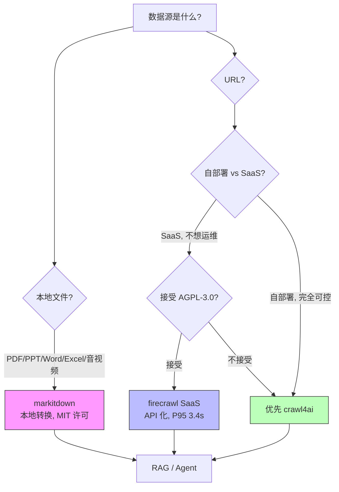

# Web 数据三件套深度对比：markitdown × crawl4ai × firecrawl

> 横向对比：microsoft/markitdown (162K⭐) · unclecode/crawl4ai (70K⭐) · firecrawl/firecrawl (142K⭐)
> 2026-06-30 · Deep Dive

---

## 一、为什么挑这三个项目

Agent 工程的核心瓶颈从来不是模型本身——**是数据**。一个 Agent 要回答"昨天 Anthropic 发了什么"，需要：

1. **找到 URL**（搜索 / 爬虫）
2. **抓取 HTML**（绕过反爬 / 渲染 JS）
3. **清洗成结构化文本**（去广告、去导航、保留正文）
4. **转换成 LLM 友好的格式**（Markdown）
5. **建立向量索引**（RAG）

每一步都有一堆工具可选。但当你打开 GitHub 一看，会发现最受欢迎的不是某一个"全能爬虫"——而是**三个分工明确、各自为王的明星项目**。

它们为什么都被 Agent 团队必装？为什么不能互相替代？

---

## 二、三个项目各自在解决什么

### 2.1 markitdown：本地文件 → Markdown

> **GitHub**: microsoft/markitdown · MIT · 162,000 Stars
> "A lightweight Python utility for converting various files to Markdown for use with LLMs"

**本质**：Microsoft AutoGen 团队出的**本地文件转换器**。把任意格式的文件转成 Markdown，专为 LLM 消费设计。

**支持格式**（README 原文）：
> PDF · PowerPoint · Word · Excel · Images (EXIF + OCR) · Audio (EXIF + transcription) · HTML · CSV/JSON/XML · ZIP · YouTube URLs · EPubs

**核心优势**：
- **Markdown 友好**：保留 headings / lists / tables / links 等结构
- **Token 高效**：Markdown 比 PDF/HTML 文本省 30-50% tokens
- **零 LLM 依赖**：默认纯本地，可选图片 OCR 才用 LLM
- **MIT License**：商业友好

**解决的问题**："我有一个 PDF/PPT/Word 文件，要塞给 Agent 处理。"

**为什么不替代爬虫**：markitdown 处理的是**已经下载的文件**——它不抓取、不联网、不渲染。

### 2.2 crawl4ai：URL → LLM-friendly Markdown（自部署）

> **GitHub**: unclecode/crawl4ai · Apache-2.0 · 70,388 Stars
> "🚀🤖 Crawl4AI: Open-source LLM Friendly Web Crawler & Scraper"

**本质**：AI-native 设计的**开源爬虫框架**。原生输出 Markdown、为 RAG / Agent / 数据流水线而生。

**核心特性**（README 原文）：
> - **LLM ready output**, smart Markdown with headings, tables, code, citation hints
> - **Fast in practice**, async browser pool, caching, minimal hops
> - **Full control**, sessions, proxies, cookies, user scripts, hooks
> - **Adaptive intelligence**, learns site patterns, explores only what matters
> - **Deploy anywhere**, zero keys, CLI and Docker, cloud friendly

**最新动态**：
- v0.9 (2026-06): secure-by-default Docker API server
- v0.8.7 (2026-05): 修复 RCE / SSRF / 鉴权绕过 / 文件写入 / XSS 等关键漏洞
- v0.8.6: 用 `unclecode-litellm` 替换 `litellm`（PyPI 供应链攻击应对）

**作者故事**（README 原文）：
> "In 2023, I needed web-to-Markdown. The 'open source' option wanted an account, API token, and $16, and still under-delivered. I went turbo anger mode, built Crawl4AI in days, and it went viral. Now it's the most-starred crawler on GitHub."

**解决的问题**："我要自部署一个 AI-native 爬虫，不要 SaaS，不要 vendor lock-in。"

**为什么不替代 SaaS**：自部署意味着你要自己处理反爬、proxy rotation、JS 渲染、SLA——crawl4ai 给你工具，但你得自己运维。

### 2.3 firecrawl：URL → API（托管 + 开源）

> **GitHub**: firecrawl/firecrawl · AGPL-3.0 · 141,797 Stars
> "🔥 The API to search, scrape, and interact with the web at scale."

**本质**：**SaaS-first 的 Web Data API**。开源自部署 + 托管服务双轨，主打"工业级可靠性"。

**核心数字**（README 原文）：
> - **96% web coverage**, including JS-heavy pages
> - **P95 latency 3.4s** across millions of pages
> - **LLM-ready output**: Markdown / JSON / screenshots

**Endpoints**：
| Endpoint | 作用 |
|----------|------|
| **Search** | 搜索 + 返回 full content |
| **Scrape** | 单 URL → Markdown/JSON/Screenshot |
| **Interact** | 抓取后交互（click/scroll/type/wait/press）|
| **Agent** | 描述需求 → 自动数据采集 |
| **Crawl** | 整站抓取 |
| **Map** | 整站 URL 发现 |
| **Batch Scrape** | 数千 URL 异步抓取 |

**集成**：任何 AI agent + MCP client 一键连接。

**解决的问题**："我要 production-grade 的 Web 数据源，不想运维爬虫。"

**License 注意**：**AGPL-3.0**。如果你要在闭源商业产品里用 firecrawl，要小心传染条款。SaaS 用户不受影响。

---

## 三、深度对比：八个维度

| 维度 | markitdown | crawl4ai | firecrawl |
|------|------------|----------|-----------|
| **输入** | 本地文件（12+ 格式）| URL | URL |
| **输出** | Markdown | LLM-ready Markdown | Markdown / JSON / Screenshot |
| **网络爬取** | ❌ | ✅ | ✅ |
| **LLM 调用** | 可选（OCR 用）| 可选（extraction 用）| 可选（interact 用）|
| **部署模式** | Python 库 | Self-hosted / Cloud | SaaS / Self-hosted |
| **License** | MIT | Apache-2.0 | **AGPL-3.0** ⚠️ |
| **处理能力** | PDF/Office/音视频 | 单页 / 整站 / 深度爬取 | 单页 / 整站 / 批量 / 交互 |
| **核心数字** | 162K⭐ | 70K⭐ / 50K+ 社区 | 142K⭐ / 96% web / P95 3.4s |
| **生产成熟度** | ✅ 即装即用 | ✅ v0.9 / 大量自部署案例 | ✅ 商业 SaaS |
| **最近活跃** | 持续更新 | v0.9 (2026-06) | 持续更新 |

**关键发现**：

1. **三者输入域完全正交**：markitdown = 本地文件、crawl4ai/firecrawl = URL
2. **三者输出都是 Markdown**：这是 LLM 友好的统一抽象
3. **三者都有可选 LLM 钩子**：默认纯规则/启发式，需要时调 LLM 增强
4. **License 差异巨大**：markitdown MIT 最自由、crawl4ai Apache-2.0 商用友好、firecrawl AGPL-3.0 商用有陷阱

---

## 四、一条真实流水线

把三个项目串起来，就是 Agent 数据工程的完整链路：

```
┌──────────────────────────────────────────────────────────┐
│  阶段 1: 数据采集                                          │
│  ┌─────────────────┐    ┌─────────────────┐              │
│  │  firecrawl API   │    │  crawl4ai 自部署 │              │
│  │  (SaaS 省心)     │    │  (完全可控)      │              │
│  └────────┬─────────┘    └────────┬─────────┘              │
│           └──────────┬───────────┘                         │
│                      ↓                                     │
│              [raw HTML / Markdown]                          │
└──────────────────────────────────────────────────────────┘
                      ↓
┌──────────────────────────────────────────────────────────┐
│  阶段 2: 文件预处理                                        │
│  ┌─────────────────────────────────────────────┐          │
│  │  markitdown                                   │          │
│  │  - PDF / PPT / Word / Excel → Markdown        │          │
│  │  - 音频 → 转录 + Markdown                     │          │
│  │  - 视频（YouTube）→ 转录 + Markdown          │          │
│  └─────────────────────────┬───────────────────┘          │
└────────────────────────────┘                              │
│                      ↓                                     │
│              [clean Markdown corpus]                       │
└──────────────────────────────────────────────────────────┘
                      ↓
┌──────────────────────────────────────────────────────────┐
│  阶段 3: RAG / Agent                                       │
│  - chunking → embedding → vector DB                        │
│  - retrieval → prompt augmentation → LLM                   │
└──────────────────────────────────────────────────────────┘
```

**关键洞察**：三个项目不是"三选一"关系，而是流水线的**不同阶段**。

- **markitdown** 处理的是"已经下载的文件"（阶段 2）
- **crawl4ai / firecrawl** 处理的是"URL → 文件"（阶段 1）
- 阶段 3 是 RAG，跟今天对比的项目无关

---

## 五、三个真相（笔者认为）

### 真相 1：AGPL-3.0 是 firecrawl 的隐藏陷阱

firecrawl 的 AGPL-3.0 License 在 README 里写得不大显眼，但**实际影响巨大**：

- **AGPL-3.0 传染条款**：如果你修改 firecrawl 源码并对外提供服务，必须开源你的修改
- **如果你只是用 firecrawl SaaS API**（不开源产品代码）：不受影响
- **如果你把 firecrawl 自部署集成进闭源商业产品**：⚠️ 可能要开源你的产品

对比 markitdown MIT、crawl4ai Apache-2.0——这两个怎么商用都没问题。

> **结论**：企业 Agent 团队选 firecrawl 时，先问法务再决定用 SaaS 还是自部署。

### 真相 2：markitdown 的真正价值不是"转换"，是"结构保留"

很多团队用 `pdftotext` 或 `pdf2text` 也能把 PDF 转文本，但它们丢结构：
- 表格变成连续空格
- 标题失去层级
- 列表丢失编号
- 图片位置丢失

markitdown 的核心设计目标是**保留 Markdown 结构**——headings、lists、tables、links 都对应原文位置。这才是 LLM 真正能用的格式。

README 原文：
> "While the output is often reasonably presentable and human-friendly, it is meant to be consumed by text analysis tools -- and may not be the best option for high-fidelity document conversions for human consumption."

这是"为机器设计，不是为人设计"——这恰好是 Agent 工程的正确选择。

### 真相 3：crawl4ai 的"adaptive intelligence"是被低估的能力

README 提到 crawl4ai 有"adaptive intelligence：learns site patterns"。这个特性在 RAG 数据采集场景里价值巨大：

- 同一个域名（如 docs.anthropic.com）的结构稳定
- crawl4ai 能学习该站点的 pattern，**复用浏览器渲染路径**
- 比起"每次都从头渲染"，能减少 5-10x 延迟（README 提到 v0.8.0 的 prefetch mode）

这跟 firecrawl 的"96% coverage"是不同维度：
- firecrawl 强在**广度**（覆盖更多冷门站）
- crawl4ai 强在**深度**（特定站点的反复高效爬取）

> **结论**：选 firecrawl 做"全网搜索 + 一次性爬取"，选 crawl4ai 做"已知站点的持续爬取"。

---

## 六、决策图：怎么选



**关键决策点**：

| 场景 | 推荐 | 理由 |
|------|------|------|
| 处理用户上传的 PDF | markitdown | 本地转换、无网络 |
| 企业内部 RAG（自部署）| crawl4ai | 完全可控、Apache-2.0 |
| 实时 Agent 数据源 | firecrawl SaaS | 96% web coverage、SLA |
| 已知站点的深度爬取 | crawl4ai | adaptive intelligence |
| 合规要求高的场景 | markitdown + crawl4ai | 都 MIT/Apache 友好 |

---

## 七、行动建议：分角色

### 如果你在做 RAG 系统

**最小必装**：
```bash
pip install markitdown[all] crawl4ai
```

然后写一个简单的采集 → 处理 → 入库 pipeline：

```python
# 伪代码
async def build_rag_corpus(urls):
    async with AsyncWebCrawler() as crawler:
        results = await crawler.arun_many(urls)
    for r in results:
        md = r.markdown  # 已经 LLM-friendly
        chunks = chunk_text(md)
        embeddings = embed(chunks)
        vector_db.upsert(embeddings, chunks)

# 处理本地文件
from markitdown import MarkItDown
md = MarkItDown()
result = md.convert("whitepaper.pdf")
process(result.text_content)
```

### 如果你在做实时 Agent

需要 firecrawl 的 SaaS API 兜底：

```python
from firecrawl import Firecrawl
app = Firecrawl(api_key="fc-...")

# 单页抓取
result = app.scrape("https://example.com")

# 整站爬取
crawl_result = app.crawl("https://example.com", limit=100)

# 搜索 + 抓取
search = app.search("latest AI agent frameworks", limit=5)
```

### 如果你在做企业级 Agent 数据平台

三层都要：
1. **入口层**：firecrawl API（处理未知 URL）
2. **专业层**：crawl4ai（处理高价值已知站点）
3. **处理层**：markitdown（处理下载文件）

按数据类型分流到不同 pipeline，统一进入向量库。

---

## 八、结尾：Agent 数据栈的全景图

把今天的对比和今早的"Agent Skill 三岔路口"放一起看：

```
┌─────────────────────────────────────────────────────┐
│  Agent Skill 层（今天上午的对比）                     │
│  agency-agents / SkillOpt / google/agents-cli       │
│  解决：Agent 怎么"思考"                               │
└─────────────────────────────────────────────────────┘
                         ↓
┌─────────────────────────────────────────────────────┐
│  Agent Data 层（今天的对比）                          │
│  markitdown / crawl4ai / firecrawl                  │
│  解决：Agent 怎么"获取知识"                           │
└─────────────────────────────────────────────────────┘
                         ↓
┌─────────────────────────────────────────────────────┐
│  Agent Runtime 层（之前的对比）                       │
│  Claude Code / Codex / browser-use / OpenHands      │
│  解决：Agent 怎么"执行"                               │
└─────────────────────────────────────────────────────┘
```

**三个层面共同构成现代 Agent 的完整工程栈**。每一层都有 3-5 个明星项目，各自定位明确、互相补充。

> **笔者认为**：Agent 工程的下一个阶段不是"更好的模型"，而是**更完整的栈**。每一层都有开源 + 商业 + 自部署的组合选择，关键是看你团队的能力分布、合规要求、规模需求。
>
> **所以你应该**：今晚把 markitdown 装上读它的源码（学习结构保留的工程细节）；本周用 crawl4ai 跑一次自部署爬虫（理解反爬与渲染的真实成本）；本月评估 firecrawl 的 SaaS vs 自部署 ROI（决定长期数据策略）。

---

## 参考资料

- [microsoft/markitdown](https://github.com/microsoft/markitdown) — MIT, 162,000 Stars
- [unclecode/crawl4ai](https://github.com/unclecode/crawl4ai) — Apache-2.0, 70,388 Stars
- [firecrawl/firecrawl](https://github.com/firecrawl/firecrawl) — AGPL-3.0, 141,797 Stars
- [MarkItDown PyPI](https://pypi.org/project/markitdown/)
- [crawl4ai v0.9 Release Notes](https://github.com/unclecode/crawl4ai/blob/main/docs/blog/release-v0.9.0.md)
- [Firecrawl Benchmarks](https://www.firecrawl.dev/blog/the-worlds-best-web-data-api-v25)

---

**主题标签**：`agent-data` · `deep-dive` · `横向对比` · `web-scraping` · `markdown` · `rag-pipeline` · `llm-friendly`