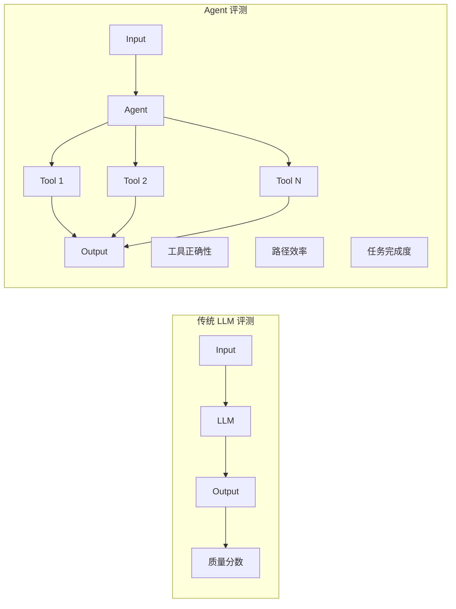
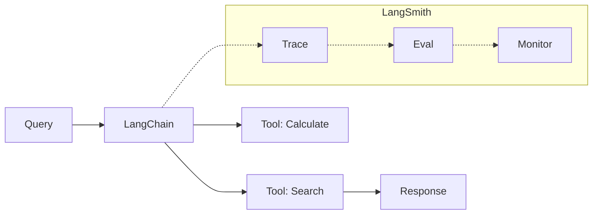
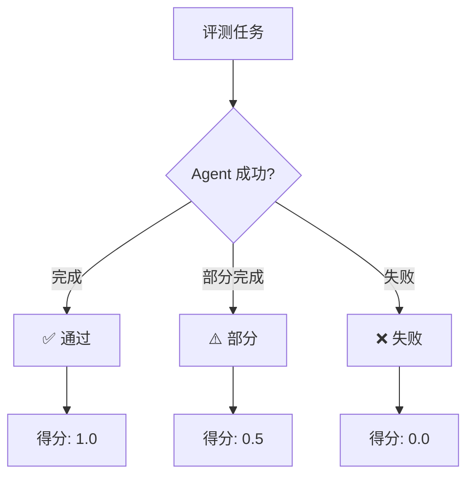
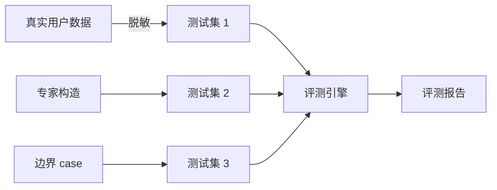
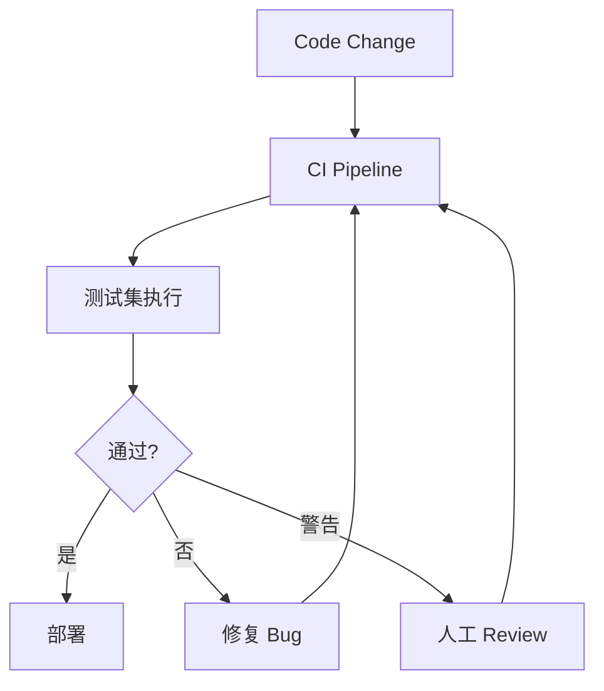

# Agent 评测工具全景图 2026

> 37% 的生产 Agent 失败因为评测不足——如何用对工具

---

## 一、为什么 Agent 评测这么难

传统 LLM 评测看 Output 质量，但 Agent 还需要评测：

- **过程**：Tool 调用是否正确？
- **路径**：推理链是否合理？
- **效率**：步数是否最优？
- **鲁棒性**：边界情况是否处理？



---

## 二、评测维度

| 维度 | 衡量什么 | 典型指标 |
|------|---------|---------|
| **任务完成度** | 是否达到目标 | Task Completion Rate |
| **工具调用准确率** | 选对工具了吗 | Tool Accuracy |
| **推理质量** | 思考链是否合理 | ReAct Trace Score |
| **效率** | 用了多少步/token | Steps, Token Usage |
| **鲁棒性** | 边界情况处理 | Error Recovery Rate |
| **幻觉率** | 事实错误频率 | Factuality Score |

---

## 三、主流评测工具对比

### DeepEval

**专为 Agent 设计的评测框架**，支持 DAG 指标评估：

```python
from deepeval import evaluate
from deepeval.metrics import ToolCallAccuracy, TaskCompletion

metric = ToolCallAccuracy(threshold=0.8)
result = evaluate(agent, test_cases, metrics=[metric])
```

**优点**：
- DAG 路径可视化
- 6 种 Agent 特异性指标
- Python-first，易集成

### LangSmith

LangChain 官方观测平台，**全链路追踪**：



**优点**：
- LangChain 原生集成
- 强大的 trace 可视化
- 支持自定义评估

### Weights & Biases (W&B) Weave

**实验追踪 + Agent 可观测性**：

```python
from weave import WeaveClient

client = WeaveClient()
agent = client.agent("my-agent")

# 自动追踪每次调用
response = agent.run(user_input)
```

### 工具横评

| 工具 | Agent 特异性 | 评测粒度 | 集成难度 | 定价 |
|------|-------------|---------|---------|------|
| DeepEval | ✅ 专为 Agent | Step 级别 | 低 | Free / $19.99/mo |
| LangSmith | ✅ 原生支持 | Call 级别 | 无缝 | 按量 |
| W&B Weave | 中 | Session 级别 | 中 | 按量 |
| OpenAI Evals | 低 | Output 级别 | 中 | Free |
| Braintrust | 中 | Output 级别 | 低 | Free |

---

## 三、Agent 评测核心指标详解

### 1. Task Completion Rate



### 2. Tool Call Accuracy

**难点**：Tool 调用有 3-15% 的失败率在生产环境：

```
Tool Call 评估清单：
□ 选对了工具吗？
□ 参数正确吗？
□ 顺序合理吗？
□ 失败后恢复了吗？
```

### 3. OSWorld Benchmark

专门评测**多模态 Agent**（GUI 操作）：

| 指标 | 描述 |
|------|------|
| Screen Understanding | 正确识别 UI 元素 |
| Operation Accuracy | 操作执行正确 |
| Task Completion | 完整任务达成率 |

---

## 四、评测最佳实践

### 1. 评测数据构造



### 2. 持续评测 Pipeline



### 3. 评测陷阱

| 陷阱 | 问题 | 解决方案 |
|------|------|---------|
| **过拟合评测集** | 只能跑高分，实际差 | 定期更新评测集 |
| **单一指标** | 忽视其他维度 | 多维度综合评估 |
| **人工标注主观** | 评分不一致 | 多人标注 + 一致性检验 |
| **忽视边界** | 正常case好，特殊case差 | 刻意构造边界case |

---

## 五、参考资料

- [Top Tools to Evaluate and Benchmark AI Agent Performance in 2026](https://randalolson.com/2026/03/06/top-tools-to-evaluate-and-benchmark-ai-agent-performance-2026/)
- [The AI Agent Evaluation Crisis: Bridging the 37% Production Gap](https://www.abaka.ai/blog/from-chatbots-to-operators-ai-agent-evaluation)
- [Agent Evaluation Guide: Testing AI Agents 2026](https://www.openlayer.com/blog/post/agent-evaluation-complete-guide-testing-ai-agents)
- [Evaluating LLM Agents in Multi-Step Workflows](https://www.codeant.ai/blogs/evaluate-llm-agentic-workflows)

---

*最后更新：2026-03-21 | 由 OpenClaw 整理*
