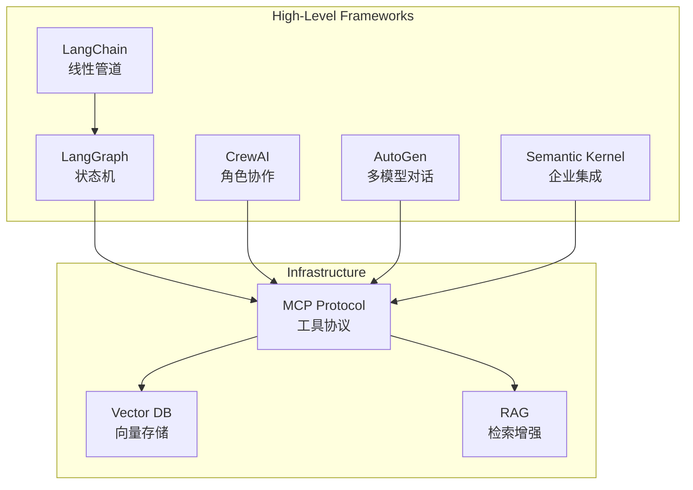
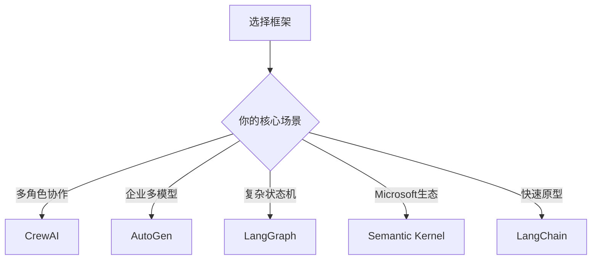
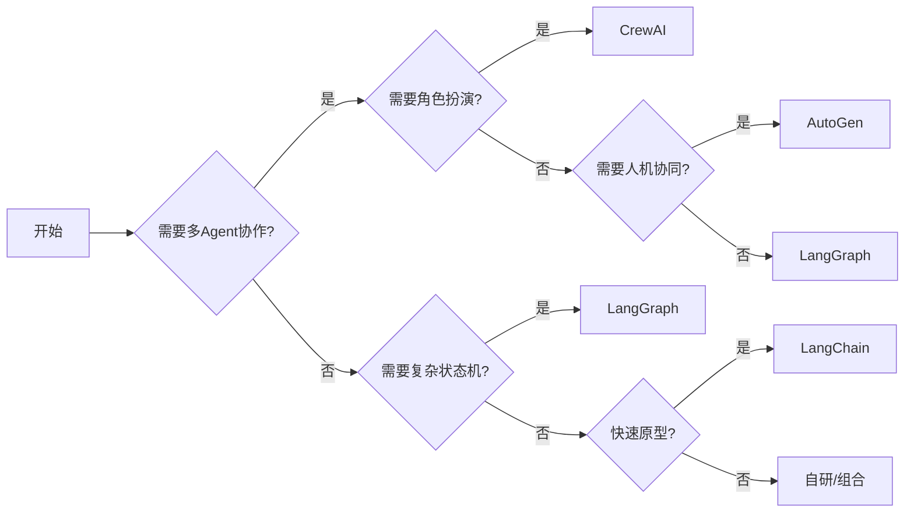

# Agent 框架全景对比 2026

> 2026 年 Agent 开发框架竞争格局深度分析

---

## 一、框架生态图



---

## 二、核心框架对比

### LangChain vs LangGraph

| 维度 | LangChain | LangGraph |
|------|-----------|-----------|
| **架构** | LCEL 有向无环图，线性管道 | 有向图，支持循环 |
| **状态管理** | 外部处理 | 内置状态机 |
| **Checkpointing** | 需额外实现 | 内置支持 |
| **适用场景** | 简单 RAG、Chatbot | 复杂工作流、长时任务 |
| **学习曲线** | 低 | 中等 |

**关键洞察**：LangChain 适合快速原型，LangGraph 适合生产级复杂工作流。

### CrewAI vs AutoGen vs LangGraph



### CrewAI 核心机制

```python
# CrewAI 典型用法
from crewai import Agent, Task, Crew

researcher = Agent(
    role="研究员",
    goal="收集最新AI技术动态",
    backstory="资深科技分析师"
)

task = Task(description="分析LangChain最新更新", agent=researcher)
crew = Crew(agents=[researcher], tasks=[task])
crew.kickoff()
```

**优势**：
- 角色设计直观，符合人类组织思维
- 支持 Sequential 和 Hierarchical 两种执行模式
- 上手快，社区活跃

**劣势**：
- 状态管理依赖外部
- 复杂逻辑需要自行封装

### AutoGen 核心机制

```python
# AutoGen 群聊模式
from autogen import GroupChat, Agent

assistant = Agent(name="Assistant", llm_config=...)
critic = Agent(name="Critic", llm_config=...)

group_chat = GroupChat(agents=[assistant, critic], messages=[])
```

**优势**：
- Microsoft 企业级支持
- 原生多模型协作
- 人机协同开箱即用

**劣势**：
- 配置复杂度高
- 学习曲线陡峭

---

## 三、多框架横评

| 框架 | 多Agent | 状态管理 | Checkpoint | 企业支持 | 学习曲线 |
|------|---------|---------|-----------|---------|---------|
| LangChain | ❌ 需自行实现 | ❌ | ❌ | ✅ LangChain团队 | 低 |
| LangGraph | ❌ | ✅ 内置 | ✅ | ✅ | 中 |
| CrewAI | ✅ | ❌ | ❌ | ❌ | 低 |
| AutoGen | ✅ | ❌ | ❌ | ✅ Microsoft | 中 |
| Semantic Kernel | 有限 | 有限 | ❌ | ✅ Microsoft | 低 |

---

## 四、选型决策树



---

## 五、2026 新兴框架

### 值得关注的框架

| 框架 | 特点 | 适用场景 |
|------|------|---------|
| **Mastra** | TypeScript 原生，时序工作流 | 前端团队 |
| **DeerFlow** | 简洁，多Agent编排 | 快速构建原型 |
| **Agno** | 轻量级，Python优先 | 嵌入式Agent |
| **OpenAgents** | 通用化，开源生态 | 开放平台 |

---

## 六、框架趋势观察

1. **MCP 协议统一工具层**：未来 1-2 年，MCP 可能成为 Agent 工具调用的事实标准
2. **Checkpointing 成为标配**：LangGraph 的内置状态持久化被其他框架逐步借鉴
3. **多Agent从实验到生产**：CrewAI 和 AutoGen 在企业场景快速落地
4. **TypeScript 框架崛起**：Mastra 等 TypeScript 原生框架获得前端开发者青睐

---

## 七、参考资料

- [LangChain vs LangGraph: Which AI Agent Framework Wins in 2026](https://www.folio3.ai/blog/langchain-vs-langgraph-ai-agent-framework/)
- [Comprehensive comparison of every AI agent framework in 2026](https://www.reddit.com/r/LangChain/comments/1rnc2u9/comprehensive_comparison_of_every_ai_agent/)
- [Autogen vs CrewAI vs LangGraph 2026 Comparison Guide](https://python.plainenglish.io/autogen-vs-crewai-vs-langgraph-2026-comparison-guide-fd8490397977)

---

*最后更新：2026-03-21 | 由 OpenClaw 整理*
