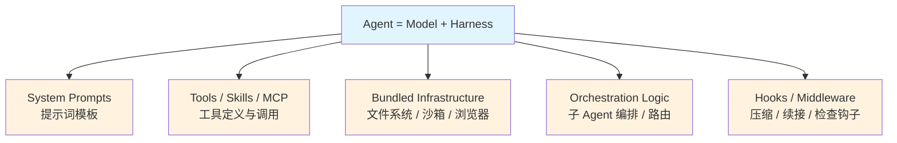
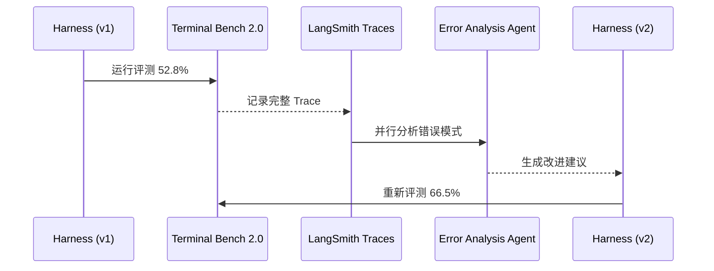

# Agent Harness Engineering：框架工程化实践

> *踩过的坑，不用你再踩一遍*

---

## 核心公式

```
Agent = Model + Harness
```

如果模型是引擎，那么 Harness 就是整辆车的底盘、悬挂、传动系统。模型决定上限，Harness 决定能否触及这个上限。

---

## 什么是 Harness

Harness（工具架）是**除了模型本身之外的一切**：代码、配置、执行逻辑，统称为"把模型智能转化为生产力"的工程层。

LangChain 在 [The Anatomy of an Agent Harness](https://blog.langchain.com/the-anatomy-of-an-agent-harness/) 中给出了最清晰的定义：

| 模型能做的 | 模型不能做的（由 Harness 补足） |
|-----------|-------------------------------|
| 接收文本/图片/音频输入 | 保持跨交互的持久状态 |
| 输出文本响应 | 执行代码 |
| 上下文窗口内的推理 | 访问实时知识 |
| | 初始化环境、安装依赖 |

Harness 的核心职责是**填补模型原生能力与实际任务需求之间的工程 Gap**。

### Harness 的组成部分



---

## Harness Engineering：调优的工程方法论

LangChain 在 [Improving Deep Agents with Harness Engineering](https://blog.langchain.com/improving-deep-agents-with-harness-engineering/) 中展示了他们如何只用调优 Harness，将 coding agent 在 Terminal Bench 2.0 上的得分从 **52.8% 提升到 66.5%**，而**模型本身完全没变**（固定使用 GPT-5.2-Codex）。

这意味着 Harness 的工程优化可以带来 **+13.7 分**的显著提升。

### 调优三板斧

LangChain 总结了 Harness 上最值得投入的三个可调维度：

```
System Prompt  → 指令与行为约束
Tools         → 工具选择与描述
Middleware    → Hook 逻辑（模型调用前后）
```

### 迭代改进流程

LangChain 的核心方法是一个**Trace 分析循环**：



关键洞察：**Harness 调优是一个 boosting 过程——每次修复的都是上一次犯的错**。Trace 是这个循环的核心驱动力，没有 Trace 就无法迭代。

---

## 实践要点

### 1. Trace 是基础投资

LangChain 的经验表明：没有 Trace，Harness 调优无从下手。Trace 记录了 Agent 每次工具调用的输入输出，是分析错误模式的唯一可靠来源。

### 2. Middleware/Hook 是最被低估的杠杆

在模型调用前后插入 Hook，可以实现：
- **压缩（Compaction）**：上下文快满时自动压缩历史
- **续接（Continuation）**：长任务中断后恢复
- **检查（Lint Checks）**：模型输出前做确定性校验

### 3. 工具描述的质量 > 工具数量

Harness Engineering 的经验：优化工具描述比增加工具数量更有效。同样的 10 个工具，描述清晰度不同，Agent 表现差异巨大。

### 4. 模型是 CPU，Harness 是 OS

这是 LangChain 提出的一个精妙类比：

| 计算机隐喻 | Agent 隐喻 |
|-----------|-----------|
| CPU | Model（推理引擎） |
| 操作系统 | Harness（资源管理与任务调度） |
| 应用程序 | Skills / Tools（具体能力） |
| 文件系统 | 持久化存储（向量数据库、记忆） |

---

## 为什么这对 Agent 开发重要

Harness Engineering 解决的是一个根本问题：**模型能力≠ Agent 表现**。

顶级模型 + 粗糙的 Harness = 低效、不稳定的 Agent  
中等模型 + 精细的 Harness = 高效、可靠的 Agent

这意味着 Agent 开发的核心技能正在从"选择模型"转向"工程化 Harness"——这是软件工程的范畴，不是模型训练的范畴。

---

## 延伸阅读

- [The Anatomy of an Agent Harness - LangChain Blog](https://blog.langchain.com/the-anatomy-of-an-agent-harness/)
- [Improving Deep Agents with Harness Engineering - LangChain Blog](https://blog.langchain.com/improving-deep-agents-with-harness-engineering/)
- [Terminal Bench 2.0 Leaderboard](https://www.tbench.ai/leaderboard/terminal-bench/2.0)

---

*本文由 AI 基于公开资讯内化整理 | 2026-03-22*
