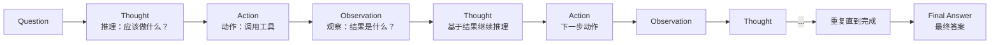
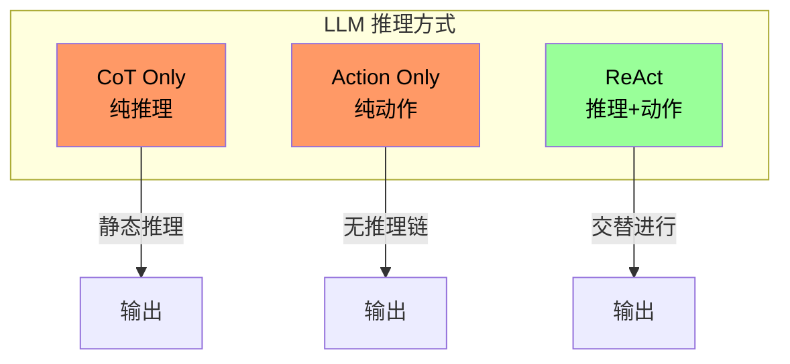
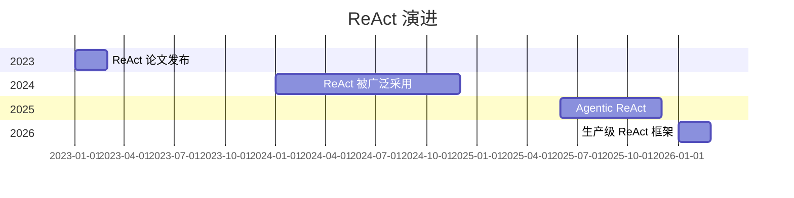

# ReAct 论文深度解读

> Synergizing Reasoning and Acting in Language Models
> Yao et al., ICLR 2023

---

## 一、论文核心贡献

### 问题背景

传统 LLM 的两种主流范式：

| 范式 | 特点 | 问题 |
|------|------|------|
| **Chain-of-Thought (CoT)** | 内部推理，不与外部交互 | 无法获取最新信息 |
| **Action Planning** | 生成动作并执行 | 缺少深层推理链 |

**ReAct 的核心思想**：让 LLM **交替生成推理轨迹（Thought）和动作（Action）**，在环境中观察结果，再继续推理。

---

## 二、ReAct 的核心流程



---

## 三、与其他范式的对比



| 范式 | 推理 | 动作 | 与环境交互 |
|------|------|------|-----------|
| **CoT** | ✅ 内部推理链 | ❌ | ❌ |
| **Action** | ❌ 直接动作 | ✅ | ✅ |
| **ReAct** | ✅ | ✅ | ✅ |

---

## 四、ReAct 的输入格式

### 提示模板

```markdown
Question: 输入问题

Thought 1: 推理过程
Action 1: 要执行的动作
Observation 1: 动作结果

Thought 2: 推理过程
Action 2: 要执行的动作
Observation 2: 动作结果

...

Thought N: 推理过程
Action N: 要执行的动作
Observation N: 动作结果

Final Answer: 最终答案
```

### 实际示例（HotpotQA 数据集）

```markdown
Question: 关于《泰坦尼克号》的电影，谁执导了 1997 年版本？

Thought 1: 我需要搜索关于 1997 年《泰坦尼克号》电影的信息
Action 1: Search[1997 Titanic movie director]
Observation 1: 詹姆斯·卡梅隆执导了 1997 年《泰坦尼克号》

Thought 2: 找到了答案，詹姆斯·卡梅隆是导演
Action 2: Finish[詹姆斯·卡梅隆]
Final Answer: 詹姆斯·卡梅隆
```

---

## 五、ReAct 的工具调用空间

ReAct 可以调用多种工具：

| 工具类型 | 示例 | 用途 |
|---------|------|------|
| **Search** | `Search[query]` | 搜索 Wikipedia 等 |
| **Lookup** | `Lookup[keyword]` | 在 Wikipedia 页面中查找 |
| **Finish** | `Finish[answer]` | 终止并返回答案 |

---

## 六、实验结果

### 任务类型

| 数据集 | 任务描述 | 特点 |
|------|---------|------|
| **HotpotQA** | 多跳问答 | 需要多条独立信息推理 |
| **FEVER** | 事实核查 | 需要验证声明 |
| **WikiActivity** | 目标导向问答 | 需要规划 |

### 关键发现

1. **ReAct 在 HotpotQA 上显著优于传统方法**
2. **结合 CoT (Thought without Action) 可进一步提升**
3. **人机协同**：人类可以介入修正推理链

### 消融实验结论

| 组件 | 影响 |
|------|------|
| Thought（推理） | ✅ 显著提升，让模型知道"为什么这么做" |
| Action（动作） | ✅ 必要，与环境交互获取真实信息 |
| Observation（观察） | ✅ 关键，推理链的反馈信号 |

---

## 七、ReAct 的局限性

| 局限性 | 说明 | 可能的解决方案 |
|--------|------|--------------|
| 推理链过长 | 多次 Tool Call 导致误差累积 | 限制最大步数 |
| 动作选择错误 | 可能选择错误工具 | 更精确的工具描述 |
| 环境反馈延迟 | 观察结果不准确时推理链断裂 | 添加自我检验 |
| 计算成本 | 多次 LLM 调用成本高 | 缓存 + 剪枝 |

---

## 八、ReAct 的后续演进

### 演进时间线



### 后续重要工作

| 工作 | 年份 | 改进点 |
|------|------|--------|
| **Plan-and-Solve** | 2023 | 先规划再执行 |
| **Self-RAG** | 2024 | 自己评估是否需要检索 |
| **Agentic RAG** | 2025 | Agent 动态决定何时检索 |
| **Active RAG** | 2026 | 主动判断检索时机 |

---

## 九、代码实现骨架

```python
def react_agent(question, tools, max_steps=6):
    """
    ReAct Agent 核心实现
    """
    context = []
    history = []

    for step in range(max_steps):
        # 1. Thought: 让 LLM 生成推理
        thought = llm.generate(
            prompt=f"Question: {question}\n"
                   f"Thought:",
            history=history
        )

        # 2. Action: 让 LLM 生成动作
        action = llm.generate(
            prompt=f"Question: {question}\n"
                   f"Thought: {thought}\n"
                   f"Action:",
            tools=tools
        )

        # 3. 执行动作
        if action.type == "Finish":
            return action.answer

        if action.type == "Search":
            result = tools["search"](action.query)
        elif action.type == "Lookup":
            result = tools["lookup"](action.query)

        # 4. Observation: 将结果加入历史
        history.append({
            "thought": thought,
            "action": str(action),
            "observation": result
        })

        context.append(result)

    return "达到最大步数限制"
```

---

## 十、原文信息

| 项目 | 内容 |
|------|------|
| 标题 | ReAct: Synergizing Reasoning and Acting in Language Models |
| 作者 | Yao et al. |
| 会议 | ICLR 2023 |
| 链接 | https://arxiv.org/abs/2210.03629 |
| 开源代码 | https://github.com/ysymyth/ReAct |

---

## 十一、核心要点总结

1. **ReAct = Reasoning + Acting**，交替进行，循环迭代
2. **Thought 提供了推理的可解释性**，让人类能看到 Agent 怎么想的
3. **Observation 是反馈信号**，让推理链能够根据真实结果调整
4. **适合需要外部知识的多跳问题**，不适合纯数学或纯逻辑问题
5. **是现代 Agent 设计模式（如 Plan-Execute、Reflection）的基石**

---

*最后更新：2026-03-21 | 由 OpenClaw 整理*
