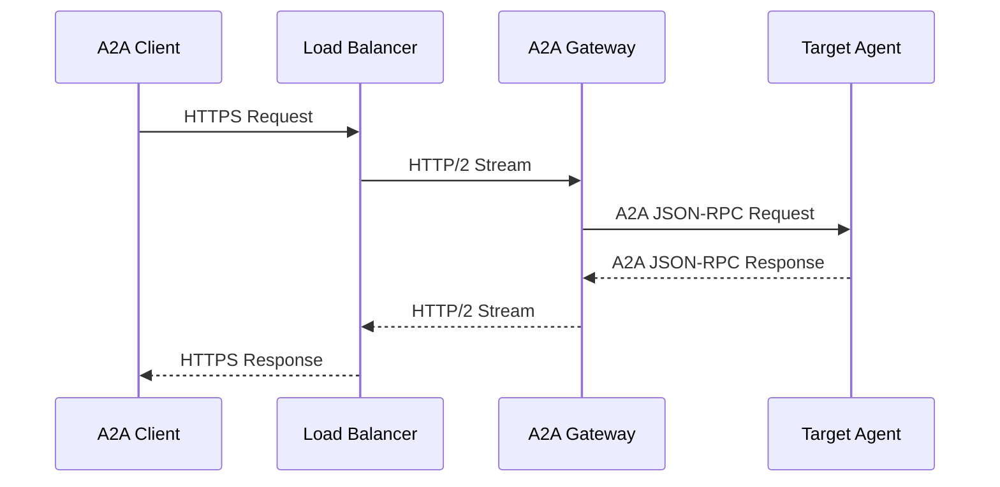
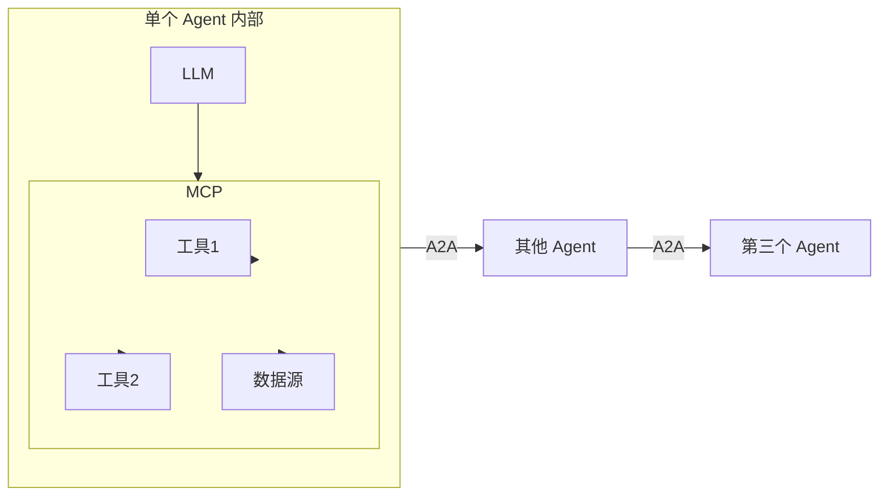

# A2A Protocol v1.0 生产级解析：150+组织采纳的证据与工程现实

## 核心结论

A2A Protocol 从概念到生产，用了不到一年。150+ 组织支持、22k GitHub Stars、三大云厂商（Google / Microsoft / AWS）原生嵌入、5 种语言 SDK——这不是早期采用，这是企业级采纳。但采纳不等于好用：Signed Agent Cards 解决了跨组织身份信任问题，Multi-tenancy 解决了单端点多租户问题，而 Web-aligned architecture 把运维团队熟悉的 HTTP 基础设施直接复用到了 Agent 通信层。这是本篇文章要回答的问题：v1.0 具体解决了什么工程问题？生产证据说明了什么？

---

## Agent 互操作为什么是 2026 年的刚需

在 2026 年，每个企业级 SaaS 都有 Agent：CRM Agent、客服 Agent、代码审查 Agent、数据分析 Agent。这些 Agent 在各自领域内表现不错，但跨系统协作时寸步难行——每个 Agent 都用自己的接口，自己的上下文格式，自己的通信协议。

当 Agent 数量从 1 个增长到 10 个、100 个时，Agent 内部的工具调用（Tool Use）已经被 MCP 标准化了，但 Agent 之间的通信（Agent-to-Agent）仍是孤岛。企业的真实需求是：**我买了 ServiceNow 的 IT Agent，能不能让它直接和 Salesforce 的 CRM Agent 通信，而不需要为每一对集成写定制代码？**

这个需求催生了 A2A（Agent-to-Agent）Protocol。Google 于 2025 年 4 月发布，2026 年 4 月 9 日迎来一周年和 v1.0 稳定版。

---

## A2A v1.0 解决了什么工程问题

### 跨版本兼容：AgentCard 的双向兼容机制

v0.3 到 v1.0 最大的工程挑战是迁移。生产环境中，不是所有 Agent 都会同时升级。v1.0 的解决方案是 **AgentCard 同时支持 v0.3 和 v1.0 协议行为**：

```json
{
  "name": "customer-service-agent",
  "version": "1.0",
  "capabilities": {
    "v03Protocol": true,
    "v1Protocol": true
  },
  "skills": [...]
}
```

这使得客户端可以渐进式迁移——先升级一部分 Agent，再逐步扩展，而不是一次性的硬切换。这个设计参考了 HTTP/1.1 到 HTTP/2 的平滑过渡思路。

### Signed Agent Cards：跨组织身份验证

这是 v1.0 最重要的企业级功能，解决了"我怎么知道对方 Agent 是谁"的问题。

Agent Card 是每个 A2A Agent 的元数据声明（能力、技能、端点），但 v0.3 时代的 Agent Card 是纯文本的——谁都可以伪造一个"银行 Agent"来骗取敏感数据。

v1.0 引入了 **JWS（JSON Web Signature）签名的 Agent Cards**：

```json
{
  "alg": "RS256",
  "typ": "JWT"
}
{
  "name": "payments-agent",
  "issuer": "cn=acme-bank,ou=finance",
  "capabilities": {...},
  "skills": [...]
}
}
[signature]
```

签名基于发起组织的私钥，接收方通过公钥验证。这套机制直接复用了 Web PKI 的信任链思维，任何已有 CA 基础设施的企业可以直接将 A2A 身份纳入现有信任体系。

> **工程建议**：在选择 A2A Partner 时，第一步检查 Agent Card 是否经过签名。未签名的 Agent Card 仅适合内部可信网络，跨组织交互必须要求 JWS 签名验证。

### 企业级 Multi-tenancy：单端点多租户

v0.3 的 Agent 通常是单租户部署——一个 Agent 实例对应一个端点。在大型企业，这意味着管理成本线性增长：100 个租户就要维护 100 个 Agent 实例。

v1.0 通过 **Multi-tenancy 支持**允许单端点托管多个 Agent 实例，通过租户隔离和访问控制实现集中管理。这对于云服务商和企业内部平台团队尤为重要——一个 A2A 网关可以统一代理所有租户的 Agent 通信。

### Multi-protocol Bindings：灵活传输层

v1.0 明确支持多种传输协议绑定：

| 协议 | 适用场景 | 复杂度 |
|------|---------|--------|
| JSON + HTTP | 通用场景，最低门槛，单请求即可开始 | ⭐ |
| gRPC | 高性能、低延迟场景，支持双向流 | ⭐⭐⭐ |
| JSON-RPC | 轻量级，对接现有 RPC 基础设施 | ⭐⭐ |

Multi-protocol 支持意味着企业不需要改变现有基础设施就能接入 A2A——已经在用 gRPC 的团队继续用 gRPC，只是把 A2A 作为上层编排层。

### Web-aligned Architecture：复用现有 Web 基础设施

这是 v1.0 架构层面的核心设计决策：**把 HTTP/Web 架构原则引入 Agent 通信层**。

具体体现在三个方面：
- **无状态交互**：每个请求包含完整上下文，支持水平扩展和负载均衡
- **分层架构**：A2A 网关可以叠加在现有 API Gateway 之上，复用鉴权、限流、监控
- **标准协议绑定**：HTTP/2、WebSocket 兼容，可直接使用现有 LB（Load Balancer）和 WAF



这个架构的实际意义是：**运维团队不需要学习任何新工具**。已有的 Nginx/HAProxy/AWS ALB 配置经验，直接复用到 A2A 流量管理。

---

## 生产证据：数字说明了什么

### 生态规模数据

| 指标 | 数值 | 意义 |
|------|------|------|
| 支持组织数 | **150+** | 从 2025 年的 50+ 增长到 150+，年化增长 200% |
| GitHub Stars | **22,000+** | 超过绝大多数企业级开源项目 |
| SDK 语言 | **5 种**（Python、JS/TS、Java、Go、.NET） | 覆盖主流企业技术栈 |
| 技术指导委员会 | **8 家**（AWS、Cisco、Google、IBM、Microsoft、Salesforce、SAP、ServiceNow） | 大厂背书，企业采购无忧 |

### 行业渗透

Linux Foundation 官方披露的生产部署覆盖：

- **供应链管理**：跨供应商 Agent 协调
- **金融服务**：跨机构合规数据传输
- **保险**：理赔流程自动化多 Agent 协作
- **IT 运维**：跨工具自动化修复

这些行业有个共同特点：**对事务完整性、审计追溯、跨组织信任有严格要求**。A2A 能渗透进这些行业，说明 Signed Agent Cards 和 Multi-tenancy 功能确实解决了实际问题。

### 云厂商原生支持

三大云厂商均已将 A2A 嵌入核心平台：

| 云厂商 | 集成产品 | 集成方式 |
|--------|---------|---------|
| **Microsoft** | Azure AI Foundry + Copilot Studio | 2025 年 5 月官宣，A2A 作为多 Agent 应用默认协议 |
| **AWS** | Amazon Bedrock AgentCore Runtime | 2025 年 11 月支持，A2A 作为跨 Agent 编排层 |
| **Google** | Vertex AI Agent Builder | 深度集成 A2A + MCP 双协议栈 |

> 笔者的判断：A2A 成为云厂商"默认选项"而非"可选插件"，这是企业采纳的最强信号。云厂商不会为一个没有客户需求的功能投入工程资源。

### Agent Payments Protocol (AP2) 延伸

A2A 社区同步推进了 **AP2（Agent Payments Protocol）**，专门解决 Agent 之间的支付和事务问题：

- 60+ 金融机构和支付服务商支持
- 支持强加密用户授权证明
- UCP（Google 主导的商务协议）已与 AP2 集成

这意味着 A2A 的野心不只是"通信协议"，而是"通信 + 事务协议"。未来 Agent 之间不只是传递消息，还会发生价值交换。

---

## A2A 与 MCP 的关系：一张图说清楚



**简言之**：MCP 在 Agent 内部连接 LLM 与工具，A2A 在 Agent 之间连接不同 Agent 的通信层。两者互补，不是竞争关系。

**实际工程选型建议**：
- 需要 LLM 调用外部工具（数据库、API、文件系统）→ 用 MCP
- 需要两个 Agent 协作完成复杂任务（分工、状态同步、委托）→ 用 A2A
- 生产多 Agent 系统 → MCP + A2A 叠加使用

---

## 已知局限与未解决问题

A2A v1.0 解决了通信层的核心问题，但以下问题仍未解决：

### 1. Agent 行为审计尚无标准

跨组织 A2A 通信会产生大量交互日志，但 v1.0 规范中没有定义统一的审计格式。每个企业仍在用各自的日志系统做审计，跨组织追溯困难。

**工程建议**：在 A2A 网关层强制写入结构化审计日志，推荐字段：`timestamp、src_agent、dst_agent、capability_invoked、outcome、latency_ms`。

### 2. 恶意 Agent 检测机制缺失

v1.0 的 Signed Agent Cards 解决了身份验证问题，但没有解决"这个签过名的 Agent 是否在执行恶意行为"的问题。已有 GitHub star 的项目不代表其 Agent 行为可信。

### 3. 事务原子性保障有限

A2A 定义了 Task 的状态机（submitted → working → completed/failed），但 **跨多个 Agent 的分布式事务**（即一个 Task 的完成依赖多个子 Task 的原子提交）仍需要应用层自己处理。AP2 解决了支付场景的事务问题，但通用场景的事务语义尚未定义。

### 4. 服务发现机制仍需完善

当前 Agent Card 需要预先配置或通过中心化注册发现，没有去中心化的动态服务发现方案（类似 DNS之于 HTTP）。对于大规模动态 Agent 集群，这是运维挑战。

---

## IETF 企业需求草案：社区在关注什么

值得关注的是，IETF 已出现针对 A2A 企业场景的草案（draft-zgsgl-dispatch-a2a-requirements-enterprise-01），由企业网络设备供应商（Cisco 参与）主导，关注：

- 企业防火墙/NAT 穿透场景
- 跨 ASD（Administrative Domain）信任模型
- 审计日志格式标准化

这说明 A2A 的下一阶段重点是企业网络深水区——不仅仅是协议规范，还有企业实际部署的网络环境适配。

---

## 一句话总结

> A2A v1.0：三大云厂商原生支持、150+ 组织生产部署——跨组织 Agent 互操作的事实标准已初步确立，Signed Agent Cards + Multi-tenancy 解决了企业采纳的最大障碍，但分布式事务审计和去中心化服务发现仍是待解工程问题。

---

## 参考文献

- [A2A Protocol v1.0 官方公告](https://a2a-protocol.org/latest/announcing-1.0/) — v1.0 完整功能说明，生产级标准
- [A2A 规范（GitHub）](https://github.com/a2aproject/A2A/blob/main/docs/specification.md) — Agent Card 签名、Multi-protocol 绑定技术细节
- [Linux Foundation：A2A 一周年公告（2026-04-09）](https://www.linuxfoundation.org/press/a2a-protocol-surpasses-150-organizations-lands-in-major-cloud-platforms-and-sees-enterprise-production-use-in-first-year) — 150+ 组织、22k stars、AP2 等关键数据
- [A2A Protocol 超 150 家组织：企业云平台全面采用](https://ground.news/article/a2a-protocol-surpasses-150-organizations-lands-in-major-cloud-platforms-and-sees-enterprise-production-use-in-first-year) — 跨行业生产部署覆盖
- [IETF draft：Enterprise A2A Requirements](https://datatracker.ietf.org/doc/draft-zgsgl-dispatch-a2a-requirements-enterprise/) — 企业网络深水区需求草案
- [Zuplo：A2A API Gateway 视角](https://zuplo.com/learning-center/agent-to-agent-a2a-protocol-guide/) — A2A 作为 API Gateway 治理对象的技术分析
