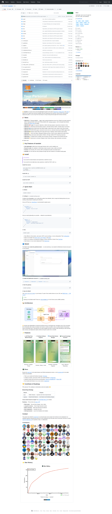

# Nanobot：4K 行代码的个人 AI Agent，可以塞进脑子里的框架

> 来源：[HKUDS/Nanobot](https://github.com/HKUDS/Nanobot)
> Stars：41,700+（2026-05-20）
> 语言：Python（≥3.11）
> 标签：`personal-agent` `lightweight` `multi-provider` `mcp` `memory`

---

## 核心命题

大多数 Agent 框架面临一个根本矛盾：要么轻量到无法扩展（Codex CLI），要么重到需要一本手册才能跑起来（LangGraph/AutoGen）。Nanobot 试图回答一个不同的问题——**如果一个 Agent 框架足够小，小到可以让人在一下午读完所有核心代码，它还能生产级别可用吗？**

答案是 HKUDS（HKU Data Intelligence Lab）交出的 41,700+ stars 的答卷。



---

## 一、4K 行代码的 Agent 核心是什么概念

Nanobot 标榜的核心代码约 4,000 行——比 OpenClaw 的核心小一个数量级。这不是修辞，是工程现实：

- **一个下午能读完**：代码结构扁平，没有 20 层抽象
- **可以 fork 后直接改**：不像某些框架，改一行配置要翻三个目录
- **出了问题能 debug**：没有黑盒黑魔法，线索都在代码里

> "~90% of an OpenClaw-style core in a fraction of the size" — 社区评价

这不是说 OpenClaw 不好，而是说 Nanobot 选择了一条不同的路：**用更小的 footprint 换一个更可读的代码库**。

---

## 二、20+ LLM Providers：为什么这很重要

Nanobot 支持的模型列表是这份推荐最有说服力的部分：

```
OpenAI · Anthropic · DeepSeek V4 · Kimi K2.6 · Qwen · GLM · MiniMax
Moonshot · Gemini · Mistral · vLLM · Ollama · LM Studio
GitHub Copilot (GPT-5/o-series) · OpenRouter · Azure OpenAI
VolcEngine · StepFun · MiMo · Hugging Face
```

2026 年的现实是：**没有哪个模型永远最优**。DeepSeek V4 在某些任务上比 GPT-4o 便宜 10 倍且效果相当；Kimi K2.6 在中文场景有天然优势；一个认真做的 Agent 项目应该能在这些选项之间切换，而不是锁死在某一个。

Nanobot 的做法是：把 20+ provider 的接入做成统一的抽象层，换 provider 只需要改一行配置。这比"每个模型写一套 prompt 工程"的做法聪明得多。

---

## 三、14+  Channels：消息通道即生态

```
Telegram · Discord · Slack · Feishu · WeChat · WeCom
DingTalk · QQ · WhatsApp · Matrix · MS Teams
Email · Web UI · OpenAI-compatible API · WebSocket
```

Channels 是 Nanobot 的差异化所在。大多数 Agent 框架把"接入哪个聊天平台"当成额外功能，Nanobot 把这个做成了一等公民。

对于需要**跨平台部署**的场景——比如同时跑一个 Telegram bot 和一个 Web UI——这个设计很实用。但笔者也要指出：14 个 channels 意味着大量的适配代码，"轻量"这个标签在 channel 数量面前要打个折扣。

---

## 四、MCP 支持：工具层的正确姿势

Nanobot 对 MCP（Model Context Protocol）的支持方式是：

- **Tools**：MCP 工具作为 Agent 的能力扩展
- **Resources**：MCP 资源作为 Agent 的知识上下文
- **Prompts**：MCP prompts 作为 Agent 的提示模板

更重要的是，Nanobot 还带了一个内置的 **ClawHub skill**——可以安装其他 Agent skills。这意味着 Nanobot 不只是一个孤立的 Agent，而是一个可以通过 skill 扩展的**平台**。

> "MCP support for tools, resources, and prompts; ships with a built-in ClawHub skill for installable agent skills"

---

## 五、Dream Memory：两阶段记忆系统

Nanobot 的记忆系统叫 **Dream**，设计成两阶段：

1. **短期记忆**：当前会话内的上下文
2. **长期记忆**：持久化存储，跨会话保持

工程实现上：
- Session 写入是原子的（不会因为中途崩溃丢数据）
- 支持 mid-turn follow-ups（Agent 可以在回复中途追问）
- 用自然语言做 cron 定时任务

这解决了个人 Agent 的核心痛点之一：**周五晚上跑的任务，周一回来还在继续**，而不是重启后失忆。

---

## 六、安装与上手

```bash
# 推荐方式（uv）
uv tool install nanobot-ai
nanobot setup
nanobot start

# 或 pip
pip install nanobot-ai

# Docker
docker pull nanobot-ai/nanobot
docker run -it nanobot-ai/nanobot
```

setup 启动后是交互式向导：选 provider → 自动补全模型名 → 粘贴 API key → 完成。不需要查文档。

---

## 七、仓库结构

```
nanobot/
├── nanobot/          # 核心 Agent loop、providers、memory、channels
├── bridge/            # 协议桥（OpenAI-compatible API、WebSocket）
├── webui/             # 浏览器聊天界面（i18n、dark mode）
├── docs/              # provider/channel 指南
├── case/              # 示例 agents 和 skill 模板
├── tests/             # 测试（对"轻量"框架来说意外地全）
├── Dockerfile
├── docker-compose.yml
└── pyproject.toml
```

Clean layout + 生产级测试覆盖率，这在个人/小团队项目中不常见。

---

## 八、与 OpenClaw/C Claude Code 的定位差异

| 维度 | Nanobot | OpenClaw | Claude Code |
|------|---------|----------|-------------|
| **核心代码量** | ~4K 行 | 更大 | CLI，无法扩展 |
| **模型支持** | 20+ providers | 专注 Claude | 专注 GPT |
| **Channels** | 14+ | 通过 skill 扩展 | 无 |
| **上手门槛** | 配置向导 | 技术用户友好 | 非开发者难上手 |
| **可读性** | 高（可 fork） | 中 | N/A |
| **生产成熟度** | v0.1.5，快速迭代 | 成熟 | 成熟 |

---

## 延伸阅读

- [Hermes Agent Control Room：多 Agent 系统的控制平面设计范式](./shannhk-hermes-agent-control-room-380-stars-2026.md) — 同样是多 Agent 治理思路，Control Room 关注 Agent 之间的协作模式，Nanobot 关注单 Agent 的可扩展性
- [awesome-harness-engineering](../projects/ai-boost-awesome-harness-engineering-2026.md) — 包含 Personal Agent 相关模式的知识地图
