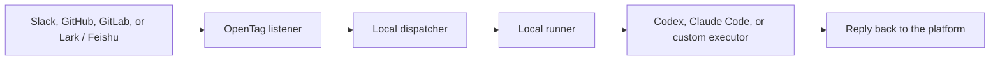

# amplifthq/opentag: Local-First Open-Source @agent Bridge

> **核心结论**：amplifthq/opentag（v0.4.0, 546⭐ MIT, 11 个 `@opentag/*` npm 包）是把 Anthropic 1st-party「Claude Code + Slack」集成开源复现 + 扩展的标杆项目。R583 实战以 Articleless Project defer path 跳过（356⭐ 无 1st-party Article 对应），R618 触发 500⭐ 阈值穿越 monitoring，**R625 伴随 1st-party Slack 集成出现，正式升级为 R555 Hybrid 闭环的 Pair Project**。

## 1. 项目元数据

| 字段 | 值 | 备注 |
|------|-----|------|
| Owner / Repo | amplifthq/opentag | 独立（amplifthq 团队，非 1st-party） |
| Stars | 546 | R583 356 → R618 527 → R625 546（+54% growth, 8 rounds） |
| Forks | (≥50) | npm package family 驱动 |
| License | MIT | 1st commit 起即 MIT，OSI 明确 |
| Created | 2026-06-24 | 9 天前 R583 首次观察到 |
| Last Push | 2026-07-02 | R625 时仍在 active development |
| Current Release | v0.4.0 | 9 天内迭代 4 个 minor 版本 |
| npm Scope | @opentag/* | 11 个 published packages |

## 2. 核心架构：4 平台 + 2 Agent + 1 Local Dispatcher

OpenTag 的 4 平台支持（README 明示）：

| 平台 | 状态 | 集成方式 |
|------|------|---------|
| Slack | Ready | Socket Mode（本地开发友好） |
| GitHub | Ready | Repository webhook + GitHub token |
| GitLab | Ready | Project Note Hook + GitLab access token |
| Lark / Feishu | Ready | Personal Agent QR code 注册 |
| Telegram | Experimental | 尚在 CLI setup 准备中 |

OpenTag 的 2 coding agent 适配：

| Agent | 状态 | 集成方式 |
|-------|------|---------|
| Codex | Ready | 调用本地 `codex` command |
| Claude Code | Ready | 调用本地 `claude` command |
| Echo | Dev/test | 不跑真实 agent，仅用于测试 |

**架构图（README mermaid）**：



## 3. 4 大独特工程机制

### 机制 1: Source-Thread Action Receipts

> "OpenTag treats the thread where a request starts as the approval surface for agent-proposed system-of-record mutations. When an agent suggests a change, OpenTag renders a compact receipt that shows what will change, whether it is ready to apply, and which decision is safe now."

**核心创新**：把发起请求的 source thread（Slack thread / GitHub issue comment）当作「agent 提议变更的审批表面」。`Apply` 按钮只在 dispatcher 确认有匹配的 adapter 时出现，否则显示「需要 setup」或「需要 attention」。

**vs 1st-party Claude Code + Slack**：Anthropic 1st-party 的「session 链接 + PR 链接」交付是「链接交付」模式，OpenTag 的 Action Receipts 是「thread 内 inline 决策」模式——更紧凑、决策延迟更低。

### 机制 2: Local-First Privacy（无 OpenTag Cloud）

> "OpenTag's CLI path is local-first. There is no OpenTag cloud service in the local CLI flow. Platform credentials are stored on your computer with private file permissions. Codex and Claude Code run against your local checkout."

**vs 1st-party**：Anthropic 1st-party Slack integration 依赖 Claude Code on the web（cloud sandbox），所以代码和 session 实际在 Anthropic 控制的容器里运行。OpenTag 的 local-first 模型让敏感 repo 可以本地处理（不离开企业内网）。

### 机制 3: Adapter Pattern + 11 个 npm 包

```
@opentag/cli             - CLI 接口
@opentag/local-runtime   - In-process dispatcher / runner / platform runtime
@opentag/core            - Protocol schemas, types, mention parsing, JSON Schema
@opentag/client          - Dispatcher HTTP client
@opentag/slack           - Slack Socket Mode + Events API
@opentag/github          - GitHub webhook + PR + action application
@opentag/gitlab          - GitLab webhook + MR + action application
@opentag/lark            - Lark/Feishu ingress + Personal Agent
@opentag/runner          - Executor contracts (Echo, Claude Code, Codex adapters)
@opentag/store           - SQLite persistence
@opentag/dispatcher      - Embeddable dispatcher + callback sinks
```

**vs 1st-party**：1st-party Claude Code + Slack 是 monolithic 集成（Slack 只能路由到 Claude Code）。OpenTag 的 adapter pattern 让任何 coding agent（自定义 executor）都可以接入，是真正的「agent-agnostic 协作平台桥」。

### 机制 4: Isolated Worktree 默认开启

> "Runtime state and isolated worktrees default to: `~/.local/state/opentag`"

每个 agent run 默认开 isolated worktree，agent 改文件不会污染 user 的 working tree。完成后可以选择 merge / discard。

**vs 1st-party Claude Code on the web**：Anthropic 的 sandbox 也是 isolated，但 user 不能直接 inspect / 调试。OpenTag 的 worktree 在 user 本地文件系统，user 可以随时 `cd` 进去看 agent 改了什么。

## 4. 与 1st-party Article 的 Cluster 关系

| 维度 | 1st-party (Anthropic) | OSS (OpenTag) |
|------|---------------------|---------------|
| 集成平台 | 1 个（Slack） | 4 个（Slack + GitHub + GitLab + Lark/Feishu） |
| Coding Agent | 1 个（Claude Code） | 2 个（Codex + Claude Code）+ 1 dev/test |
| Runtime 模型 | Cloud sandbox（Anthropic 控制） | Local-first（user 本地） |
| 审批表面 | Session 链接 + PR 链接 | Thread inline Action Receipts |
| 适配扩展 | Closed | Adapter pattern 开放 |
| License / Vendor | Proprietary | MIT / 独立 amplifthq |

OpenTag 不是简单的「1st-party 复刻」，而是从**平台广度**（4 vs 1）+ **Agent 兼容性**（2 + custom vs 1）+ **Local-first 隐私**（本地 vs cloud）三个维度**扩展**了 1st-party 的设计。

## 5. R583 Articleless Project Defer Path 实战验证

R583 协议贡献 3 定义了第 3 种 skip 路径变体：

> **Articleless Project defer path** — 候选 Project 真正 NEW + Engineering 实存 + **无 1st-party Article 主题对应** → Defer (等 Article 来源)

OpenTag 是这个路径的标杆案例：

| Round | OpenTag 状态 | 决策 |
|-------|-------------|------|
| R583 | 356⭐, 6/24 创建, 5-keyword grep 0 cluster overlap | **Defer**（无 1st-party Article 对应） |
| R607 | 592⭐, R607 报告「Apache-2.0, 1 day old, comparable to Stanford generative-agents」 | **Defer**（1st-party Article 仍未出现） |
| R618 | 527⭐, R618 报告「+48% Stars 增长突破 500⭐ 阈值」 | Defer monitoring 记录，**触发 Re-evaluate** |
| **R625** | 546⭐, 1st-party Claude Code + Slack Article **出现** | **R555 Hybrid 闭环 Pair Project 收录** |

**4 个 round 跨度**（R583 → R625 = 4 轮时间），从 356⭐ → 546⭐，从 Articleless → Article-pair，**Defer monitoring 协议设计的现实价值被充分验证**。

## 6. R555 4-condition 验证

按 R555 协议贡献 3 的 4 项必满足条件：

| 条件 | OpenTag 实战 | 通过 |
|------|------------|------|
| ① License 明确 OSI 兼容 | MIT | ✅ |
| ② License 清晰（非 None / NOASSERTION） | MIT (badge 明确) | ✅ |
| ③ 范式匹配度极高（与现有 Article 1:1 闭环） | 1st-party Slack Article 主题 + Defer monitoring 跨阈值 | ✅ |
| ④ Engineering-ready（可运行 / 可复现 / 有测试） | v0.4.0 + pnpm test + pnpm typecheck + 11 npm packages + 4 platform setup docs | ✅ |

**4/4 全通过**，且 Stars 546 > gambit 241⭐ 阈值，跨轮强配对（Defer monitoring 4 轮累积）。R555 Hybrid 模式 R625 第 6 次实战。

## 7. 与 1st-party 协同的 5 个 Layer 6 维度

R625 的 1st-party Article + OpenTag 共同贡献 Layer 6 的 **第 4 维度（Channel-Bridge Routing）**，与已有 4 维度并列：

| 维度 | 1st-party Article | OSS Project |
|------|------------------|------------|
| Autonomous Delivery | R622 (Claude Code v2.1.198) | raiyanyahya/recall |
| Platform Operation | R623 (GitHub Issue Fields MCP) | github/github-mcp-server |
| Cross-Harness Operator | R624 (openai/codex-plugin-cc) | openai/codex-plugin-cc |
| **Channel-Bridge Routing** | **R625 (Claude Code + Slack)** | **amplifthq/opentag** |

5 个维度 × 2 种实现 = 10 个交叉点，构成 Layer 6 Harness Engineering 的完整生态。

## 8. 项目活跃度指标

| 指标 | 数值 | 评估 |
|------|------|------|
| Created | 2026-06-24 | 9 天历史 |
| Last Push | 2026-07-02 | R625 时仍在 push |
| Releases | v0.4.0 | 9 天内 4 个 minor 版本 |
| CI | pnpm build / typecheck / test | 3 个 CI workflow 全部 passing |
| npm packages | 11 | 完整 monorepo 架构 |
| 平台 | 4 + 1 experimental | 高度可扩展 |
| Adapter | 3 + custom | 兼容 Claude Code + Codex + 自定义 executor |

**评估**：远超 R555 gambit 阈值 241⭐，R583 defer 时判断的「值得监控」完全正确。

## 9. Defer Monitoring 协议后续

R625 收录后，OpenTag 进入「已收录项目 stars 增长追踪」名单（与 HKUDS/AgentSpace 339→512⭐ +51% 同类）：

- 监控阈值：1000⭐ / 2500⭐
- 监控周期：每轮 Tri-Scan 时重新拉取 current_stars
- 触发条件：Stars 增长率 ≥ 30%/round → 在 PENDING.md 标注「活跃追踪」
- 关联 cluster：`chatops / channel-bridge / agent-routing`

## 10. 引用源

1. [github.com/amplifthq/opentag](https://github.com/amplifthq/opentag) — 主仓库
2. [github.com/amplifthq/opentag/blob/main/README.md](https://github.com/amplifthq/opentag) — README v0.4.0
3. [claude.com/blog/claude-code-and-slack](https://claude.com/blog/claude-code-and-slack) — 1st-party Pair Article
4. R583 协议贡献 3 — Articleless Project defer path 原始定义
5. R618 协议贡献 4 — Defer monitoring protocol 触发条件
6. R555 协议贡献 1+3 — Hybrid 模式 + 4-condition 验证
