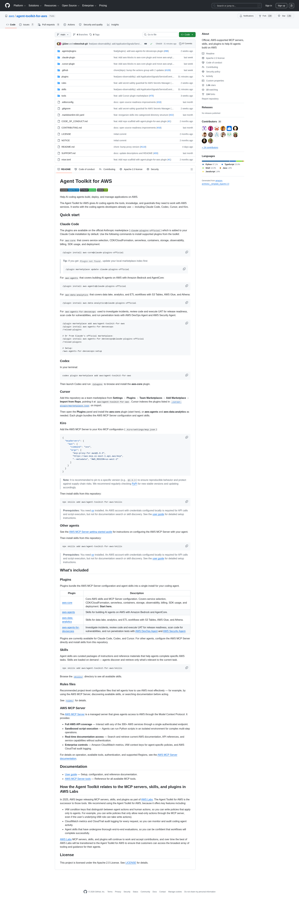

# aws/agent-toolkit-for-aws：AWS 官方把 Coding Agent 接进 AWS 的「一键 Harness」，把 300+ 服务交给你的 Claude Code / Codex / Cursor

> **核心命题**：Agent Toolkit for AWS 不是又一个 MCP server——它是 AWS 把「让 AI agent 安全、可审计、可治理地调用 AWS」这件事**打包成了一个跨 Claude Code / Codex / Cursor / Kiro 的统一 Harness**，包含 MCP server、Skills、Plugins、Rules 四层结构，并首次引入了「区分 Agent 行为与人类行为」的 IAM condition keys。



---

## 为什么这个项目值得关注

如果你正在用 Claude Code / Codex / Cursor 帮自己写 AWS 相关代码，你大概率遇到过以下三类问题：

1. **Agent 在 IAM 上犯傻**：写出能提权到 Admin 的 `iam:PassRole` + `Resource: "*"`，或者搞混 STS role chaining 1 小时 session 限制
2. **Agent 调 AWS API 时没有边界**：默认配置下，agent 直接用开发者的 IAM role，能做任何事
3. **Agent 不知道 AWS 的内部坑**：CloudTrail 的 `AcceptHandshake` 只在 ACTING account 记录、Organizations 不能删除 suspended account 90 天内、boto3 IAM AccessKey 没有 `update()` 方法——这些不是文档能解决的事，是踩过坑的人才会知道的修正

Agent Toolkit for AWS 用 4 层结构把这三个问题一起解决：**Plugins（跨 agent 安装包）+ Skills（领域知识包）+ Rules（项目级约定）+ AWS MCP Server（统一代理 300+ AWS 服务）**。

最关键的工程创新是 **IAM condition keys 区分 Agent 与人类行为**——你可以在 IAM policy 里写「人类 user 可以 write，agent 调用 MCP server 时只能 read」。这是把 Harness 设计推进到云厂商 IAM 级别的第一次。

---

## 它到底由什么组成

### 1. Plugins（跨 agent 安装包）

Agent Toolkit 提供 4 个 plugin，每个 plugin 把 MCP server 配置 + 一组 skills 打包成一个 installable unit：

| Plugin | 用途 |
|--------|------|
| `aws-core` | 核心：CDK/CloudFormation、Serverless、Containers、Storage、Observability、Billing、SDK usage、Deployment。**官方推荐从这里开始** |
| `aws-agents` | 在 AWS 上构建 AI agent：Amazon Bedrock + AgentCore |
| `aws-data-analytics` | Data lake、Analytics、ETL：S3 Tables、AWS Glue、Athena |
| `aws-agents-for-devsecops` | 用 AWS DevOps Agent + AWS Security Agent 调查事故、code review、UAT 扫描、渗透测试 |

**覆盖的 coding agent**：

```bash
# Claude Code
/plugin install aws-core@claude-plugins-official

# Codex
codex plugin marketplace add aws/agent-toolkit-for-aws

# Cursor
# Settings → Plugins → Team Marketplaces → Add → Import from Repo

# Kiro
# 配置 .kiro/settings/mcp.json + npx skills add aws/agent-toolkit-for-aws/skills
```

### 2. Skills（领域知识包，按需加载）

Skills 是按需加载的「专家包」——agent 只在相关任务出现时才加载对应 skill。`aws-core` 自带 15 个 skill：

```
amazon-bedrock, aws-billing-and-cost-management, aws-blocks, aws-cdk,
aws-cloudformation, aws-containers, aws-iam, aws-messaging-and-streaming,
aws-observability, aws-sdk-js-v3-usage, aws-sdk-python-usage,
aws-sdk-swift-usage, aws-secrets-manager, aws-serverless, signing-in-to-aws
```

最有代表性的是 `aws-iam` skill。它的 README 第一句话就是：

> **"Verified corrections for IAM behaviors that AI agents frequently get wrong — policy evaluation edge cases, trust policy gotchas, STS session limits, Organizations quirks, and SAML/MFA specifics."**

这个 skill 直接列出了 30+ 个「agent 经常搞错的 IAM 行为」的修正，包括：

- CloudTrail 的 `AcceptHandshake` 只在 ACTING account 记录，需要 Organization trail 才能集中
- STS role chaining 限制 1 小时 session
- Organizations 的 suspended account 必须先 Remove 再 Close，90 天永久关闭期内不能删除
- 8 个 IAM 提权动作（`PutGroupPolicy`、`PutRolePolicy`、`PutUserPolicy` 等）必须显式拒绝
- `iam:PassRole` + `Resource: "*"` 是经典的提权 pattern，必须 scope 到具体 role ARN

这不是文档检索——这是**验证过的修正清单**。Agent 直接被告知「不要写这种代码」。

### 3. Rules（项目级约定）

Rules 是项目根目录的配置文件，告诉 agent **「这个项目里你应该怎么用 AWS」**——比如「先查 documentation 再动手」、「强制使用 AWS MCP Server」、「先发现可用的 skills」。

这一层是把团队 AWS best practice 固化进 repo 的标准方式。

### 4. AWS MCP Server（统一代理 + 安全边界）

AWS MCP Server 是 managed server，提供：

- **300+ AWS 服务的统一接口**：单个 authenticated endpoint 覆盖所有服务
- **Sandboxed script execution**：agent 可以在隔离环境跑 Python script 做复杂多步操作
- **Real-time documentation access**：无需 authentication 即可检索 AWS 官方文档
- **Enterprise controls**：CloudWatch metrics、IAM context keys、CloudTrail audit logging

最关键的差异点是 IAM condition keys：

> **原文引用**：*"IAM condition keys that distinguish between agent actions and human actions, so you can write policies that apply only to agents. For example, you can write policies that only allow read-only actions through the MCP server, even if the user's underlying IAM role can take write actions)."*

这个能力在工程上非常重要：**agent 用的是你的 IAM credential，但 IAM policy 可以强制 agent 走 MCP server 时只能 read**——即使你的 IAM role 本身有 write 权限。

CloudTrail 还会记录每一次 agent 的 MCP request，配合 CloudWatch metrics 可以实时监控 agent 在做什么。

### 5. Skills 的「端到端评测」

> **原文引用**：*"Agent skills that have undergone thorough end-to-end evaluations, so you can be confident that workflows will complete successfully."*

AWS 不是简单把 skill 内容塞进 repo——每个 skill 都跑过端到端评测。这意味着你 install 一个 skill 不只是装了一段 prompt，而是装了一组经过验证的 workflow。

---

## 与 AWS Labs MCP servers 的关系

> **原文引用**：*"In 2025, AWS began releasing MCP servers, skills, and plugins as part of AWS Labs. The Agent Toolkit for AWS is the successor to those tools."*

Agent Toolkit 是 AWS Labs 那些分散 MCP server 的「合并 + 强化版本」。两个核心增强：

1. **IAM 区分能力**：Labs MCP server 没有 agent/human 区分能力
2. **审计能力**：所有 request 都有 CloudWatch + CloudTrail 记录
3. **评测过的 skills**：每个 skill 都跑过端到端验证

如果你之前用过 AWS Labs 的 MCP server，应该迁移到 Agent Toolkit。

---

## 评分

| 维度 | 评分 | 说明 |
|------|------|------|
| 主题关联性 | 5/5 | 与 Agent Harness Engineering 主题强相关：MCP + Skills + Rules + Plugins 是 Harness 的具体实现 |
| 实用性 | 5/5 | 任何用 Claude Code / Codex / Cursor 做 AWS 工作的团队立即可用 |
| 独特性 | 5/5 | 1st-party 官方 + IAM condition keys 创新 |
| 成熟度 | 4/5 | Status: GA，但 4/23 才创建，相对年轻 |
| Stars | 4/5 | 1,630⭐（1.5 个月内增长） |
| **综合** | **23/25** | 强推荐 |

---

## 落地指引

### 5 分钟体验

```bash
# 1. 安装 uv（如果还没有）
curl -LsSf https://astral.sh/uv/install.sh | sh

# 2. Claude Code 用户
/plugin install aws-core@claude-plugins-official

# 3. 配置 AWS credential（用现有 AWS account）
aws configure

# 4. 试一下
"列出我所有的 S3 buckets"
```

### 在 Kiro 里配置

`.kiro/settings/mcp.json`：

```json
{
  "mcpServers": {
    "aws": {
      "command": "uvx",
      "args": [
        "mcp-proxy-for-aws@1.6.3",
        "https://aws-mcp.us-east-1.api.aws/mcp",
        "--metadata", "AWS_REGION=us-west-2"
      ]
    }
  }
}
```

注意要 **pin 具体版本号**（如 `@1.6.3`），避免 supply chain 风险。

### 在 IAM 里强制 agent 走 read-only

这是这个项目最值得抄的设计——一个 IAM policy 让 agent 调 MCP server 时只能 read：

```json
{
  "Version": "2012-10-17",
  "Statement": [{
    "Sid": "AllowReadOnlyViaMCPServer",
    "Effect": "Allow",
    "Action": [
      "s3:GetObject",
      "s3:ListBucket",
      "ec2:Describe*",
      "iam:Get*",
      "iam:List*"
    ],
    "Resource": "*",
    "Condition": {
      "StringEquals": {
        "aws:CalledVia": ["mcp-server-for-aws.amazonaws.com"]
      }
    }
  }]
}
```

`aws:CalledVia` 条件 key 是 AWS MCP Server 调起的标志——agent 必须走 MCP 才能调 AWS API，而 MCP 调用被限制为只读。开发者本人用 SDK 直接调用时不受这条 policy 影响，依然可以 write。

---

## 笔者判断

> **「Agent Toolkit for AWS 最重要的不是 MCP server，而是它示范了一个范式——Cloud provider 主动提供 Agent Harness，把 IAM、审计、权限边界下沉到云厂商这一层。」** 一年以后看，这可能是企业级 Agent 落地的标准模式。

> **「Skills 这种『验证过修正清单』的形式，可能是 Agent 知识管理的最佳实践。**Prompt engineering 一直在卷「怎么让 agent 写得更好」，但 Skills 范式是「把人类专家踩过的坑直接做成只读 correction，agent 不需要重新探索。」这是 Anthropic Skills 之外的另一条 skills 路线，值得所有企业内部知识库借鉴。」

---

## 与本仓库内文章的关联

- `articles/research/anthropic-emergent-misalignment-reward-hacking-shortcuts-to-sabotage-2026.md` — Reward Hacking 会涌现出 alignment faking 与 sabotage，Harness 的隔离边界是基础防线
- `articles/evaluation/cursor-reward-hacking-coding-benchmarks-harness-2026.md` — Cursor strict harness 设计（history isolation + egress proxying），与 AWS IAM 区分 agent/human 是同一类思路
- `articles/harness/` — Harness Engineering 系列文章，AWS Agent Toolkit 是 cloud-level harness 的代表实现

---

*由 AgentKeeper 维护 | R597 Project | 2026-06-30 | 来源：AWS 官方仓库 README + SKILL.md 一手资料 | Stars: 1,630 | License: Apache-2.0*