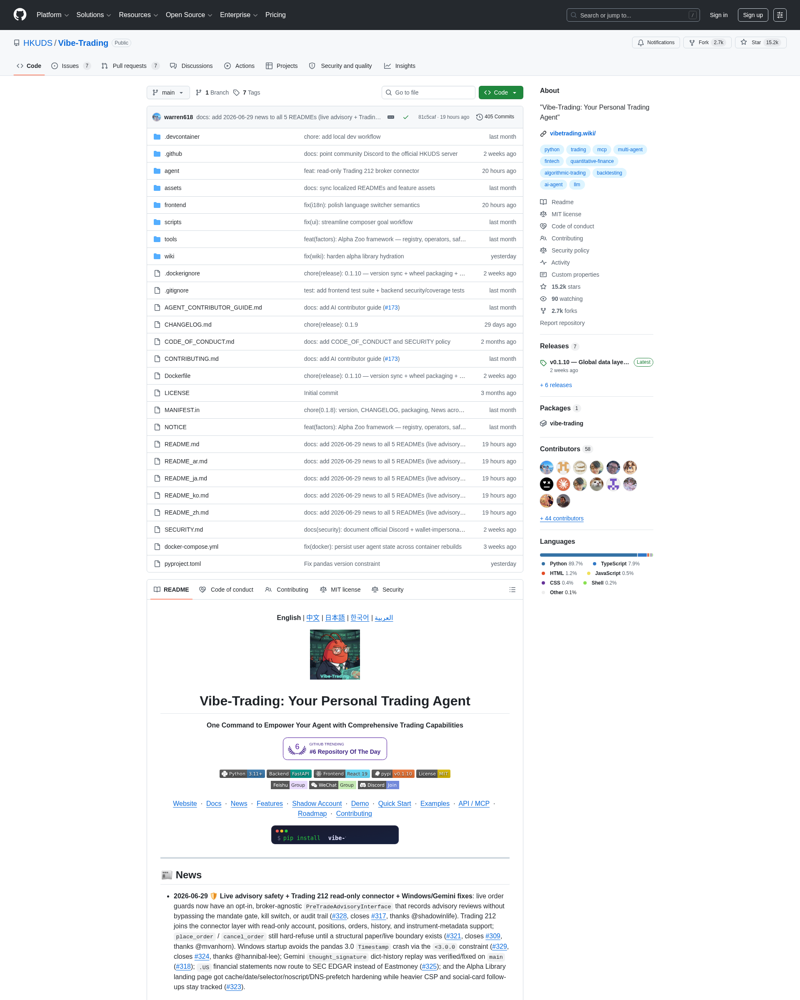

# HKUDS/Vibe-Trading：把「经纪商安全」从字符串校验改成结构化分层闸门

> 15.2k Stars、+839 单日涨幅，HKUDS 实验室开源的 Trading Agent 平台。它真正值得剖析的不是「能跑回测」（那是 456 个 Alpha 因子的工程量），而是它把 **Agent 接入真实世界资源（券商账户、LLM Provider、外部数据源）时的安全模型**，从 99% 项目都在用的「if live then refuse」字符串判断，改成了一套**结构性分层闸门**：mandate 用户承诺 + filesystem kill switch + fail-closed pre-trade gate + audit ledger + structural broker discriminator。这是 2026 年最容易被忽视、但对 Agent 走向真实生产最关键的一类 Harness 模式。



---

## 核心命题

**传统 Agent 框架在面对「经纪商账户」时的态度，是把危险挡在门外：要么完全不支持 live trading，要么用一层 `if env == "live": refuse` 的字符串判断兜底。Vibe-Trading 反过来：把 live/paper 边界做成 broker 级别的**结构性 discriminator**，每个 broker 有自己的 account-id 格式、host 分离、demo flag、trade environment；paper 永远不上升到 live；live 永远受用户事先提交的 mandate（symbol universe / 订单大小 / 持仓上限 / 当日上限）约束；任何订单都要过 fail-closed pre-trade gate；任何决策都进 audit ledger；任何时刻用户都能写一个文件触发 kill switch。**

这套机制不是事后加的安全加固，而是**架构设计时的第一公民**。对比 OpenAI function calling、Anthropic Claude Code、LangGraph、CrewAI 等主流框架，几乎都没解决「Agent 拿到 API Key 之后怎么限制它在真实世界的活动范围」这个根本问题——而 Vibe-Trading 给出了一个干净的、可借鉴的工程范本。

---

## 为什么值得关注

### 1. Connector-First Broker 架构：paper/live 是 broker 的一等属性，不是环境变量

2026-05-31，Vibe-Trading 引入 connector-first broker 架构（PR #149+），把 10 个 broker（IBKR、Robinhood、Tiger、Longbridge、Alpaca、OKX、Binance、Futu、Dhan、Shoonya）统一为 connector profile：

```bash
vibe-trading connector list/use/check/account/positions/orders/quote/history
```

关键不是这个 CLI 接口，而是 **paper vs live 的判定从 env 变量挪到了 broker 层**：

| Broker | Paper/Live 区分机制 | 是否允许 live 下单 |
|--------|-------------------|----------------|
| IBKR (local TWS) | account-id format 前缀 (DU 开头 = paper) | ✅ 受 mandate 约束 |
| Robinhood | OAuth + 显式 "live" 标识 | ✅ 受 mandate 约束 |
| Longbridge | **API 没有 paper/live discriminator** | ❌ 强制 paper + read-only |
| Dhan / Shoonya | 类似 Longbridge | ❌ 强制 paper + read-only |

**范式意义**：当 broker 自己不区分 paper/live 时，agent 层就**强制**将其降级为 paper + read-only——这是结构性的、不允许绕过的硬约束，而不是 "if config says paper" 的字符串判断。

### 2. Mandate-Gated Order Placement：用户事先承诺 + filesystem kill switch + fail-closed gate

对于允许 live 的 5 个 broker（IBKR、Robinhood、Tiger、Alpaca、OKX、Binance、Futu），下单必须同时满足：

1. **用户事先 commit 的 mandate**（mandate.json）：
   - `symbol_universe`: 可交易标的清单
   - `max_order_size`: 单笔订单上限
   - `max_exposure`: 总持仓上限
   - `max_leverage`: 杠杆上限
   - `daily_cap`: 当日累计上限
2. **Filesystem kill switch**：`~/.vibe-trading/kill_switch` 文件存在 → 立即停止所有下单（pre-emptive flatten 已有仓位）
3. **Fail-closed pre-trade gate**：下单前逐项 check mandate；任一不满足则硬拒绝
4. **Full audit ledger**：每次下单/撤单/止损操作进 `audit_ledger.jsonl`，包含 reason、mandate 检查结果、broker 响应

**对比其它 Agent 框架**：

| 框架 | Live Trading 安全模型 | Kill Switch | Audit Ledger |
|------|---------------------|-------------|--------------|
| LangChain | 无内置，需用户自行实现 | ❌ | ❌ |
| CrewAI | 无内置 | ❌ | ❌ |
| AutoGPT | "Don't actually use this for real money" | ❌ | ❌ |
| OpenAI Function Calling | 模型行为约束，无 enforce 层 | ❌ | ❌ |
| **Vibe-Trading** | **Structural + Mandate + FS Kill + Audit** | ✅ | ✅ |

### 3. Provider Reliability Layer：把每个 LLM Provider 的 quirk 隔离到独立 capability 层

2026-06-12，Vibe-Trading 修复了一组 DeepSeek hang / Kimi 拒连 / Gemini `thought_signature` 丢失的问题。**根因不是单个 bug，而是所有 OpenAI-compatible provider 共用一个 shim，每个 provider 的 quirk 在 shim 里互相污染**。

修复方式是把 provider-specific 行为隔离到**显式 capability layer**：

| Provider | 单独处理的能力 |
|----------|--------------|
| DeepSeek | 官方原生 adapter（`vibe-trading-ai[deepseek]` 可选） |
| Kimi | `User-Agent` override + `temperature=1` 自动应用 |
| Gemini | `thought_signature` 在 invoke + stream 两条路径统一 chokepoint 处理 |
| OpenRouter | reasoning body 单独处理 |

**新增的统一错误信号**：
- `provider_stream_error`：自动重试一次（transient reset）
- `empty_model_response`：替代含糊的 "max iterations"
- Reasoning-only stream 渲染 "Reasoning…" 实时指示器（不再 dead air）
- Stuck read-only tool 有独立 timeout，不再被 heartbeats 掩盖

**范式意义**：当 Agent 接多个 LLM Provider 时，**绝不能用同一个 shim 套所有 provider**——每个 provider 都有自己的 reasoning 协议、tool-call 协议、错误信号、UA 限制。这是 Agent Harness 的核心架构原则，Anthropic、Cohere、Mistral 等都有类似问题，但 Vibe-Trading 是少有的把它做成显式 capability layer 的项目。

### 4. Research Goal Runtime：跨 session 的结构化 Goal 持久化

2026-05-24，Vibe-Trading 引入 session-scoped **Research Goal** 层（PR #224），把传统 "对话 session" 升级为 "Goal 驱动的 task runner"：

- Goal metadata：`{claims, acceptance_criteria, evidence_rows, budgets, completion_policy}`
- Agent tool 可以 create / update / link evidence
- CLI `/goal`、REST `/goal/{id}`、MCP `goal_*` 工具全部对接
- Web UI 在 chat timeline 里直接 render Goal 进度
- **跨 session 仍能 advance**：agent 从 "current goal snapshot" 出发继续，而不是仅从 original prompt 出发

```
用户: "Analyze AAPL's Q3 earnings"
  → Goal created: criteria=[valuation, risk, peer comparison], budget=20 iterations
  → Agent executes, attaches evidence per claim
  → Session ends
  → User: "/goal resume"
  → Agent re-reads goal snapshot, continues from where it stopped
```

**对比 Claude Projects / ChatGPT Memory / OpenAI Deep Research**：这些系统都提供了跨 session 记忆，但 Goal 维度的结构化跟踪、evidence ledger、completion policy 是更细的工程抽象。

### 5. Swarm DAG + Live Reconcile + MCP Keepalive

2026-05-22 起的多次迭代，Vibe-Trading 把多 Agent swarm 从「一次性 fire-and-forget」升级为**可恢复、可监控、可中途干预**的 DAG runtime：

- **Live status reconciliation**：每次 read 都从 live task files 重新读，crashed/stale run 不再永久卡在 "running"
- **First-frame SSE guarantee**：`swarm_started run_id=<id>` 在 MCP 心跳前先发出，客户端 reconnect 后能立即获得 run id
- **Strict alpha-bench random control + OOS split**：`run_bench_strict()` 加 same-universe 随机对照组 + 样本外 split，抓那些「只跟市场 beta 走」的假 alpha
- **Worker MCP trust boundary**：swarm worker 可以调用 operator-configured 外部 MCP server，但 trust boundary 显式 pinned

**对比 Claude Code Subagents / OpenAI Swarm / CrewAI**：这些框架的多 Agent 调度多是「起一个子任务 → 等结果」的简单模型，没有 live reconcile + stale reaper + worker MCP trust boundary 这套 ops 基础设施。

### 6. PreTradeAdvisoryInterface：可旁路审计、不可旁路闸门（2026-06-29 最新设计）

这是 Vibe-Trading 最新（6 月 29 日）才加入的精细化设计：

> "live order guards now have an opt-in, broker-agnostic `PreTradeAdvisoryInterface` that records advisory reviews **without bypassing** the mandate gate, kill switch, or audit trail"

- **Opt-in**：默认关闭，需要显式 enable
- **Broker-agnostic**：不绑定具体券商
- **Records advisory reviews**：审计可见
- **Cannot bypass**：mandate gate / kill switch / audit trail 仍然强制

**范式意义**：这是一个典型的「hookable audit layer」模式——Agent 可以「建议」一笔交易，但建议本身必须被记录；mandate / kill switch / audit 是**强制执行层**，advisory 是**非强制观察层**。这种分层在 R505 raptor（Claude Code Security Research Harness）也出现过（Landlock+seccomp+namespaces 三层隔离），但 Vibe-Trading 是把它用在金融场景下的第一次系统化实践。

### 7. Loader Registry + OHLC Integrity Gate：数据层闸门

2026-06-20，Vibe-Trading 在所有 loader 的入口加了一道 **OHLC sanity check**，统一丢弃以下数据：
- `high < low`（脏数据）
- 非正价格（zero/negative bars）
- 错误 bracketing（open/close 超出 high/low）

这是**结构化数据完整性**的典型范例——不是「失败时打 log」，而是**入口处直接 reject**。同样，2026-06-25 的 NaN/Infinity 序列化处理、2026-06-26 的 tushare ETF/index/HK routing（防止 `daily()` 在非股票标的返回空数据导致 silent failure），都是「数据层闸门」的工程实践。

---

## 工程机制密度盘点

| 维度 | Vibe-Trading 实现 | 是否可复用 |
|------|------------------|----------|
| Broker 安全 | Connector-first + paper/live structural discriminator + mandate + FS kill switch + pre-trade gate + audit ledger | ✅ 任何接入真实世界资源的 Agent 都需要 |
| LLM Provider 适配 | Capability Layer（每个 provider 独立 quirk 处理） | ✅ 多 Provider 项目的通用模式 |
| Goal 持久化 | Goal snapshot + evidence ledger + completion policy | ✅ Deep Research 类项目的标配 |
| Swarm runtime | DAG + live reconcile + stale reaper + worker MCP trust boundary | ✅ 多 Agent 调度通用模式 |
| 审计可观察性 | PreTradeAdvisoryInterface + audit ledger + run_card.json + llm_usage.json | ✅ 任何生产 Agent 都需要 |
| 数据层完整性 | OHLC sanity gate + NaN/Infinity JSON normalization + routing per-symbol type | ✅ 任何外部数据源接入 |

**单一项目覆盖 6 个独立工程机制**，且每个机制都不是「demo 级」而是「生产级」（每个 PR 都有 regression tests + 文档更新 + 案例分析）。

---

## 与本仓库现有项目的互补

| 项目 | 焦点 | 与 Vibe-Trading 关系 |
|------|------|--------------------|
| [xbtlin/ai-berkshire](./xbtlin-ai-berkshire-multi-agent-value-investing-4005-stars-2026.md) | 多 Agent 投资研究框架（4 大师视角） | 互补：研究层互补，但**没有 mandate / kill switch**，仅适合 paper 阶段 |
| [Unclecheng-li/VulnClaw](./unclecheng-li-vulnclaw-ai-pentest-agent-1166-stars-2026.md) | 渗透测试 Agent（证据级反幻觉） | 互补：反幻觉机制深度类似（claim 必须匹配工具输出），但 VulnClaw 是 pentest 场景，无金融合规需求 |
| [openai-harness-engineering-codex-agent-first-world](../harness/openai-harness-engineering-codex-agent-first-world-2026.md) | Codex Agent-First 工程模型 | 互补：通用 harness 哲学，无金融场景的具体落地 |
| [anthropic-teaching-claude-why](../harness/anthropic-teaching-claude-why-principles-over-demonstrations-2026.md) | Agent 行为对齐（misalignment 研究） | 互补：原则层 vs 工程层（Vibe-Trading 是原则在金融场景的工程化） |
| [Claude Tag Agent Identity](../security/anthropic-claude-tag-agent-identity-multiplayer-access-model-2026.md) | Multi-Agent Identity + Access | 强互补：Vibe-Trading 的 mandate 实际上是 "Agent 操作真实资源"的 Access Control；但 Claude Tag 是 generic 框架层，Vibe-Trading 是金融场景实例 |

---

## 数据点

| 指标 | 数值 | 备注 |
|------|------|------|
| GitHub Stars | **15,213** | 截至 2026-06-30 |
| 当日 Star 增量 | +839 | GitHub Trending |
| Forks | 2,700 | |
| License | MIT | 2026 HKUDS Vibe-Trading Contributors |
| 最近更新 | 2026-06-29 | docs: add 2026-06-29 news to all 5 READMEs |
| 累计 commits | 405+ | 仍有持续活跃 |
| MCP Tools | 54 | 自 v0.1.8 起快速增长 |
| Alpha Zoo Factors | 456 | Qlib 158 + alpha101 + GTJA 191 + academic 10 |
| Broker Connectors | 10 | IBKR + Robinhood + Tiger + Longbridge + Alpaca + OKX + Binance + Futu + Dhan + Shoonya |
| 数据源 | 18 | tushare / okx / yfinance / akshare / baostock / tencent / mootdx / ccxt / futu / local / eastmoney / sina / stooq / yahoo / finnhub / alphavantage / tiingo / fmp |
| Skills | 79 | 8 categories |
| LLM Providers | 13 | OpenAI / Anthropic / DeepSeek / Kimi / Gemini / GLM / Z.ai / OpenRouter / Mistral / 等 |

---

## 启示

**Vibe-Trading 给 2026 年 Agent 工程社区的最大启示不是「AI 炒股」或「多 Agent 回测」，而是把「Agent 接入真实世界资源（券商账户、LLM Provider、外部数据源）时的安全模型」做成了**结构化分层闸门**：

1. **把 paper/live 边界做成 broker 级别的结构属性**，而不是 env 变量
2. **mandate 是用户事先 commit 的 declarative 约束**，不是 agent 自由裁量
3. **filesystem kill switch 是最便宜也最可靠的紧急停止机制**
4. **audit ledger 不是合规装饰**，而是 "every decision is recoverable" 的工程纪律
5. **多 Provider 接入必须用 capability layer**，而不是同一个 shim
6. **数据层闸门**（OHLC sanity / NaN normalization / routing per-symbol type）应该在入口处 reject，不要让脏数据流到 agent 推理层

对于任何要把 Agent 推向「真实生产」的项目（不只是金融——医疗、政务、客服、运营），这套范式都值得借鉴。

---

## 来源

- **GitHub**: https://github.com/HKUDS/Vibe-Trading
- **README News 段**: 2026-04-08 至 2026-06-29 共 60+ 条更新日志
- **关键 PR**: #328 (PreTradeAdvisoryInterface), #281 (Live-authorize OAuth), #267 (Research Autopilot), #258 (Provider Reliability Overhaul), #181 (Dhan + Shoonya connectors), #177 (Data Cache)
- **关键 Issue**: #317 (Live advisory safety), #309 (Trading 212), #324 (Windows startup), #318 (Gemini thought_signature), #325 (SEC EDGAR routing)
- **PyPI**: `pip install -U vibe-trading-ai`（v0.1.10，2026-06-19）