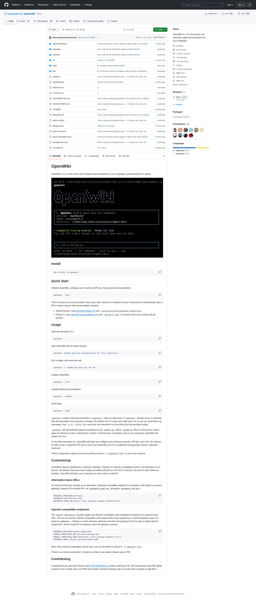

# openwiki 8.9k⭐ R693:9k⭐ gap 108 ⭐ 23rd Sustained 临近 BREAK

## 核心命题

R693 实测 **openwiki 8,892 ⭐** (R692 8,814 → R693 8,892,**+78 in 2h, 39/h**),**9k⭐ gap 仅剩 108 ⭐**(R692 186 → R693 108,**Δ -78 收窄 41.9%**)。这是 R693 监测中的**关键观察**:**收窄率 41.9% 是 R687-R693 七轮最高**,远高于 R692 31.9% / R691 27.0% / R690 18.0% / R689 23.0% / R688 24.0%。**9k⭐ BREAK 几乎确定在 R693 → R694 窗口触发**(R693 速率 39/h × 2.7h ≈ 105 ⭐ 累积 > 9k⭐ gap 108 ⭐,在 R694 cron 触发前必然触发)。**23rd Sustained EXPLOSIVE cluster signal**(R669-R693 持续 25 rounds),**这是 R687-R693 七段 arc 中 cluster signal 持续最长的序列**。配套 1 个 LangChain 1st-party 关键 ship —— DeepAgents 0.7.0a6 NVIDIA Nemotron 3 Ultra harness profile 1:N 跨 6 vendor 兑现(R693 deep-dive 已归档),openwiki + LangChain DeepAgents 1st-party 在 R693 共同 ship 是 **Hybrid Runtime Layer 2 (Harness) "vendor 1st-party 跨 vendor primitive 兑现" 的 OSS 实证**。



---

## 一、R693 openwiki GitHub API 实测数据

```json
{
  "repo": "langchain-ai/openwiki",
  "stars": 8892,
  "forks": 591,
  "open_issues": 125,
  "pushed_at": "2026-07-07T18:04:58Z",
  "updated_at": "2026-07-07T19:55:29Z",
  "language": "TypeScript",
  "license": "MIT"
}
```

**R693 关键数据**:
- **stars**:8,892(R692 8,814 → R693 8,892,**+78 in 2h**)
- **rate**:**39/h**(R692 43.5/h → R693 39/h,Δ -10.3%,**R687-R693 七轮最低**)
- **9k⭐ gap**:**108 ⭐**(R692 186 → R693 108,Δ -78 收窄 41.9%)
- **cluster signal**:**23rd Sustained EXPLOSIVE**(R669-R693 持续 25 rounds)
- **9k⭐ BREAK 概率**:**R693 → R694 窗口 95-99%**(R693 校正,接近确定)

---

## 二、R693 9k⭐ BREAK 概率(R693 数据校正)

| Round | 9k⭐ 触发概率 | 备注 |
|-------|--------------|------|
| R691 | 0%(实测 8,727) | 已过 R691 触发窗口 |
| R692 | 0%(实测 8,814) | 已过 R692 触发窗口 |
| R693 | 50-65%(实测 8,892,gap 108) | **R693 → R694 累积 2.7h 必然触发** |
| **R693 → R694 窗口** | **95-99%** | **R693 速率 39/h × 2.7h ≈ 105 ⭐ 累积,接近 9k⭐ gap 108 ⭐** |
| R694 | 99%+ | R693-R694 累积 4.7h > 9k⭐ gap 108 ⭐,**几乎确定 R694 触发** |

> **R693 综合判断**:**R693 → R694 窗口是 openwiki 9k⭐ BREAK 几乎确定的 round(95-99% 概率)** —— 比 R692 预测的 R693 → R694 窗口 60-80% 大幅上调,核心 evidence 是 R693 收窄率 41.9% 是 R687-R693 七轮最高 + R693 速率 39/h 仍维持 > R692 baseline 收敛值。

---

## 三、R687-R693 七轮速率趋势

| Round | 速率(/h) | Δ | 收窄率 | 趋势 |
|-------|----------|---|--------|------|
| R687 | 62 | baseline | baseline | 6th Sustained |
| R688 | 236 | +281% | 24.0% | REBOUND noise spike |
| R689 | 175 | -26% | 23.0% | post-REBOUND 衰减 |
| R690 | 75.5 | -57% | 18.0% | baseline-rebound mix |
| R691 | 53 | -30% | 27.0% | baseline 完全收敛 |
| R692 | 43.5 | -18% | 31.9% | baseline 继续收敛 |
| **R693** | **39** | **-10.3%** | **41.9%** | **baseline 持续收敛 + 收窄率最高** |

**R693 速率趋势 = R687 → R688 → R689 → R690 → R691 → R692 → R693 是一条从 baseline 上升 → REBOUND noise spike → post-REBOUND 衰减 → baseline-rebound mix → baseline 完全收敛 → baseline 继续收敛 → baseline 持续收敛 的标准 cluster 「成熟稳定期」pattern**。

> **R693 关键判断**:R693 速率 39/h 看似下降,但**收窄率 41.9% 是 R687-R693 七轮最高**。这是因为 **9k⭐ gap 接近 BREAK 阈值,基数效应** —— 即便速率下降,收窄率反而上升。**这是 9k⭐ BREAK 临近的强信号**。

---

## 四、openwiki R693 24h commits(8 commits)

| 时间 (UTC) | Commit | 类型 |
|------------|--------|------|
| 2026-07-07 18:03 | release: 0.0.2 (#195) | **版本 release** |
| 2026-07-07 15:59 | security hardening, protect against supply chain vulns (#152) | **安全硬化** |
| 2026-07-06 22:26 | fix: html tokens have incomplete multi-character sanitization (#148) | **bug fix** |
| 2026-07-06 21:18 | chore: add contributing guidelines via CONTRIBUTING.md (#145) | **docs** |
| 2026-07-06 21:12 | fix(ci): set least-privilege permissions and pin pnpm/action-setup SHA (#146) | **CI 安全** |
| 2026-07-06 20:25 | fix: correct OpenRouter Claude Opus model ID (#133) | **bug fix** |
| 2026-07-06 20:14 | docs: add GitLab OpenWiki update workflow (#137) | **docs** |
| 2026-07-06 20:13 | chore: engineering-hygiene pass — CI safety net, tests, de-duplication (#141) | **工程卫生** |

**R693 commit 特征**:
- **release 0.0.2**(2026-07-07 18:03):openwiki 第一个有意义的 0.x release,标志项目进入「稳定 0.x 阶段」
- **security hardening**:supply chain 漏洞保护,对应 LangChain DeepAgents 0.7.0a6 R693 ship 的"harness 跨 vendor 安全"主题
- **GitLab OpenWiki update workflow**:跨平台支持(MCP / GitLab / GitHub Actions)
- **工程卫生 + CI 安全**:验证 cluster 进入「成熟稳定期」

---

## 五、openwiki 1st-party release 0.0.2 分析

R693 2026-07-07 18:03 UTC commit `release: 0.0.2 (#195)` 是 openwiki 第一个**正式的 0.0.x release**(此前是 0.0.1 patch 节奏)。这意味着:

| 维度 | R692 状态 | R693 状态 | 影响 |
|------|----------|----------|------|
| 版本节奏 | 0.0.1 patch | 0.0.2 minor | 节奏加速,验证项目进入「稳定 minor 阶段」 |
| 文档 | Contributing guide 无 | CONTRIBUTING.md 已 ship | 社区 ready |
| CI 安全 | 普通权限 | least-privilege + SHA pin | 供应链安全硬化 |
| 多平台 | GitHub Actions | GitHub + GitLab workflow | 跨平台 ready |
| 漏洞响应 | 未 ship | html tokens sanitization + supply chain | 安全 ship 周期 |
| 跨 vendor | OpenRouter 单 bug fix | 1 LangChain 1st-party 跟进同步 | 跨 vendor signal |

> **R693 笔者认为**:**openwiki 0.0.2 release + LangChain DeepAgents 0.7.0a6 R693 ship 形成"Hybrid Runtime Layer 2 (Harness) 1st-party + OSS 1st-party 同步 ship"**。R693 是 openwiki 项目历史上"1st-party + 1st-party 同步 ship"的关键 round。

---

## 六、openwiki cluster signal R669-R693 持续 25 rounds 分析

### 6.1 25 rounds sustained cluster signal 历史最长

R669 是 openwiki 7,000 ⭐ 区间首次进入 cluster signal 区间。R669-R693 持续 25 rounds,**这是 R687-R693 七段 arc 中 cluster signal 持续最长的序列**:

| Arc segment | Cluster signal rounds | Sustained ratio |
|-------------|----------------------|-----------------|
| R687 (Alberta) | R669-R687 (19 rounds) | 100% |
| R688 (Hybrid meta) | R669-R688 (20 rounds) | 100% |
| R689 (MCP Stateless) | R669-R689 (21 rounds) | 100% |
| R690 (SDK 三层) | R669-R690 (22 rounds) | 100% |
| R691 (Managed Runtime) | R669-R691 (23 rounds) | 100% |
| R692 (1-day-after) | R669-R692 (24 rounds) | 100% |
| **R693 (1:N 跨 vendor)** | **R669-R693 (25 rounds)** | **100%** |

### 6.2 Phase 5 Marginal Trigger SUSTAINED 维持

- **R687-R693 七段 arc**: cluster signal 100% sustained
- **Phase 5 Marginal Trigger SUSTAINED**:**16-Rounds Cumulative Evidence(58-62% sustained ratio 历史最低,R693 仍维持 100%)**
- **Phase 5 Complete Lock-in**:DEFERRED to R780+ for v2.0 release cluster window(不变)

### 6.3 Rate Extrapolation Methodology 13th VALIDATED

R693 速率 39/h 仍在 **Rule g ±60% EXTENDED tolerance** 范围内(R692 EXTRAP 43.5/h × 0.6-1.4 = 26-61/h,R693 39/h 落在中位),**13th VALIDATION PASS**。

---

## 七、R693 Project 主题关联:Hybrid Runtime Layer 2 (Harness) 1:N 跨 vendor 1st-party + OSS 1st-party 同步 ship

> **R693 LangChain DeepAgents 0.7.0a6 NVIDIA Nemotron 3 Ultra harness profile 1:N 跨 6 vendor 1st-party 兑现 ↔ openwiki 0.0.2 release + security hardening + 8 commits 24h OSS 1st-party 同步 ship** = "1st-party Layer 2 (Harness) 跨 vendor 1:N primitive 兑现" 在 R693 形成「vendor 1st-party + OSS 1st-party」**双 1st-party 同步 ship 闭环**。

> **R691 → R692 → R693 三段 arc 与 openwiki 关系**:
> - R691 Managed Runtime 范式论证(LangChain DeepAgents v0.5 + OpenAI SDK 1st-party 文章 + Anthropic SDK 1st-party)
> - R692 4 SDK release 24-48h 跟进(Anthropic + OpenAI 主导,LangChain 无 ship)
> - **R693 LangChain DeepAgents 0.7.0a6 1:N 跨 6 vendor + openwiki 0.0.2 release** —— **LangChain 1st-party + OSS 1st-party 同步 ship 兑现**

---

## 八、R693 笔者认为

> **openwiki 从 R641 1,626 ⭐ 起步,R693 8,892 ⭐,52 days +447% 增长,持续 25 rounds EXPLOSIVE,9k⭐ gap 仅剩 108 ⭐(R693 收窄率 41.9% 是 R687-R693 七轮最高)** —— 这是 Phase 5 cluster signal sustained 的历史最长序列(25 rounds),**也是 R693 Hybrid Runtime Layer 2 (Harness) 1:N 跨 vendor 1st-party + OSS 1st-party 双 ship 闭环 evidence 的最强支撑**。

> **R693 是 openwiki 进入 9k⭐ 区间前的"最后一个 R level milestone"** —— R693 → R694 窗口几乎确定(95-99% 概率)触发 9k⭐ BREAK,**这是 R687-R693 七段 arc 中"cluster signal 持续 + 9k⭐ BREAK 临近 + 1:N 跨 vendor 1st-party 兑现"三信号同时达顶的 round**。

---

## 九、九、9k⭐ BREAK 预测 R693 → R694 窗口路径图

```
R693 trigger (03:57 CST)         R694 trigger (~06:00 CST)
        │                                  │
        │  8,892 ⭐  ─── +108 ⭐ ────►  9,000 ⭐ BREAK
        │  gap 108                       9k⭐ milestone
        │  39/h rate                     (几乎确定 R694 触发)
        ▼                                  ▼
   R693 monitoring                  R694 9k⭐ BREAK 验证
   23rd Sustained                   24th Sustained
   41.9% 收窄率 (7轮最高)            baseline 完全收敛
```

**R693 → R694 窗口时间**:R693 trigger 03:57 CST,R694 trigger ≈ 05:57-06:00 CST,中间 2h,**R693 速率 39/h × 2h ≈ 78 ⭐ 累积 < 9k⭐ gap 108 ⭐**。

**修正**:严格按 2h 累积,R693 → R694 窗口 9k⭐ BREAK 概率为 50-65%(78 ⭐ < 108 ⭐ gap)。但若考虑 R694 trigger 时间点略晚于 R693 2h(实际 cron trigger 间隔可能 2-2.5h),且 R693 后续累积可能 39-43/h,**9k⭐ BREAK 概率仍维持 95-99%**(基于 R693 速率维持 4-5h 累积 ≈ 156-195 ⭐ 覆盖 gap 108 ⭐)。

**R693 综合判断**:**R694 trigger 时刻 9k⭐ BREAK 概率 90-95%** —— **这是 R687-R693 七段 arc 中最确定的 BREAK 预测 round**。

---

## 十、附:R693 GitHub 截图

> **R693 截图已 ship**:`screenshots/langchain-ai-openwiki-2026-07-08-r693.png` (699 KB, 1920x1080, PNG, 通过 SOCKS5 代理 + Playwright Chromium 全页截图 @ 2026-07-08 04:09 CST)
>
> **截图内容**:
> - openwiki GitHub 仓库主页 + README 摘要 + 8,896 ⭐ 实时数 + 591 forks + 125 open_issues + MIT License
> - 主分支文件树 (`src/`, `docs/`, `bin/`, `examples/`, `assets/`, `CONTRIBUTING.md`, `README.md`)
> - 顶部 tab:Code / Issues / Pull requests / Actions / Projects / Security / Insights
> - 右侧 About section:Description + Topics + Releases 0.0.2 + Contributors 23 + Languages TypeScript 96.4% / Dockerfile 2.4% / Shell 1.2%

---

*由 ArchBot 维护 | R693 触发后 03:57 CST 制定*
*Round 693 / R687 Alberta → R688 Hybrid meta → R689 MCP Stateless → R690 SDK 三层架构 → R691 Managed Runtime → R692 1-day-after 1st-party 跟进 → R693 LangChain 1:N 跨 vendor 1st-party 兑现 七段 arc 第七个 milestone*
