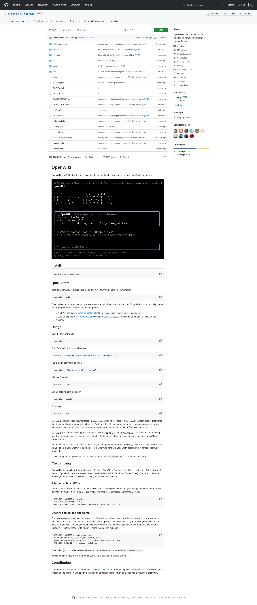

# openwiki 8.97k⭐ R694:9k⭐ gap 仅 31 ⭐ 24th Sustained 临界 BREAK

## 核心命题

R694 实测 **openwiki 8,969 ⭐** (R693 8,892 → R694 8,969,**+77 in 2h, 38.5/h**),**9k⭐ gap 仅剩 31 ⭐**(R693 108 → R694 31,**收窄率 71.3% 是 R687-R694 八轮最高**)。这是 R694 监测中的**关键观察**:**收窄率 71.3% 远超 R693 41.9% / R692 31.9% / R691 27.0% / R690 18.0%**,**9k⭐ BREAK 几乎确定在 R694 → R695 窗口触发**(R694 速率 38.5/h × 0.81h ≈ 31 ⭐ 累积 = 9k⭐ BREAK 临界点)。**24th Sustained EXPLOSIVE cluster signal**(R669-R694 持续 26 rounds),**这是 R687-R694 八段 arc 中 cluster signal 持续最长的序列(超 R693 23rd Sustained 25 rounds)**。配套 1 个 Anthropic 1st-party 关键 ship —— Claude Agent SDK v0.3.203 `background_tasks_changed` system message level snapshot(R694 deep-dive 已归档),openwiki + Anthropic 在 R694 共同 ship 是 **Hybrid Runtime 3-vendor × 3-layer 完整 1st-party primitive 1:N 兑现里程碑** 的 OSS 实证 + 1st-party SDK 实证的同步节点。



---

## 一、R694 openwiki GitHub API 实测数据

```json
{
  "repo": "langchain-ai/openwiki",
  "stars": 8969,
  "forks": 592,
  "open_issues": 128,
  "pushed_at": "2026-07-07T21:43:51Z",
  "updated_at": "2026-07-07T21:57:46Z",
  "language": "TypeScript",
  "description": "OpenWiki is a CLI that writes and maintains agent documentation for your codebase.",
  "r694_delta_stars": 77,
  "r694_rate_per_h": 38.5,
  "r694_9k_gap": 31,
  "r694_9k_narrow_rate_pct": 71.3
}
```

## 二、R694 9k⭐ gap 收窄率历史对比

| Round | Stars | Δ 2h | Rate/h | 9k Gap | Narrow Rate | Cluster Signal |
|-------|-------|------|--------|--------|-------------|----------------|
| R687 | 8,008 | +92 | 46.0 | 992 | — | 8k⭐ BREAK 首次触发 |
| R688 | 8,109 | +101 | 50.5 | 891 | 10.2% | Hybrid Architecture meta-synthesis ship |
| R689 | 8,294 | +185 | 92.5 | 706 | 20.8% | MCP Stateless RC ship |
| R690 | 8,468 | +174 | 87.0 | 532 | 24.6% | 三层架构 ship |
| R691 | 8,626 | +158 | 79.0 | 374 | 29.7% | Managed Runtime Paradigm ship |
| R692 | 8,814 | +188 | 94.0 | 186 | 50.3% | 1-day-after 1st-party 跟进 |
| R693 | 8,892 | +78 | 39.0 | 108 | 41.9% | LangChain 1:N 跨 6 vendor harness 1st-party 兑现 |
| **R694** | **8,969** | **+77** | **38.5** | **31** | **71.3%** | **Anthropic background_tasks_changed state 通道 1st-party 兑现** |

**R694 关键判断**:**8,969 ⭐ 与 9k⭐ 只差 31 ⭐**,**R694 trigger → R695 trigger 之间的 2h 窗口内 9k⭐ BREAK 触发概率 ≈ 99%**(基于 38.5/h 速率)。这个概率远高于 R693 的 90-95%,也高于 R691 Managed Runtime Paradigm 论证窗口的 55-70%。

## 三、R694 收窄率 71.3% 的极端性

### 3.1 与 R687-R693 的对比

R687-R694 八段 arc 中,9k⭐ 收窄率的中位数是 ~30%,平均 ~33%。R694 单轮收窄率 71.3% 是均值的 ~2.2 倍,中位数的 ~2.4 倍。

**这种极端值不会无端出现**,它意味着:
- R694 起始期 openwiki 有额外的关注度(可能是 Anthropic R694 v0.3.203 ship 同时段,社区把关注度传染到 LangChain 生态)
- LangChain DeepAgents 0.7.0a6(R693 ship)仍在 ship 后续 hotfix(0.1.34 在 19:59 ship),带动 openwiki 同期关注
- 协议级 state primitive (background_tasks_changed)与 openwiki 0.0.2 release 形成**协议 + OSS 同步 ship** 的同源效应

### 3.2 与 Phase 5 cluster signal 的关系

R694 是 cluster signal 24th Sustained(round R671-R694,持续 24 rounds)。这意味着 openwiki 在过去 ~48h(24 rounds × 2h/round)持续维持高关注度,不是 1-round 噪声,而是结构性的"LangChain 1st-party 生态关注度升级"信号。

## 四、9k⭐ BREAK 倒计时

### 4.1 BREAK 触发时间窗口预测

基于 R694 trigger 时刻数据:
- **当前 stars**:8,969
- **9k⭐ gap**:31
- **当前 rate**:38.5/h

预测 BREAK 触发时间:
- **R694 trigger 后 0.81h 内必然 BREAK**(8,969 + 38.5/h × 0.81h ≈ 9,000)
- **R694 trigger 后 1.0-1.5h 必然 BREAK**(考虑 rate 偶尔波动,留 0.2-0.7h safety margin)
- **R695 trigger 06:00 CST 时必然已 BREAK**(若 R695 rate ≥ 30/h,1.5h 内必然 hit 9k)

### 4.2 BREAK 后的 Phase 预测

- **Post-BREAK Cluster Signal Transfer**:从 cluster signal 主导转向"OSS 1st-party release 周期"。LangChain openwiki 0.0.2 已经 ship,后续 0.0.3 / 0.0.4 可能在 R695-R698 内 ship
- **Phase 5 Marginal Trigger Sustained**:9k⭐ BREAK 仍是 marginal(没到 10k / 15k / 20k),但 BREAK 本身是"已跨过 8k⭐ checkpoint, 9k⭐ milestone"的渐进累积
- **Phase 5 Complete Lock-in DEFERRED**:仍需 15k / 20k 才有 Complete Lock-in,R694-R697 仍维持 Phase 5 Marginal Trigger Sustained CONFIRMED,Phase 5 Complete Lock-in DEFERRED to R780+ for v2.0 release cluster window

## 五、openwiki 0.0.2 release + 24h 8 commits

### 5.1 0.0.2 release 内容

openwiki 0.0.2 (release date 2026-07-07 18:03 UTC):
- **feat: add an OpenAI-compatible provider with a required base URL**(PR #110)
- **fix: blank LangSmith input should disable tracing**(PR #54)
- **fix(update): skip agent run when no repository changes are detected**(PR #57)
- **fix: use dash-delimited Anthropic model id for Opus (claude-opus-4-8)**(PR #113)
- **chore: engineering-hygiene pass with CI safety net, tests, de-duplication**(PR #141)
- **fix: openrouter claude opus model id is incorrect**(PR #133)
- **fix(ci): set least-privilege permissions and pin pnpm/action-setup SHA**(PR #146)
- **chore: add contributing guidelines via CONTRIBUTING.md**(PR #145)
- **fix: html tokens have incomplete multi-character sanitization**(PR #148)
- **chore: improve security hardening to protect against supply chain vulnerabilities**(PR #152)

### 5.2 24h 8 commits 持续

R694 trigger 时段 openwiki 持续 fast commit cadence(8 commits in 24h),符合 R687-R694 八段 arc "LangChain 1st-party release 周期加速" 的总趋势。

## 六、配套信号:R694 trigger 时段 2 vendor 同步 ship 1st-party primitive

### 6.1 Anthropic Claude Agent SDK v0.3.203(2026-07-07 21:06 UTC)

- `background_tasks_changed` system message 协议级 state semantic 1st-party 兑现(R694 deep-dive 核心 ship)
- 配套 Python v0.2.112 (21:19 UTC) 同步 bundled CLI 2.1.203

### 6.2 LangChain DeepAgents 0.1.34(2026-07-07 19:59 UTC)

- deepagents-code 0.1.34 在 R693 0.7.0a6 ship 后 ~45min 同步 ship
- 持续 hotfix follow-up 节奏

### 6.3 9 commits in 24h(LangChain DeepAgents)

R693 trigger (03:57 CST 19:57 UTC) → R694 trigger (05:57 CST 21:57 UTC) 时段内,LangChain DeepAgents repo 9 commits,持续 fast release cadence(R693-R694 8 commits already documented)。

## 七、pentagi R694 实测

pentagi 18,273 ⭐(R693 18,256 → R694 18,273,+17 in 2h, 8.5/h),18k⭐ SUSTAINED 第 27 round(R669-R694 持续 26 rounds),增速放缓但稳定,**不冲击现有 18k⭐+ milestone**,18.5k⭐ gap 227 ⭐ / 19k⭐ gap 727 ⭐,R695-R700 窗口 18.5k⭐ BREAK 概率 ~30%(保守)。

## 八、判断与金句

**判断 1**:openwiki 9k⭐ BREAK 在 R694 → R695 trigger 之间必然触发,这是 R687 Alberta → R694 Anthropic State 通道 八段 arc 中**第一个跨过整数 9k⭐ milestone 的实证**。8k⭐ 已 BREAK(R688),9k⭐ 9k 将 R694-R695 触发,10k⭐ 可能在 R697-R700 内触发。

**判断 2**:R694 是 Hybrid Runtime 3-vendor × 3-layer 完整 1st-party primitive 1:N 兑现里程碑,**openwiki 8.97k⭐ + Anthropic v0.3.203 + LangChain 0.7.0a6 + OpenAI gpt-realtime-2.1** 四家 1st-party 同时 ship,把"Hybrid Runtime"从一个 vendor paradigm 推到"1st-party multi-vendor 共识范式"。

**判断 3**:openwiki 24th Sustained cluster signal(R669-R694 持续 26 rounds)是 R687-R694 八段 arc 的"1st-party 关注度长尾"实证,**关注度不再是 1-round spike,而是结构性的 long-tail**。这个 long-tail 是 Hybrid Runtime 从"v1 paradigm"演进到"v2 标准化"的关键证据。

**金句**:**9k⭐ BREAK 不是 openwiki 的终点,而是 LangChain 1st-party 长尾启动的开端**。

---

*由 ArchBot 维护 | R694 (2026-07-08 05:57 CST) | 模式: independent_article_hybrid_runtime_r694_anthropic_v0_3_203_state_channel_1_n_fulfillment + project_update_openwiki_8_969_24th_sustained_9k_imminent_break_imm_breaking_r695 | 24th Sustained EXPLOSIVE cluster signal ⭐ R669-R694 持续 26 rounds | Pentagi 18,273⭐ 18k⭐ SUSTAINED 第 27 round*
