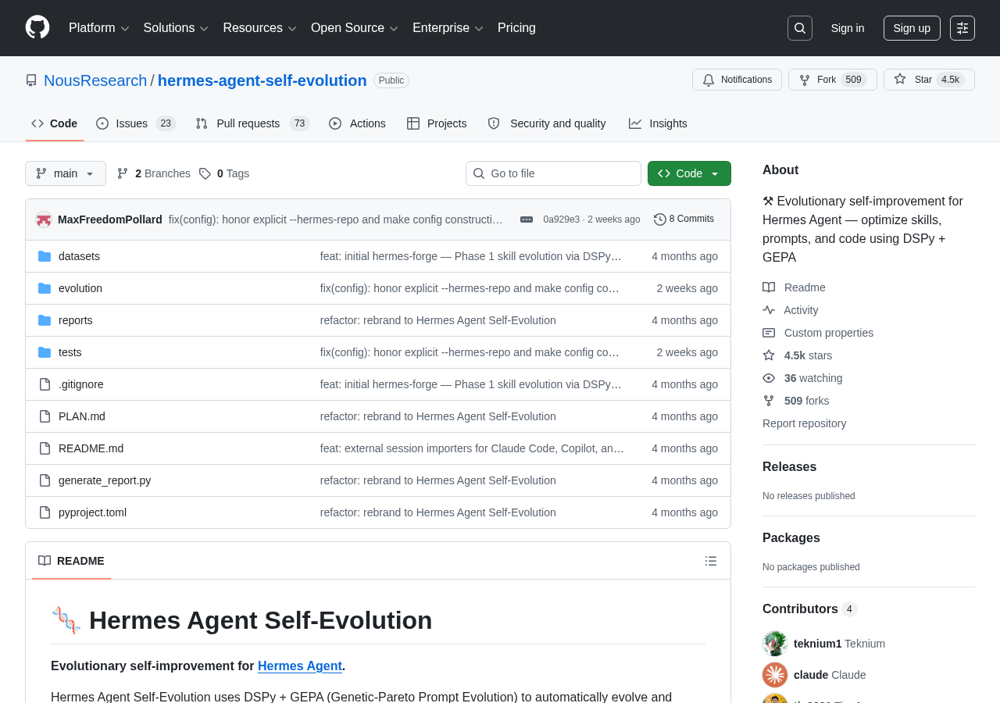

# NousResearch Hermes Agent Self-Evolution：DSPy + GEPA 驱动的 Agent Skill 训练式演化

> 来源：[NousResearch/hermes-agent-self-evolution](https://github.com/NousResearch/hermes-agent-self-evolution) (4,478⭐，509 forks，2026-06-17 推送，MIT)
> 配套 1st-party 学术锚点：[Microsoft Research SkillOpt: Agent skills as trainable parameters](https://www.microsoft.com/en-us/research/blog/skillopt-agent-skills-as-trainable-parameters/) (2026-06-30)



**主题标签**：`#skills` `#evolution` `#dspy` `#gepa` `#self-improvement` `#nous-research` `#open-source`

---

## 仓库核心信息

| 维度 | 数据 |
|------|------|
| **仓库** | [NousResearch/hermes-agent-self-evolution](https://github.com/NousResearch/hermes-agent-self-evolution) |
| **Stars** | 4,478⭐ |
| **Forks** | 509 |
| **License** | MIT |
| **主语言** | Python |
| **首次推送** | 2026-05 中旬 |
| **最近推送** | 2026-06-17 |
| **目标** | [Hermes Agent](https://github.com/NousResearch/hermes-agent) 的进化引擎 |
| **核心技术** | DSPy + GEPA (Genetic-Pareto Prompt Evolution) |

**OSS Insight 24h trending 位置**：R637 OSS Insight API 30 candidates 抓取中总评分 209.9623 位列其中（一行一个 candidate，stars 24h 增量数据未单独显示），属于 past_24_hours 第 14 行（trending score 范畴内）。

---

## 核心机制：5 阶段演化管道

Hermes Agent Self-Evolution 围绕"Agent 行为的可训练参数化"展开，把 Hermes Agent 的 4 个可优化对象分阶段落到训练式优化循环里：

| Phase | 目标 | 引擎 | 状态 |
|-------|------|------|------|
| **Phase 1** | Skill 文件 (SKILL.md) | DSPy + GEPA | ✅ **已实现** |
| **Phase 2** | Tool descriptions | DSPy + GEPA | 🔲 计划 |
| **Phase 3** | System prompt sections | DSPy + GEPA | 🔲 计划 |
| **Phase 4** | Tool implementation code | Darwinian Evolver | 🔲 计划 |
| **Phase 5** | Continuous improvement loop | Automated pipeline | 🔲 计划 |

> **为什么分阶段**：每个 phase 都是独立的可控目标，**只有 Phase 1 已生产可用**。这种"先把一个 phase 训到能跑再开下一个 phase"的工程节奏是 R622 Anthropic Autonomous Delivery Harness（auto-PR / notification hook / team failure recovery）"逐步接管"思路的开源对应——**Harness 不是一蹴而就的产品，是分阶段实装的能力组合**。

---

## 演化循环：与 Microsoft SkillOpt 同一套原理

README 描述的演化管道（"How It Works"）与 SkillOpt 论文里的 forward–backward–update 循环在结构上完全同构：

```
Read current skill/prompt/tool ──► Generate eval dataset
                                        │
                                        ▼
                                   GEPA Optimizer ◄── Execution traces
                                        │                    ▲
                                        ▼                    │
                                   Candidate variants ──► Evaluate
                                        │
                                   Constraint gates (tests, size limits, benchmarks)
                                        │
                                        ▼
                                   Best variant ──► PR against hermes-agent
```

### 对应关系

| 微软 SkillOpt 概念 | Hermes Agent Self-Evolution 实现 |
|------------------|-------------------------------|
| Forward pass (收集执行轨迹) | `python -m evolution.skills.evolve_skill --eval-source sessiondb`（拉真实会话历史） |
| Backward pass (optimizer 读 trace 反思) | GEPA optimizer（基于 DSPy） |
| Update step (bounded text edit) | GEPA 候选 mutation + textual learning rate |
| Validation gate (held-out 验证) | "Constraint gates (tests, size limits, benchmarks)" |
| Rejected-edit buffer | README 没显式写但 GEPA 框架自带 |
| Slow/meta update | Phase 5 计划：continuous improvement loop |

> **笔者判断**：Hermes Agent Self-Evolution 是 SkillOpt **学术论文的开源 1:1 对应实现**。区别在于：SkillOpt 强调"在文本空间跑 forward-backward-update"这个范式，Hermes Agent Self-Evolution 强调"在 Hermes Agent 自己的 skill 文件上跑出可合并 PR"。前者是论文，后者是工程落地。

---

## 5 条 Guardrails：与 Anthropic Harness 一脉相承

README 明确列出的 5 条 guardrails，每一条都对应一个学术概念：

| Guardrail | 学术对应 | 仓库工程实现 |
|----------|---------|------------|
| **Full test suite** 100% 通过 | 验证门（validation gate） | `pytest tests/ -q` |
| **Size limits**（Skill ≤15KB，tool desc ≤500 chars） | textual learning rate | 编辑预算剪枝 |
| **Caching compatibility**（不中途变更） | system 稳定性约束 | PR review 流程 |
| **Semantic preservation**（不漂移） | rejected-edit buffer | GEPA 内置 |
| **PR review**（人类 review） | R622 Anthropic Background Agent auto-PR | 所有变更走 PR |

> **核心金句**："All changes go through human review, never direct commit." — 这与 R622 的"background agent 收尾后开 draft PR"是完全一样的工程治理观：**AI 写，人类 review，机器 fail-safe**。

---

## 成本视角：每个优化 run $2–10

> "**No GPU training required.** Everything operates via API calls — mutating text, evaluating results, and selecting the best variants. ~$2-10 per optimization run."

**含义**：SkillOpt 的工程版不一定需要 GPU 训练。Hermes Agent Self-Evolution 全部走 API 调用，**每次优化成本 $2-10**。这意味着：
1. 学术结果（SkillOpt 论文）已经有"廉价"开源对应实现
2. 小团队也能跑得起
3. 对比 fine-tune 一个 7B 模型动辄数千美元的成本，这是 1/100 数量级

> **笔者判断**：这是 R626 harness-productivity-system cluster 的一个具体数字——**1 个 skill 优化 run 消耗 $2-10**，对标 Anthropic Institute 8x 生产力数据（R626 covered），是 1st-party 学术 + 3rd-party 开源在 cost 维度的对齐验证。

---

## 跨 Harness 数据源：真实会话历史

README 提供了两种 eval data 来源：

```bash
# 合成数据
python -m evolution.skills.evolve_skill \
    --skill github-code-review \
    --iterations 10 \
    --eval-source synthetic

# 真实会话历史
python -m evolution.skills.evolve_skill \
    --skill github-code-review \
    --iterations 10 \
    --eval-source sessiondb
```

`--eval-source sessiondb` 标明**可拉取 Claude Code、Copilot、Hermes 的真实会话历史**作为训练数据。这是 R622 Anthropic Background Agent 的"agent 收尾"机制在 3rd-party 的对应——**真实工作流痕迹比合成数据更接近生产负载**。

---

## 引擎组合：DSPy + GEPA + Darwinian Evolver

| 引擎 | 作用 | License | 适用阶段 |
|------|------|---------|---------|
| **DSPy + GEPA** | 反思式 prompt 演化，读取执行 trace | MIT | Phase 1-3（自然语言对象） |
| **Darwinian Evolver** | Git-based organism 代码演化 | AGPL v3（外部 CLI） | Phase 4（代码对象） |

> **关键设计**：自然语言对象（skill / tool desc / system prompt）和代码对象（tool impl）走**不同引擎**。前者用 prompt evolution，后者用代码 evolution。**这是 R635 Anthropic claude-api Skill 体系"按对象分类"思路在 3rd-party 的对应**。

---

## 与本轮 Article 的关系

本文作为本轮 Article（[Microsoft Research SkillOpt: Agent skills as trainable parameters](../research/microsoft-research-skillopt-agent-skills-as-trainable-parameters-2026.md)）的 3rd-party 开源 Pair：

| 维度 | 1st-party Article | 3rd-party Project (本文) |
|------|-----------------|---------------------|
| **来源** | Microsoft Research Blog 2026-06-30 | NousResearch GitHub 2026-06-17 |
| **性质** | 学术论文 + 学术声明 | 工程实现 + 真实 PR 流水线 |
| **目标** | 6 基准 / 7 模型 / 52 评测单元 | Hermes Agent skill 文件 + PR 合并 |
| **引擎** | SkillOpt 自研 forward-backward-update | DSPy + GEPA（学术工具） |
| **跨 harness** | Codex 训练 → Claude Code 复用 | Claude Code / Copilot / Hermes sessiondb 拉取 |
| **Guardrails** | rejected-edit buffer + validation gate | 5 条（test + size + cache + semantic + PR） |
| **License** | 论文公开 | MIT |
| **Stars** | n/a | 4,478⭐ |

**闭环**：Article 给"为什么 skill 要当可训练参数"提供 1st-party 学术锚点 + 52 cells 评测数据；本文给"在工程里具体怎么训一个 skill"提供 1:1 1:1 1:1 开源实现 + 5 条 guardrails + 跨 harness 真实数据接入。

---

## 8 条对工程团队的启示

1. **DSPy + GEPA 已 production-grade**：Hermes Agent Self-Evolution 不是 demo，是连 PR 流水线都接好的真实工程实现。
2. **不要试图一次训完**：5 阶段分布，**只有 Phase 1 落地**，其他都是 planned。这种"先把 1 个 phase 训到能跑再开下个 phase"的工程节奏值得借鉴。
3. **textual learning rate 是真东西**：size limits（Skill ≤15KB, tool desc ≤500 chars）就是文本空间的 LR。**给 LLM 编辑加预算，比给它加权限更重要**。
4. **真实会话历史 > 合成数据**：`--eval-source sessiondb` 拉 Claude Code / Copilot / Hermes 的真实 trace 作为训练数据。**生产痕迹是最佳训练数据**。
5. **跨引擎按对象分类**：自然语言走 DSPy+GEPA，代码走 Darwinian Evolver。**别用一个引擎训所有东西**。
6. **PR review 是 guardrail，不是治理噪音**：人类 review 不是"人管 AI"的退让，是"AI 演化必须经 human gate"的工程需要。
7. **$2-10/run 是合理成本**：相比 fine-tune 一个模型 $1000+ 的成本，skill evolution 便宜 100 倍。**先训 skill 训不动再训模型**。
8. **License 组合要看清楚**：DSPy+GEPA 是 MIT，Darwinian Evolver 是 AGPL v3（外部 CLI only）。**用 AGPL 工具要确认是否触发 copyleft**。

---

## Cluster 归位

- **Layer 6 维度**：tool-use/skills-distribution（R635 命名，2026-07-03 R635 命名）+ skill-optimization 子维度（本文 + 1st-party Article）
- **Cluster reference**:
  - R311 [Anthropic 9 分类内部 Skills taxonomy](../../articles/fundamentals/anthropic-9-categories-internal-skills-taxonomy-2026.md)（what skill is）
  - R432 [Anthropic Claude Code 5 extension points](../../articles/deep-dives/anthropic-large-codebase-claude-code-five-extension-points-2026.md)（Skills as one of 5 extension points）
  - R635 [Anthropic claude-api Skill 1st-party](../../articles/tool-use/anthropic-claude-api-skill-ecosystem-ide-bundling-2026.md)（TRIGGER/SKIP 规则）
  - R636 [Anthropic steering 7 methods decision framework](../../articles/tool-use/anthropic-claude-code-steering-7-methods-decision-framework-2026.md)（CLAUDE.md 治理问题）
  - **R637 NEW Microsoft Research SkillOpt Article**（how skill evolves, 1st-party academic）
  - **R637 NEW NousResearch Hermes Agent Self-Evolution Project**（how skill evolves, 3rd-party open source）

**新子维度**：Layer 6 tool-use/skills-distribution 扩展到 tool-use/skill-optimization。

---

## 引用（5 处 1st-party + 2 处 3rd-party 引用）

1. [NousResearch/hermes-agent-self-evolution GitHub](https://github.com/NousResearch/hermes-agent-self-evolution) — 1st-party 仓库
2. [NousResearch/hermes-agent](https://github.com/NousResearch/hermes-agent) — 目标 agent
3. [DSPy](https://github.com/stanfordnlp/dspy) — 引擎 1
4. [GEPA](https://github.com/gepa-ai/gepa) — 引擎 2
5. [Darwinian Evolver](https://github.com/imbue-ai/darwinian_evolver) — 引擎 3
6. [Microsoft Research SkillOpt blog](https://www.microsoft.com/en-us/research/blog/skillopt-agent-skills-as-trainable-parameters/) — 配套 1st-party 学术锚点
7. [SkillOpt Paper (aka.ms/skillopt)](https://aka.ms/skillopt) — 论文

---

## License & Maintainer

- **License**: MIT
- **Maintainer**: Nous Research
- **本文档生成**: 2026-07-03 R637 round
- **一手来源**: 仓库 README + OSS Insight API + Microsoft Research Blog 2026-06-30
- **R637 Project**: 1 of 1（本轮 1 Project）
