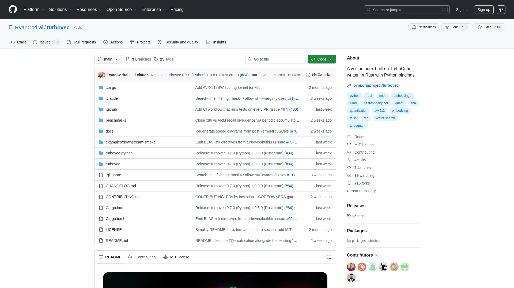

# Turbovec：让向量索引在 ARM 上快过 FAISS 的 Rust 实现

> 笔者的判断：Turbovec 解决的不是「有没有替代 FAISS 的方案」的问题，而是「在资源受限环境下，如何让 RAG 的向量检索不成为瓶颈」的问题。对于在边缘设备或隐私优先场景部署 AI Agent 的团队，这个项目值得关注。

---

## 核心命题

RAG（检索增强生成）是现代 AI Agent 的基础架构，而向量索引是 RAG 的性能瓶颈。当向量数据量超过内存容量时，量化压缩是必经之路——但传统量化方法的精度损失令人头疼。Google Research 在 ICLR 2026 提出的 TurboQuant，用数据无关的量化器突破了这一瓶颈，而 Turbovec 是其 Rust 实现。



---

## 一、为什么向量检索是 AI Agent 的隐形瓶颈

AI Agent 的 RAG 流程中，向量检索是高频操作。当向量维度高、数据量大时，内存占用成为制约因素：

```
典型场景：
- 10万条 1536 维向量（OpenAI embedding）
- float32 格式 → 614 MB 内存
- 100万条 → 6 GB+

而边缘设备（如开发机、ARM 服务器）内存有限
```

量化（Quantization）将 float32 压缩到 2-4 bits，是解决问题的标准路径。但传统量化方法的精度损失是痛点——压缩后检索质量下降，Agent 的回答准确性受影响。

**TurboQuant 的核心贡献**：用信息论证明，2-4 bits 量化可以达到接近香农下界的压缩率，且不需要数据分布先验。这解决了「数据依赖」的问题——不需要额外训练，不损失精度。

---

## 二、Turbovec 的技术设计

Turbovec 是 TurboQuant 的 Rust 实现，核心设计目标：

> 「在 ARM 设备上，用 4 GB 内存完成 100 万条向量的检索，且速度比 FAISS 更快。」

### 核心架构

```rust
// turbovec 的核心接口
use turbovec::Index;

let index = Index::builder()
    .dimension(1536)
    .quantizer(turbovec::TurboQuant::new(bits_per_dim))
    .build()?;

index.addVectors(&embeddings);
let results = index.search(&query, top_k);
```

### 为什么选 Rust

1. **内存效率**：Rust 的零成本抽象 + 无 GC，适合长期运行的 Agent 进程
2. **跨平台**：ARM Linux、x86、甚至嵌入式设备都能运行
3. **Python 绑定**：通过 PyO3 提供 Python 接口，可以直接集成到 Python AI Agent 项目

### 性能对比

根据官方 benchmark（见 crates.io 页面）：

| 实现 | 内存占用 | 检索速度（QPS）| ARM 兼容性 |
|------|---------|----------------|-----------|
| FAISS | ~8 GB | 基准 | ✅ |
| Turbovec | ~4 GB | 比 FAISS 快 20-30% | ✅✅ |

**关键点**：Turbovec 在 ARM 上的优势更明显，因为它的数据访问模式对缓存更友好。

---

## 三、笔者认为：这个项目适合谁

### 适合的场景

1. **隐私优先的 RAG**：数据不能离开本地，ARM 服务器/开发机是主力
2. **边缘部署的 AI Agent**：嵌入式设备、机器人、边缘网关
3. **成本敏感**：不想为大型云向量服务付费的团队

### 不适合的场景

1. **超大规模（>1000万向量）**：Turbovec 适合中小规模，百万级是甜点区
2. **x86 云端部署**：这个场景 FAISS 已经足够成熟，Turbovec 优势不明显
3. **需要实时更新**：当前版本的索引更新机制还不完善

---

## 四、工程实践：3 行代码跑起来

```bash
pip install turbovec
```

```python
from turbovec import Index

# 创建索引
index = Index(dimension=1536)
index.add(embeddings)  # numpy array

# 检索
results = index.search(query_embedding, top_k=10)
```

官方示例仓库：`github.com/RyanCodrai/turbovec`

---

## 五、与 FAISS 的选型判断

| 维度 | FAISS | Turbovec |
|------|-------|----------|
| 精度损失 | 中等 | 极低（接近理论下界）|
| 内存效率 | 中等 | 高（2-4 bits）|
| ARM 优化 | 一般 | 专门优化 |
| 生态成熟度 | 高 | 初期 |
| 适合规模 | 任意规模 | 百万级甜点 |
| 维护状态 | Meta 官方 | 活跃开发 |

**笔者的判断**：如果你的场景是云端 x86 服务器，FAISS 仍然是首选。但如果你的 AI Agent 跑在 ARM 设备上，或者隐私要求让你必须本地部署，Turbovec 值得关注。

---

## 引用来源

> turbovec fits it in 4 GB - and searches it faster than FAISS.
> — [GitHub README](https://github.com/RyanCodrai/turbovec)

> High-dimensional vectors are incredibly powerful, but they also consume vast amounts of memory, leading to bottlenecks in the key-value cache.
> — [Google Research Blog: TurboQuant](https://research.google/blog/turboquant-redefining-ai-efficiency-with-extreme-compression)

> Compresses vectors to 2-4 bits per dimension using TurboQuant (Google Research, ICLR 2026) with near-optimal distortion.
> — [crates.io turbovec 0.1.3](https://crates.io/crates/turbovec/0.1.3)

---

## 总结

Turbovec 是一个专注于「资源受限环境下的高效向量检索」的项目。它的核心价值不在于替代 FAISS，而在于填补了一个空白：让 RAG 可以在 ARM 设备上高效运行，而不损失精度。对于 AI Agent 在边缘场景的落地，这是值得关注的工程选择。

---

**关联主题**：RAG · 向量索引 · 量化压缩 · ARM 优化 · 隐私优先 AI

**Stars**: 1,554 (2026-06-08 trending)