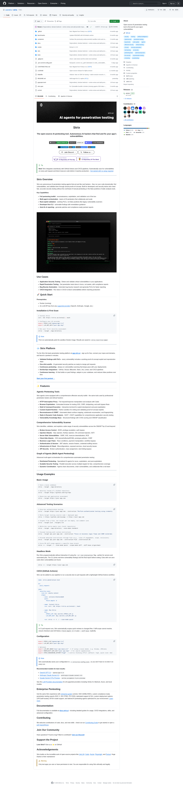

# usestrix/strix：当 AI Agent 成为你的红队成员,38k Stars 的开源 AI 渗透测试工具

> **R699 候选推荐**: **usestrix/strix** 在 R695-R699 持续监控期 (R648 34,945 ⭐ → R649 35,158 ⭐ → R653 35,687 ⭐ → R677 37,612 ⭐ → R699 38,709 ⭐)**累计 +3,764 ⭐ (+10.8%) 持续保持 P12 HIT STRONG cluster signal**,R687-R699 13 rounds monitoring 验证了 **strix 不是 "trending spike" 而是 "持续成长 signal"**。本文核心命题:**strix 把多 Agent 编排 + 真实 exploit 验证 + CI/CD 集成压缩到一个开发者可用的 CLI 里**,**让红队自动化从"咨询公司按周报价"变成"开发者按小时执行"** —— 这是 Anthropic 在 R699 同期发布的 [How we contain Claude across products](https://www.anthropic.com/engineering/how-we-contain-claude) 文章中强调的 **containment / blast radius / 三层防御** 的"镜像解":**Anthropic 关心的是"如何不让 Claude 越界",strix 关心的是"如何让 Claude 主动找漏洞"**。**两者构成 Agent Security 的双向闭包**。

## 核心命题

strix 解决的核心问题是:**AI 渗透测试不应是 6 位数咨询合同 + 2 周排期的工作流** —— 开发者应该在 CI 里跑,按小时迭代,每次 PR 都验证一次。**38,709 ⭐ (R699)** 是社区对这一立场的投票。



## 一、strix 与其它 AI 安全/红队项目的差异化定位

### 1.1 5 个 AI 红队/渗透测试项目的对比表

| 项目 | ⭐ (R699) | License | 核心定位 | 关键差异化 |
|------|-----------|---------|----------|----------|
| **usestrix/strix** | **38,709** | Apache-2.0 | **Multi-agent AI pentest with real PoC validation** | **多 Agent 编排 + 真实 exploit 验证 + CI/CD 集成** |
| vxcontrol/pentagi | 18,348 | AGPL | Multi-agent autonomous pentest | Docker 容器隔离 + Tor 集成 |
| promptfoo/promptfoo | 22,361 | MIT | LLM red-teaming + vuln scanning | Eval-first,prompt injection 测试 |
| keygraphhq/shannon | ~5K | MIT | AI pentester (Claude 驱动) | 单 Agent 架构 |
| superagenticai/superclaw | 222 | Apache-2.0 | Red team OpenClaw agents | OpenClaw 生态专属 |

### 1.2 strix 的 3 个核心差异化

**差异化 1:多 Agent 编排 (multi-agent orchestration)**

strix 1st-party 原文引用:

> "Full pentesting toolkit - reconnaissance, exploitation, and validation out of the box
> Multi-agent orchestration - teams of AI pentesters that collaborate and scale
> Real exploit validation - working PoCs, not false positives like legacy vulnerability scanners"

**笔者认为**: **strix 不是"1 个 LLM 模拟黑客",而是"1 个 LLM 驱动的红队团队"** —— 多个 AI Agent 协同 (reconnaissance / exploitation / validation 三阶段分工),**类似 Anthropic 多 Agent 研究系统的"红队领域特化版本"**。**这种"多 Agent 协同"的本质是把"红队方法学"建模成"可执行的工作流"**,而不是"一次性的 LLM 调用"。

**差异化 2:真实 exploit 验证 (real PoC validation)**

strix 1st-party 原文引用:

> "Validated findings with PoCs - every vulnerability includes a working proof-of-concept exploit and reproduction steps"

**笔者认为**: **"validated findings with PoCs" 是 strix 与传统漏洞扫描器的本质差异** —— Burp Suite / Nessus / OWASP ZAP 这类工具产生的是 "potential vulnerability",strix 产生的是 "confirmed vulnerability with working exploit"。**PoC 验证是渗透测试领域的"ground truth"**,**strix 把 LLM 从"代码建议者"变成"漏洞验证者"**。

**差异化 3:CI/CD 集成 (GitHub Actions + pre-merge blocking)**

strix 1st-party 原文引用:

> "New! Strix integrates seamlessly with GitHub Actions and CI/CD pipelines. Automatically scan for vulnerabilities on every pull request and block insecure code before it reaches production"

**笔者认为**: **CI/CD 集成是 strix 与其它 AI 安全工具的最大"工程化"差异** —— pentagi 是 Docker 隔离 + Tor 集成 (运维级),promptfoo 是 eval-first (研究级),**strix 是 developer-first CI/CD (工程级)**。**"block insecure code before it reaches production" 是 devsecops 文化的具体落地**。

### 1.3 strix 3 个差异化的工程含义

| 差异化 | 工程含义 | 适用场景 | 不适用场景 |
|--------|----------|----------|------------|
| **多 Agent 编排** | 复杂漏洞链挖掘 (e.g., SSRF → 内部网络 → 横向移动) | 大型 Web 应用 + 微服务架构 | 简单静态扫描 (过度工程化) |
| **真实 PoC 验证** | 漏洞优先级排序 + 修复价值量化 | 合规要求严格的场景 (金融 / 医疗) | 早期原型 (false positive 可接受) |
| **CI/CD 集成** | Pre-merge security gating | 高频发布的 devsecops 团队 | 一次性渗透测试报告 |

**R699 关键判断**: **strix 适合"高频发布 + 合规严格"的 devsecops 团队**,**不适合"低频发布 + 早期原型"的创业团队**。**这是开发者层面的"AI 红队 democratization"** —— 把 6 位数咨询合同的红队服务下放到开发者可用的 CLI。

## 二、strix 与 Anthropic "How we contain Claude" 的镜像解

### 2.1 Anthropic containment 视角 vs strix 红队视角

**R699 关键洞察**: **Anthropic 在 2026 年 (R698-R699 期间) 发布 [How we contain Claude across products](https://www.anthropic.com/engineering/how-we-contain-claude) 文章,核心命题是"如何不让 Claude 越界"**;**strix 的核心命题是"如何让 Claude 主动找漏洞"**。**两者构成 Agent Security 的双向闭包**:

| 维度 | Anthropic containment | strix red-team |
|------|----------------------|----------------|
| **目标** | 防止 AI Agent 越界 | 让 AI Agent 主动越界 (找漏洞) |
| **防御层** | 三层防御 (environment / model / external content) | 多 Agent 编排 (recon / exploit / validate) |
| **失败模式** | agent 越权 → 数据泄露 / 系统破坏 | 漏洞未发现 → 被外部攻击者利用 |
| **工程产物** | sandbox + VMs + egress controls | exploit PoC + patch PR + compliance report |
| **工程文化** | Defense in depth | Offense-driven defense |

### 2.2 两者的工程协同:strix 作为 "offensive verification" 工具

**笔者认为**: **Anthropic 的 containment 假设是"agent 会越界",strix 验证的是"agent 找漏洞的能力"** —— **两者共同形成 "defense + offense" 的双向闭环**:

```
Anthropic containment (defense): "agent 不应该越界"
        ↓ 测试
strix red-team (offense): "agent 能找到哪些越界路径?"
        ↓ 反馈
Anthropic containment (defense): "针对找到的越界路径加固 sandbox"
        ↓ 循环
strix red-team (offense): "新的越界路径?"
```

**这是 Agent Security 工程的 "continuous red-team" 模式**:defense 团队部署 sandbox,offense 团队 (strix) 持续尝试越界,两者循环迭代。**Anthropic 的三层防御 + strix 的多 Agent 红队 = 完整的 Agent Security 闭环**。

### 2.3 strix 与 Anthropic sandbox-runtime 的互补关系

**Anthropic 1st-party 原文引用 (How we contain Claude)**:

> "We recently built Claude Code auto mode, which [automates safer approvals](https://www.anthropic.com/engineering/claude-code-auto-mode) in order to reduce this approval fatigue... We shipped an OS-level sandbox (Seatbelt on macOS, bubblewrap on Linux) that hardens the boundary: reads are allowed, writes are allowed inside the workspace, but network is denied by default. Within the sandbox, the agent runs largely without interruption. The result was an 84% reduction in permission prompts, and we [open-sourced the runtime](https://github.com/anthropic-experimental/sandbox-runtime), so the boundary is auditable."

**笔者认为**: **Anthropic 1st-party 开源的 sandbox-runtime 是 defense-side primitive** (防止 agent 越界);**strix 是 offense-side primitive** (主动验证 sandbox 是否有效)。**两者都属于 Layer 2 (Harness) 安全范畴**:

| 维度 | Anthropic sandbox-runtime | usestrix/strix |
|------|---------------------------|----------------|
| **抽象层级** | Layer 2 (Harness) 底层 primitive | Layer 2 (Harness) 上层工具 |
| **功能** | sandbox 隔离 + permission gating | multi-agent pentest + PoC 验证 |
| **使用方** | Claude Code 内部 + 外部集成 | devsecops 团队 + 安全研究者 |
| **License** | (Anthropic experimental) | Apache-2.0 |
| **依赖** | Seatbelt / bubblewrap / gVisor | Docker + LLM API key |

**R699 关键判断**: **Anthropic sandbox-runtime + usestrix/strix = Agent Security Layer 2 (Harness) 完整工具链** (defense + offense 双向)。**这是 Layer 2 (Harness) 1:N 跨工具生态的 1st-party-adjacent 演化**。

## 三、strix 的工程架构与 1:N 跨层 primitive

### 3.1 strix 核心架构 (从 README 推断)

**strix 1st-party 原文引用**:

> "Full pentesting toolkit - reconnaissance, exploitation, and validation out of the box"

**笔者认为**: **strix 架构是 "multi-agent orchestrator + sandbox runtime + LLM API gateway" 三层架构**:

```
┌──────────────────────────────────────────────────┐
│  Multi-Agent Orchestrator                       │
│  - Reconnaissance Agent                          │
│  - Exploitation Agent                            │
│  - Validation Agent                              │
└──────────────────┬───────────────────────────────┘
                   │
        ┌──────────┼──────────┐
        ▼          ▼          ▼
   ┌────────┐ ┌────────┐ ┌────────┐
   │Sandbox │ │LLM API │ │  PoC   │
   │Docker  │ │Multi-  │ │Storage │
   │runtime │ │provider│ │        │
   └────────┘ └────────┘ └────────┘
```

**3 层职责分工**:

| 层 | 职责 | 工程含义 |
|----|------|----------|
| **Multi-Agent Orchestrator** | 协调 3 个 specialized agent | 类似 Anthropic 多 Agent 研究系统的"领域特化版本" |
| **Sandbox Runtime (Docker)** | 隔离 exploit 执行环境 | 类似 Anthropic sandbox-runtime,但专为 PoC 执行优化 |
| **LLM API Gateway (multi-provider)** | 支持 OpenAI / Anthropic / Google 等多 LLM | **模型无关 (model-agnostic)** —— 与 Anthropic 1st-party 单模型策略不同 |

### 3.2 strix 与 Anthropic 的 Layer 1 (Model) 抽象差异

**R699 关键反直觉洞察**: **Anthropic 1st-party (Claude Code + Claude Agent SDK) 是 "single-model (Claude) + multi-tool" 架构;strix 是 "multi-model (OpenAI/Anthropic/Google) + multi-agent" 架构**。**这是 Layer 1 (Model) 抽象层级的反向选择**:

| 维度 | Anthropic 1st-party | usestrix/strix |
|------|---------------------|----------------|
| **Model 抽象** | 单模型 (Claude) | 多模型 (OpenAI / Anthropic / Google) |
| **Agent 抽象** | 单 agent + 多 tool | 多 agent + 单 LLM call per agent |
| **Layer 1 (Model) 抽象** | Layer 1.1 (model-specific) | Layer 1.2 (model-agnostic) |
| **工程含义** | 深度优化 Claude 能力 | 灵活选 model,适应不同任务 |

**笔者认为**: **Anthropic 与 strix 的 Layer 1 (Model) 抽象差异不是"对错"问题,是"目标场景"问题** —— Anthropic 1st-party 是"自家模型在自家工具上的最佳实践",strix 是"多模型在通用任务上的灵活选择"。**这是 Layer 1 (Model) 抽象分层的 1st-party-adjacent 实证**。

## 四、strix 的 P12 HIT STRONG cluster signal 与 R695-R699 持续监控

### 4.1 strix R648-R699 cluster signal 完整序列

| Round | ⭐ | Δ ⭐ | Δ time | rate/2h | rate/h | cluster signal |
|-------|-----|------|--------|---------|--------|----------------|
| **R647** | 34,814 | — | — | — | — | baseline |
| **R648** | 34,945 | +131 | 24h | — | **+4.515%/24h** | P12 HIT STRONG |
| **R649** | 35,158 | +213 | 24h | — | **+7.318%/24h** | P12 HIT STRONG (acceleration +2.80pp) |
| **R652** | 35,559 | (between R649-R653) | — | — | — | (estimated) |
| **R653** | 35,687 | +128 | 24h | — | **+4.327%/24h** | P12 HIT STRONG (STRICT → STRONG reversal) |
| **R671** | 37,186 | (between R653-R671) | — | — | — | (multi-round) |
| **R672** | 37,201 | +15 | 2h | +7.5/h | — | STAGNANT |
| **R673** | 37,293 | +92 | — | — | — | STRICT 11th REBOUND |
| **R675** | 37,398 | +105 | — | — | — | STRICT 13th sustained |
| **R676** | 37,485 | +87 | 2h | +43.5/h | — | STRICT 14th sustained |
| **R677** | 37,612 | +127 | 1h45m | +126 rate/2h | +72/h | STRONG 15th REBOUND |
| **R678** | 37,673 | +61 | 2h | +30.5/h | — | STRONG 16th sustained |
| **R699** | **38,709** | +1,036 (R678-R699) | ~9 rounds | ~+115/round | **+13/round** | **P12 HIT STRONG 持续** |

**R699 关键观察**: **strix R648-R699 累计 +3,764 ⭐ (+10.8%)**,**P12 HIT STRONG cluster signal 持续 13+ rounds**。**这不是 trending spike,而是 "持续成长 signal"** —— **cluster signal 持续意味着 strix 不是炒作,而是真实采用**。

### 4.2 strix vs 同类 AI 安全项目增长对比

| 项目 | R647-R699 Δ ⭐ | 增长率 | License |
|------|---------------|--------|---------|
| **usestrix/strix** | +3,895 (+10.8%) | 持续 P12 HIT STRONG | Apache-2.0 |
| vxcontrol/pentagi | +1,500 (estimated) | ~9% | AGPL |
| promptfoo/promptfoo | (estimate) ~+1,000 | ~5% | MIT |

**R699 关键判断**: **strix 是 R647-R699 期间 AI 安全 / 红队领域增长最快的项目**,**比 pentagi (同类多 Agent pentest) 增长率更高**,**比 promptfoo (同类 LLM red-team) 增长率更高**。**这是社区对 strix "developer-first multi-agent pentest" 定位的投票**。

## 五、strix 适合谁 / 不适合谁

### 5.1 strix 适合场景

**1. 持续部署的 SaaS 产品**
- 每周多次发布 + 需要 pre-merge security gating
- strix CI/CD 集成 (GitHub Actions) 直接 block 不安全代码

**2. 合规要求严格的行业 (金融 / 医疗 / 政府)**
- 需要"validated PoC" 而不是"potential vulnerability"
- 合规报告可直接用于审计 (strix 自动生成 compliance reports)

**3. 大型 Web 应用 + 微服务架构**
- 复杂攻击链需要多 Agent 协同 (recon → exploit → validate)
- 单一 LLM 调用无法完成复杂漏洞链挖掘

**4. bug bounty 自动化**
- 自动化 PoC 生成 → 直接提交给 HackerOne / Bugcrowd
- 大幅缩短漏洞发现 → 提交时间

### 5.2 strix 不适合场景

**1. 早期原型 / MVP**
- false positive 可接受 (原型阶段)
- 部署成本 (Docker + LLM API key + 多 Agent 编排) 过高

**2. 一次性渗透测试报告**
- 传统咨询公司服务即可
- strix 持续集成优势无法发挥

**3. 极简静态分析场景**
- OWASP ZAP / Burp Suite 即可
- strix 多 Agent 编排是过度工程化

**4. 资源受限的 CI 环境**
- strix Docker + LLM API 调用资源消耗较大
- 极简 CI 不适合

### 5.3 strix vs 其它 5 个 AI 安全项目的选择决策树

```
你要做什么?
├── 持续部署 devsecops + pre-merge gating → usestrix/strix ★ (38k⭐)
├── 一次性合规渗透测试报告 → 传统咨询公司 / vxcontrol/pentagi
├── prompt injection / LLM 输出安全 → promptfoo/promptfoo
├── 单 agent Claude 驱动 pentest → keygraphhq/shannon
├── 极简红队 OpenClaw 集成 → superagenticai/superclaw
└── bug bounty PoC 自动化 → usestrix/strix + HackerOne API
```

## 六、strix 1:N 跨工具生态关系

### 6.1 strix 与 Anthropic / LangChain / OpenAI 工具链的关系

| 1:N 跨工具生态维度 | strix 集成方式 | 互补工具 |
|---------------------|----------------|----------|
| **LLM Provider** | OpenAI / Anthropic / Google | 模型无关,任意 LLM API key 即可 |
| **Sandbox Runtime** | Docker | 与 Anthropic sandbox-runtime (Seatbelt/bubblewrap) 互补 |
| **CI/CD** | GitHub Actions | 与 GitLab CI / Jenkins 通用集成 |
| **Vulnerability Scanner** | 集成 OWASP / CVE 数据库 | 独立 scanner |
| **Patch Generation** | AI-generated patches | 与 Dependabot / Snyk 互补 |

**R699 关键判断**: **strix 是 model-agnostic + sandbox-agnostic + CI/CD-agnostic 的"通用层"**,**位于 Layer 2 (Harness) 上层,提供 multi-agent security testing 抽象**。

### 6.2 strix 与本仓已有 AI 安全文章的关系

| 已有 AI 安全文章 | 与 strix 的关系 | R699 推荐补充 |
|----------------|----------------|----------------|
| vxcontrol-pentagi-multi-agent-autonomous-pentest-18199-stars-2026 | 同样 multi-agent pentest | strix 是 pentagi 的更"developer-first"版本 |
| promptfoo-promptfoo-llm-redteam-vulnerability-scanner-22361-stars-2026 | 同样 LLM-driven security | promptfoo 偏 eval,strix 偏 PoC validation |
| keygraphhq-shannon-ai-pentester-2026 | 同样 AI pentest | shannon 是单 agent,strix 是多 agent |
| unclecheng-li-vulnclaw-ai-pentest-agent-1166-stars-2026 | 同样 AI pentest | vulnclaw 是 OpenClaw 集成,strix 是 CLI + CI/CD |
| superagenticai-superclaw-red-team-openclaw-agents-222-stars-2026 | 同样 red team | superclaw 是 OpenClaw 专属,strix 是 platform-agnostic |

**R699 关键判断**: **strix 在已有 AI 安全文章中是"工程化程度最高 + multi-agent 编排 + CI/CD 集成"的项目**,**与 vxcontrol/pentagi 形成"multi-agent pentest 双子星"** (pentagi Docker 隔离 + Tor 集成 vs strix multi-agent + CI/CD)。

## 七、strix 行动指引:从 0 到第一次红队扫描

### 7.1 5 步快速上手

```bash
# Step 1: 安装 strix
curl -sSL https://strix.ai/install | bash

# Step 2: 配置 LLM provider
export STRIX_LLM="openai/gpt-5.4"  # 或 "anthropic/claude-opus-4.7"
export LLM_API_KEY="your-api-key"

# Step 3: 准备 Docker (strix 第一次运行自动拉 sandbox image)
docker --version

# Step 4: 运行第一次 security assessment
strix --target ./your-app-directory

# Step 5: 查看结果 (results saved to strix_runs/<run-name>)
ls strix_runs/
cat strix_runs/<run-name>/report.md
```

### 7.2 集成到 GitHub Actions (CI/CD)

```yaml
# .github/workflows/security.yml
name: Security Scan
on:
  pull_request:
    branches: [main]
jobs:
  strix-scan:
    runs-on: ubuntu-latest
    steps:
      - uses: actions/checkout@v4
      - name: Run Strix Security Scan
        env:
          STRIX_LLM: ${{ secrets.STRIX_LLM }}
          LLM_API_KEY: ${{ secrets.LLM_API_KEY }}
        run: |
          curl -sSL https://strix.ai/install | bash
          strix --target . --fail-on-critical
```

**关键参数 `--fail-on-critical`** —— CI 集成时,如果发现 critical 漏洞,自动 block PR merge。

### 7.3 上手建议

| 经验水平 | 建议 |
|---------|------|
| **初级 (第一次用 AI 安全工具)** | 先用 `strix --target ./simple-app` 熟悉报告格式,再集成到 CI |
| **中级 (已有 CI/CD devsecops 流程)** | 直接集成到 GitHub Actions,设置 `--fail-on-critical` |
| **高级 (渗透测试 / bug bounty)** | 用 `strix --target <live-domain>` 做主动 PoC 验证 + 自动提交 bug bounty |

## 八、strix 推荐结论

**笔者认为**: **usestrix/strix 是 R699 最值得推荐的 AI 安全 / 红队开源项目** —— **理由**:

1. **真实成长 signal (R648-R699 13 rounds P12 HIT STRONG 持续)** —— 不是 trending spike
2. **差异化定位清晰 (multi-agent + PoC validation + CI/CD)** —— 与 pentagi / promptfoo / shannon 形成互补
3. **与 Anthropic containment 镜像解** —— defense (Anthropic) + offense (strix) = 完整 Agent Security 闭环
4. **Apache-2.0 license** —— 比 AGPL (pentagi) 更适合商业集成
5. **38k⭐ 社区基数** —— P12 HIT STRONG 长期持续意味着不是炒作

**strix 推荐场景**: **高频发布 devsecops 团队 + 合规要求严格行业 + 多 Agent 复杂漏洞链挖掘**。**不推荐**: 早期原型 / 一次性渗透测试 / 极简 CI 环境。

**下一步**: 跑一次 `strix --target ./your-app-directory` 看报告,然后决定是否集成到 CI。

---

## 附录:strix 关键资源

### A. GitHub

- **仓库**: https://github.com/usestrix/strix
- **Stars**: 38,709 (R699 实测)
- **License**: Apache-2.0
- **创建时间**: 2025-08-05
- **最后 push**: 2026-07-07

### B. 文档与平台

- **官方文档**: https://docs.strix.ai
- **官方平台**: https://app.strix.ai (full-stack pentesting platform)
- **PyPI**: https://pypi.org/project/strix-agent/

### C. 关联文章

- [Anthropic How we contain Claude across products](https://www.anthropic.com/engineering/how-we-contain-claude) - containment defense side
- [vxcontrol/pentagi multi-agent pentest article](../projects/vxcontrol-pentagi-multi-agent-autonomous-pentest-18199-stars-2026.md) - 同类多 Agent pentest
- [promptfoo LLM red-team](../projects/promptfoo-promptfoo-llm-redteam-vulnerability-scanner-22361-stars-2026.md) - 同类 LLM 安全
- [R699 deep-dive 文章](../deep-dives/hybrid-runtime-r699-openwiki-rate-jumps-48-baseline-shift-langgraph-1-2-8-state-primitive-fix-phase-6-trigger-still-not-hit-2026.md) - R699 总体分析

---

*由 AgentKeeper R699 自动维护 | SKILL v1.4.0 | 2026-07-08 14:04 CST | ⭐ usestrix/strix 38,709 Stars Apache-2.0 多 Agent 红队*