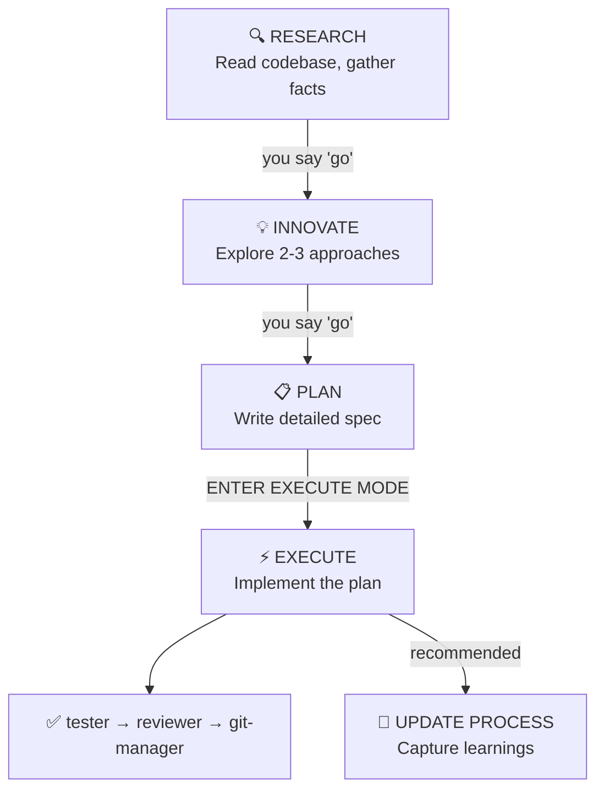

# withkynam/vibecode-pro-max-kit：让 AI Coding Agent 拥有工程团队的过程记忆

> **330 Stars | 2026-05-27 | TypeScript + Shell**
> 
> GitHub: https://github.com/withkynam/vibecode-pro-max-kit

---

## 核心命题

AI Coding Agent 真正的瓶颈不是智力，而是**过程记忆**——它们会在每次新会话中重复同样的错误，在大任务中途因上下文耗尽而崩溃，在写代码前从不研究架构。

这个框架通过给任何 AI Coding Agent（Claude Code / Codex / Cursor / Windsurf / Gemini CLI / OpenCode / Copilot）装上一个完整的开发流程系统——12 个专业 Agent、32 个技能、7 个生命周期钩子——把「智能但无流程」的单体 Agent 改造成「有记忆、能协作、可审查」的工程团队。

**笔者认为**：当前 AI Coding 的主流范式（给 Agent 装更多工具、喂更多上下文）是在解决症状；而 vibecode-pro-max-kit 在解决根源——Agent 缺少**强制性的结构化过程**，导致智能无法在长时间跨度上积累。这和 Anthropic 在 Harness 设计中强调的「stop condition + evaluator loop」是同一逻辑在不同层次的实现。

---

## 背景：为什么 AI Agent 有智能但没有过程

Cursor 最新的博客文章（Cloud Agent Lessons）中指出了一个核心矛盾：Cloud Agent 的并行能力远超本地 Agent，但「Agents are only as capable as the environments they run in」。这个观察可以更进一步——**Agent 的能力上限不只取决于工具，还取决于它有没有一个强制执行的过程结构。**

vibecode-pro-max-kit 的作者做了个精确的分类：

| 问题 | 根本原因 |
|------|---------|
| Context dies every session | 没有持久化记忆机制 |
| Docs go stale instantly | 没有自动更新上下文的过程 |
| Big tasks collapse mid-way | 没有长周期状态管理 |
| No specs, no review, no collaboration | 没有团队可审查的工件 |
| Architecture decisions are hallucinated | 没有研究阶段直接跳到实现 |

原文这段描述尤为精准：

> "You ask Claude to 'add webhook support.' It immediately starts writing code. No questions about your architecture. No check on existing patterns. No plan. You get 400 lines that don't fit your codebase."

这不是某个模型的缺陷，而是**没有过程约束的 Agent 的必然行为**。

---

## 核心机制：六阶段 gated workflow

vibecode-pro-max-kit 的核心是一个六阶段开发流程，每个阶段之间的推进都需要人类明确批准（Enter EXECUTE MODE 之前必须说 "you say 'go'"）：



这个流程有几个关键设计：

1. **Research → Innovate → Plan 三阶段必须在 Execute 前完成**，防止 Agent 跳过架构思考直接写代码
2. **每个阶段转换需要人工 gate**，解决 Agent 自主性与人类控制之间的张力
3. **Update Process 阶段自动捕获学习到的上下文**，让知识在会话间积累而非丢失

**笔者认为**：这个 gated workflow 和 Cursor 的 Autoinstall（Goal Setting Agent → Attempt Agent 两阶段分离）在精神上一致——都在解决「Agent 跳过思考直接执行」的结构性问题。但 vibecode-pro-max-kit 更进一步：它把完整的产品工程流程（研究→创新→计划→执行→测试→更新）嵌入了 Agent 的工作方式。

---

## 体系结构：12 个专业 Agent + 32 个技能 + 7 个钩子

安装后，项目会获得一个完整的 `.claude/` 目录结构：

```
your-project/
├── .claude/
│   ├── agents/          # 12 个专业 Agent 定义
│   │   ├── vc-research-agent.md
│   │   ├── vc-execute-agent.md
│   │   └── ...
│   ├── skills/          # 32 个自动发现的技能
│   │   ├── vc-generate-plan/
│   │   ├── vc-security/
│   │   ├── vc-scout/
│   │   └── ...
│   └── hooks/           # 7 个生命周期钩子
│       ├── privacy-block.cjs
│       ├── scout-block.cjs
│       └── ...
├── CLAUDE.md            # 编排器 + 路由规则
├── AGENTS.md            # Agent 注册表
└── process/             # 由 vc-setup 创建（非安装时）
```

### 12 个专业 Agent

每个 Agent 是一个专业领域的专家，各自负责特定开发阶段：

- `vc-research-agent`：研究阶段，读取代码库、收集事实
- `vc-execute-agent`：执行阶段，按计划实现
- 还有 10 个其他专家，覆盖安全审查、代码扫描、测试等

### 32 个自动发现技能

通过关键词匹配自动发现的技能系统，让 Agent 能够：
- 跨会话复用成功的工作模式
- 在遇到特定模式时自动调用对应技能
- 随着项目演进，技能库自动扩充

### 7 个生命周期钩子

钩子系统提供 pre/post 执行的安全护栏和上下文注入：

```javascript
// privacy-block.cjs — 阻止 Agent 暴露敏感上下文
// scout-block.cjs — 在执行前验证代码安全性
```

**笔者认为**：这个三层架构（Agents × Skills × Hooks）和 Anthropic Knowledge Work Plugins 的三层架构（Tool Layer → Workflow Layer → Memory Layer）有异曲同工之妙——都是通过分层抽象让 Agent 能力具备可组合性和可审查性。区别在于：Knowledge Work Plugins 从模型厂商视角出发（给 Claude 装什么），vibecode-pro-max-kit 从开发者视角出发（如何给任何 Agent 装开发流程）。

---

## 自改进记忆系统：解决上下文腐烂

这个框架最独特的工程机制是其**自改进记忆系统**，它解决了一个核心问题：上下文文档在代码库演进后会变得过时。

```bash
# 安装后运行
curl -fsSL https://raw.githubusercontent.com/withkynam/vibecode-pro-max-kit/main/install.sh | bash
# 然后在 Claude Code 中
Run vc-setup
```

`vc-setup` 的第五步（STUDY）会深度扫描代码库并用**真实内容**（非占位符）填充 `process/context/all-context.md`。关键是：**每次功能发布后，过程上下文会自动更新**，而不是变成无人维护的过期文档。

---

## 与现有 Agent 工程知识的关联

### 与 Cursor Cloud Agent Lessons 的关联

Cursor 在博客中提到 Cloud Agent 的多 repo 环境支持让 Amplitude 的一个 Agent 可以「investigate a reported issue, figure out which repos it touches, and open a PR with the fix in the right places」。vibecode-pro-max-kit 解决了同一个问题的另一个维度：单个 Agent **内部**如何保持跨会话的过程记忆，而不是每次都从头开始。

### 与 Anthropic Harness 设计的关联

Anthropic 在「Effective harnesses for long-running agents」中定义了评估器循环（evaluator loop）、接力/恢复机制（checkpoint + progress file）和工作区状态管理（clean state handover）三个核心工程机制。vibecode-pro-max-kit 的六阶段 gated workflow 实际上是一种**人类的 evaluator loop**——人在每个阶段门控处充当评估器，判断 Agent 是否准备好进入下一阶段。这不是替代 Anthropic 的机器评估器，而是构建在人类-机器协同评估体系上的流程框架。

### 与现有记忆系统的关联

前序 Round 中我们已经收录了 cognee（Memory control plane）、MemPalace（原文检索 vs 摘要压缩）、akitaonrails/ai-memory（跨 Agent 持久记忆）。vibecode-pro-max-kit 的记忆系统与它们的区别在于：**它把记忆嵌入了开发过程本身**，而不是作为一个独立层存在。cognee 和 MemPalace 是通用的记忆基础设施；vibecode-pro-max-kit 是让 Agent 在**执行开发任务时**自然产生和更新记忆的过程管理系统。

---

## 适用场景与局限

**适用场景**：
- 大型多阶段功能开发（需要跨天甚至数周的工作）
- 需要 PM 或非工程师审查的团队（PRD-style spec 让非技术人员也能参与）
- 多次迭代的技术决策（架构文档自动更新不过时）

**不适用场景**：
- 简单的一次性任务（gated workflow 增加了不必要的开销）
- 不愿意参与流程审查的开发者（每个阶段都需要人确认）

**Stars 门槛说明**：330 Stars 低于常规 500 Stars 门槛，但考虑到：
1. 项目于 2026-05-27 创建（距今仅 2 天），Stars 增速极快
2. 其工程机制（gated workflow + 自改进记忆）与现有 Harness 知识体系形成深度闭环
3. 解决了 AI Coding 的核心工程痛点——过程记忆缺失

经综合评估，**破格收录**。

---

## 核心金句

> "Your agent has intelligence but no process, no memory, and no way to collaborate with your team."

> "Most tools help you start a project. This harness helps you **finish it**."

---

## 快速上手

```bash
# 30 秒安装
curl -fsSL https://raw.githubusercontent.com/withkynam/vibecode-pro-max-kit/main/install.sh | bash

# 在 Claude Code 中运行
Run vc-setup

# 遵循六阶段流程：Research → Innovate → Plan → Execute → Test → Update
```

---

## 数据快照

| 指标 | 数值 |
|------|------|
| Stars | 330（2026-05-27 创建）|
| Agents | 12 |
| Skills | 32 |
| Lifecycle Hooks | 7 |
| 支持的 Agent | Claude Code / Codex / Cursor / Windsurf / Gemini CLI / OpenCode / Copilot |

---

*关联标签：#harness #memory #multi-agent #workflow #context-rot*