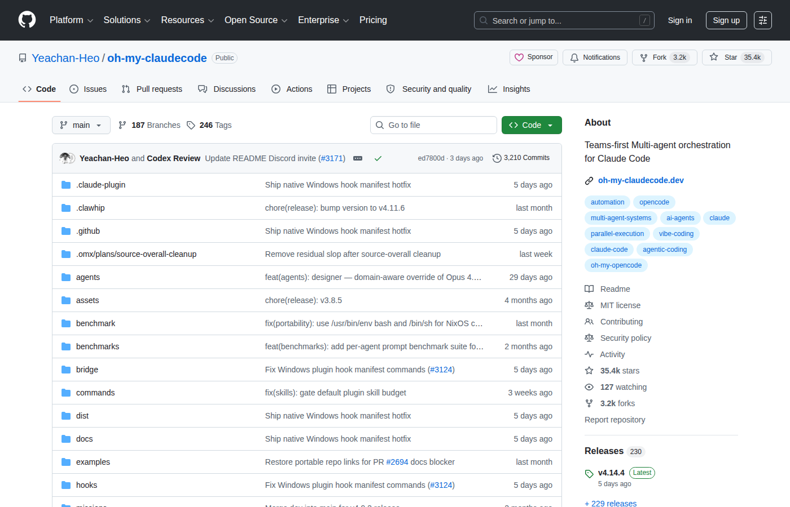

# Yechan-Heo / oh-my-claudecode：让 Claude Code 长出「团队」

> Multi-agent orchestration for Claude Code. 35K stars，零学习曲线。

**核心命题**：Claude Code 是个好工具，但它的多 Agent 能力藏在一堆实验性 Flag 后面。oh-my-claudecode（OMC）把这些能力拧成一个自然语言界面——你只需要说「帮我做」，不需要知道 Team 怎么配置、不需要知道多 Agent 怎么通信。

---



---

## 一句话概括

**oh-my-claudecode** 是一个 Claude Code 的多 Agent 编排层：装上它，你的 Claude Code 就从「一个人干活」变成「一个团队协作」，命令还是那些自然语言，只是背后多了分工和并行。

---

## 为什么这值得关注

笔者认为，Claude Code 本身的多 Agent 功能并不难用，只是**暴露方式太工程师化**——你需要知道怎么配置 `CLAUDE_CODE_EXPERIMENTAL_AGENT_TEAMS`、怎么写 Team JSON、怎么管理各个 Agent 的上下文。OMC 做的，就是把这些全部用自然语言包装掉。

> 「Don't learn Claude Code. Just use OMC.」

这不是营销口号，是设计哲学的概括。

35K stars 背后，是大量非深度技术用户（PM、设计帅、内容创作者）用上了 Claude Code 的多 Agent 能力。这本身就说明 OMC 解决了真实的可访问性问题。

---

## 核心架构

### Team Mode（推荐模式）

从 **v4.1.7** 起，Team 成为 OMC 的标准编排界面，本质是一个阶段性管道：

```
team-plan → team-prd → team-exec → team-verify → team-fix（循环）
```

用户只需要：

```bash
/team 3:executor "fix all TypeScript errors"
```

OMC 自动完成：拆解任务 → 分配给多个 Agent → 验证结果 → 有问题打回重做。全程自然语言，不需要写任何配置。

### tmux CLI Workers（v4.4.0+）

如果你不只是用 Claude Code，还要用 Codex 和 Gemini CLI，OMC 提供了一个更底层的入口：

```bash
omc team 2:codex "review auth module for security issues"
omc team 2:gemini "redesign UI components for accessibility"
omc team status auth-review
omc team shutdown auth-review
```

这里用的是真实的 tmux 分屏——每个 worker 是一个独立进程，干完就销毁，不占用任何空闲资源。这解决了多 CLI 并行调度的工程问题。

### Deep Interview

当你需求模糊的时候，OMC 不直接开工，而是先做 Socratic 追问：

```bash
/deep-interview "I want to build a task management app"
```

它会通过追问暴露你没想到的假设、衡量需求的清晰度——确保你知道自己要什么之后再执行。这是笔者认为最有意思的一个功能，它解决的是「Claude Code 执行很快但方向可能是错的」这个问题。

---

## 关键数据

| 指标 | 数值 |
|------|------|
| **GitHub Stars** | 35,389 |
| **Forks** | 3,238 |
| **语言** | TypeScript |
| **安装方式** | npm (`oh-my-claude-sisyphus`) / Claude Code Marketplace |
| **更新时间** | 持续活跃（最后 push 2026-05-30）|

---

## 使用场景对比

| 场景 | 不用 OMC | 用 OMC |
|------|---------|--------|
| 多 Agent 并行改 Bug | 手动开多个 Claude Code 窗口 | `/team N:executor "fix all bugs"` |
| 多人协同代码审查 | 复制粘贴上下文 | `/ccg "Review PR — backend + UI"`（Codex 审后端，Gemini 审 UI）|
| 模糊需求 | 直接开工做一半发现方向错了 | `/deep-interview` 先澄清需求 |
| 跨平台 CLI 工作流 | 分别调 Codex 和 Gemini | `omc team` 统一管理 |

---

## 竞品角度

| 项目 | Stars | 定位 | OMC 差异 |
|------|-------|------|---------|
| **OMC** | 35K | Claude Code 多 Agent 编排 | 专注 Claude Code 生态，零学习曲线 |
| **wshobson/agents** | 36K | 跨 5 平台工具市场 | 工具发现，OMC 是任务执行 |
| **openai/openai-agents-python** | 27K | OpenAI 官方 Agents SDK | 更底层，OMC 面向 Claude Code 用户 |

---

## 笔者的判断

笔者认为 OMC 解决的不是技术问题，而是**可用性问题**。Claude Code 的多 Agent 能力早就有了，只是门槛高到大部分人不会用。OMC 通过自然语言封装，把这个门槛拉到了普通用户也能用的水平。

**适合人群**：想用 Claude Code 做复杂任务、但不想折腾配置的开发者或非开发者。  
**不适合**：需要深度定制多 Agent 流程、需要跨框架编排的工程师（那应该用 CrewAI 或 Agency Swarm）。

---

## 快速上手

```bash
# 方式一：Claude Code Marketplace（推荐）
/plugin marketplace add https://github.com/Yeachan-Heo/oh-my-claudecode
/plugin install oh-my-claudecode
/setup

# 方式二：npm 全局安装
npm i -g oh-my-claude-sisyphus@latest
omc setup
```

```bash
# 启用 Claude Code 原生 Team（推荐）
# 在 ~/.claude/settings.json 添加：
{
  "env": {
    "CLAUDE_CODE_EXPERIMENTAL_AGENT_TEAMS": "1"
  }
}
```

---

## 相关资源

- [GitHub 仓库](https://github.com/Yeachan-Heo/oh-my-claudecode)
- [官方文档](https://yeachan-heo.github.io/oh-my-claudecode-website)
- [Discord 社区](https://discord.gg/sj4exxQ9v)
- [oh-my-codex](https://github.com/Yeachan-Heo/oh-my-codex)（OpenAI Codex CLI 版本）

---

*推荐关联阅读*：[wshobson/agents](articles/projects/wshobson-agents-multi-harness-marketplace-36167-stars-2026.md) — 跨 5 平台 Agent 工具市场；[browser-use/browser-harness](articles/projects/browser-use-browser-harness-self-healing-harness-14087-stars-2026.md) — 自愈式浏览器 Harness。三个项目覆盖了 AI Coding 的「工具市场 → 执行编排 → 浏览器操作」完整链路。