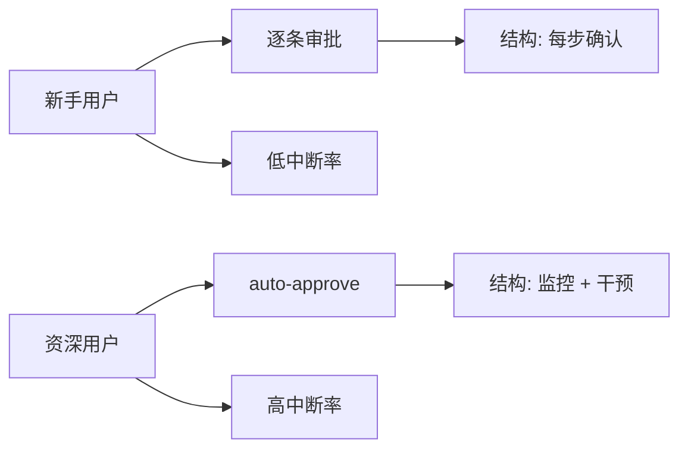

# Anthropic 实证研究：AI Agent 自主性的真实测量

**来源**: [Measuring AI agent autonomy in practice](https://www.anthropic.com/research/measuring-agent-autonomy) | Anthropic Research | 2026年2月18日

---

## 核心问题

AI Agent 已经被大规模部署——从邮件分类到网络安全渗透测试，场景差异巨大。但我们对这些 Agent 在现实世界中如何运作知之甚少。

Anthropic 的这篇论文试图回答一个根本问题：**现实环境中，人们究竟给 Agent 多少自主权？**

> 关键结论：模型实际被允许的自主性，远低于其能力边界。

---

## 研究方法

Anthropic 使用了隐私保护工具 [Clio](https://www.anthropic.com/research/clio)，分析了两类数据：

| 数据源 | 覆盖范围 | 优势 |
|--------|---------|------|
| Claude Code | 深度：完整工作流 | 可见完整会话周期 |
| 公共 API | 广度：数千客户 | 跨行业多样性 |

**Agent 定义**（操作性定义）：具备工具调用能力的 AI 系统，可执行代码、API 调用、发送消息等动作。

---

## 核心发现

### 1. Claude Code 自主运行时长显著增长

在最长的工作周期中，Claude Code 单次运行不被中断的时长在三个月内几乎翻倍：

- 2025年10月：99.9百分位 < 25 分钟
- 2026年1月：99.9百分位 > 45 分钟

这个增长是**平稳递进**的，而非随模型发布跳跃式变化。这说明：

> 自主性的提升不完全来自模型能力进步，还来自用户信任的积累、产品体验的优化，以及用户将 Agent 应用于更具挑战性任务的意愿。

有意思的是，1月中旬后极端时长有所回落。研究团队推测两个原因：用户基数翻倍（新增用户较保守），以及假期结束后用户任务从个人项目转向更正式的工作任务。

### 2. 经验用户：auto-approve 更多，但中断也更多

初看起来矛盾的数据：

- 新手用户（<50会话）：完全 auto-approve 约 20%
- 资深用户（~750会话）：auto-approve 超过 40%

然而，中断率也随经验增长：
- 10次会话用户：每轮中断率约 5%
- 资深用户：每轮中断率约 9%

这不是矛盾，而是**监督策略的转变**：

新手：主动审批每一步（结构化监督）→ 很少需要中途打断
资深：让 Agent 跑，出问题时精准介入 → 中断频率更高

这说明**过度干预和完全不干预都不是最优解**。理想的监督是"放手但保持警觉"。

### 3. Agent 自己暂停比人类主动中断更频繁

在最复杂任务上，Claude Code **主动停下来请求澄清**的频率，是人类主动中断频率的两倍以上。

这一发现很重要：当前我们讨论人机协作时，焦点几乎全在"人类何时介入"。但 Anthropic 的数据表明，**Agent 自身发起的暂停（如"这个操作会覆盖文件，要继续吗？"）** 是同等甚至更重要的安全阀。

### 4. Agent 已被用于高风险领域，但规模尚小

公共 API 数据中：
- 大多数工具调用是**低风险、可逆**的操作
- 软件工程占 Agent 活动的近 50%
- 但在医疗、金融、网络安全领域也已出现使用案例

值得注意：低复杂任务中，87% 的工具调用有人类参与；高复杂任务（如自主发现零日漏洞、编写编译器），这一比例降至 67%。这说明**任务越复杂，人类监督越难以为继**。

---

## 对比能力评估：差距在哪里

Anthropic 援引了 METR 的 "Measuring AI Ability to Complete Long Tasks" 评估：

> Claude Opus 4.5 在理想环境（无人类交互、无现实后果）下，能以 50% 成功率完成人类需要近 5 小时的任务。

但 Claude Code 实际测量的 99.9 百分位运行时间约 42 分钟，远低于这个数字。

两个指标不可直接比——METR 衡量的是任务难度（人类需要多久），而非模型实际运行时间。但差距清晰地指向：

> **部署过剩（Deployment Overhang）**：模型能处理的自主性上限，高于实践中被允许的自主性。

---

## 启示与建议

Anthropic 对不同角色提出了建议：

### 模型开发者
- 提供更多 agentic 能力评估指标
- 关注"有效自主性"而非单纯"任务完成率"

### 产品开发者
- 设计更精细的人机交互范式
- 在复杂任务中，让 Agent 主动发起暂停请求

### 政策制定者
- 建立 Agent 部署后的监控基础设施
- 不要只看模型能力，要看实际自主性配置

---

## 行业意义

这篇论文的核心价值在于**实证**。Agent 领域充斥着各种理论讨论，但 Anthropic 拿出的是百万量级交互数据。它的结论对行业有降温作用——

- 不要高估当前 Agent 的实际自主性水平
- 也不要低估用户（尤其是资深用户）对 Agent 的信任增长速度
- 最优监督策略是"放手但保持警觉"，而非逐条审批或完全放任

这对 Agent 架构设计有直接影响：checkpointing 的重要性不仅在于"容错恢复"，更在于**支撑更长的自主运行周期**。

---

## 延伸阅读

- [Anthropic Clio - Privacy-preserving tool](https://www.anthropic.com/research/clio)
- [METR - Measuring AI Ability to Complete Long Tasks](https://metr.org/blog/2025-03-19-measuring-ai-ability-to-complete-long-tasks/)
- [Claude Code 架构深度解析](../claude-code-architecture-deep-dive.md)
- [Anthropic Building Effective Agents](../anthropic-building-effective-agents.md)

---

*本文为 AgentKeeper 原创解读，内容基于 Anthropic 公开研究论文，不含原始论文全文。*
