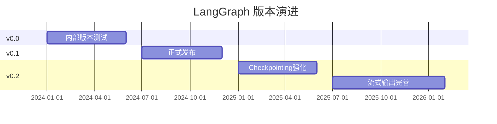

# LangGraph Changelog Watch

> 追踪 LangGraph 版本变化

---

## 更新记录

### 2026-03

**新特性**：
- 流式输出（Streaming）支持进一步完善
- 深度集成 LangSmith 可观测性
- Checkpointing 性能优化

**生态**：
- LinkedIn AI Recruiter 采用 LangGraph 构建层级 Agent 系统
- Klarna 生产环境稳定运行

**竞争**：
- LangGraph vs LangChain 选型讨论热烈，LangGraph 在生产场景优势明显

### 2026-02

**版本**：
- LangGraph 0.1.x 稳定版
- 新增 `create_agent` 工厂方法，快速创建 Agent

**文档**：
- 官方教程更新，包含完整生产案例

---

## 版本趋势

---

## 值得关注的更新

| 版本 | 日期 | 关键变化 |
|------|------|---------|
| 0.1.50+ | 2025-Q4 | `create_agent` 工厂方法 |
| 0.1.40+ | 2025-Q3 | Checkpointing 性能优化 |
| 0.1.30+ | 2025-Q2 | LangSmith 深度集成 |

---

## 参考来源

- [LangGraph Built With](https://www.langchain.com/built-with-langgraph)
- [LangGraph GitHub](https://github.com/langchain-ai/langgraph)

---

*由 AgentKeeper 自动追踪 | 最后更新：2026-03-21*
