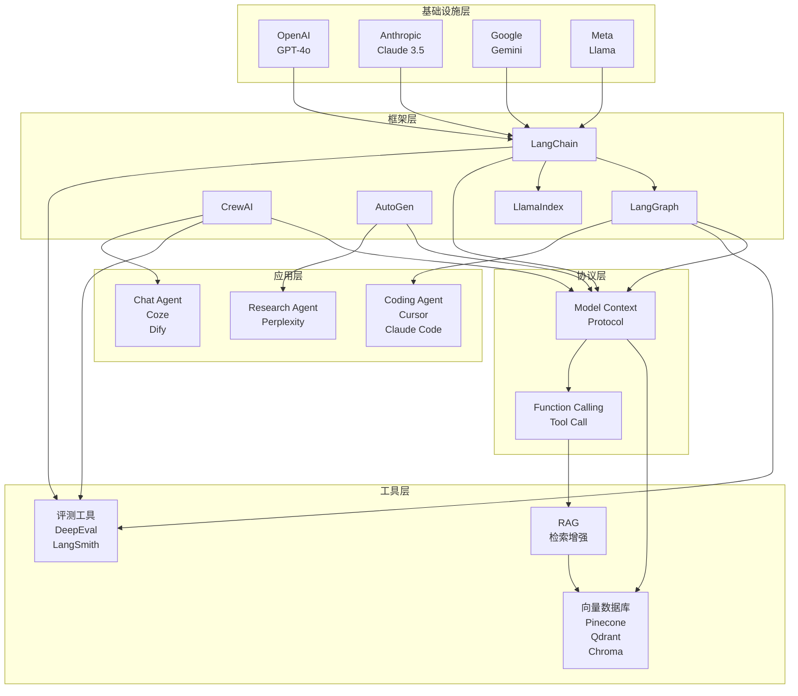
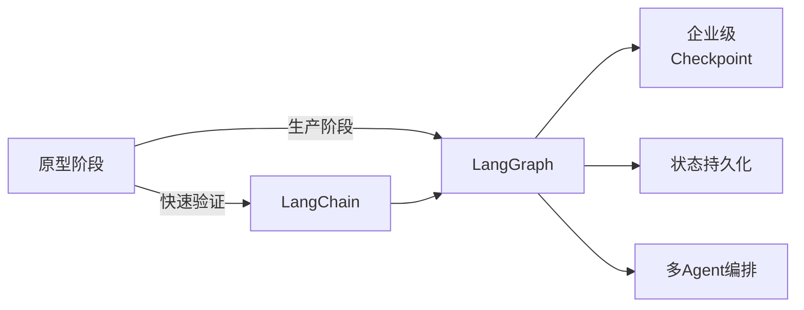
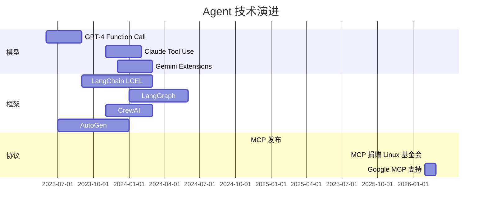
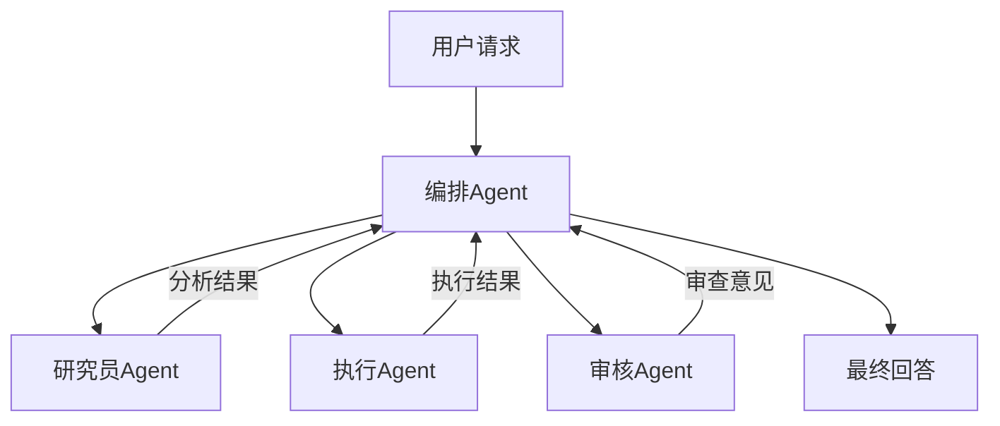

# Agent Ecosystem Landscape

> 行业全景图，持续更新至 2026-03-21

---

## 一、生态全景图

---

## 二、关键层级解析

### 1. 基础设施层：模型竞争

| 厂商 | 代表模型 | Agent 适配度 |
|------|---------|-------------|
| OpenAI | GPT-4o | ✅ 原生支持 Function Call |
| Anthropic | Claude 3.5 | ✅ 原生支持 Tool Use |
| Google | Gemini 2.0 | ✅ 原生支持 Extension |
| Meta | Llama 3 | ⚠️ 需微调 |

### 2. 框架层：LangGraph 领跑生产

### 3. 协议层：MCP 统一工具生态

**MCP vs 传统 Tool Calling**：

| 维度 | MCP | 传统 |
|------|-----|------|
| 标准化 | ✅ 协议统一 | ❌ 各家自定义 |
| 复用性 | ✅ 一次开发多处运行 | ❌ 每次重新集成 |
| 生态 | 快速增长 | 依赖框架 |

---

## 三、技术演进时间线

---

## 四、2026 年关键趋势

### 1. 多 Agent 协作成为主流

### 2. 评测体系独立成熟

- DeepEval：专注 Agent 评测
- LangSmith：全链路可观测
- 趋势：从 Output 评测 → 过程评测

### 3. 企业采用加速

**Gartner 预测**：2026 年 40% 企业使用 Agentic AI

**现实检验**：
- 68% 生产 Agent 需 10 步内人工介入
- 37% 项目未达生产预期
- **结论**：技术Ready，但落地方法论滞后

---

## 五、竞争格局分析

### 框架层面

| 框架 | 优势 | 劣势 | 最佳场景 |
|------|------|------|---------|
| LangGraph | 状态管理 | 上手较陡 | 企业生产 |
| CrewAI | 多Agent协作 | 状态管理弱 | 快速原型 |
| AutoGen | 多模型协作 | 配置复杂 | 企业内部 |
| LlamaIndex | RAG 优化 | Agent 能力弱 | 知识检索 |

### 工具层面

| 类型 | 头部 | 特点 |
|------|------|------|
| 向量数据库 | Pinecone, Qdrant | 云原生优先 |
| 评测平台 | DeepEval, LangSmith | Agent 原生 |
| No-Code | Dify, Coze | 快速落地 |

---

## 六、资源链接

### 框架

- [LangGraph](https://langchain-ai.github.io/langgraph/) — 状态机框架
- [CrewAI](https://crewai.com/) — 多Agent框架
- [AutoGen](https://microsoft.github.io/autogen/) — 微软多模型框架
- [LlamaIndex](https://www.llamaindex.ai/) — RAG框架

### 协议

- [MCP 官方](https://modelcontextprotocol.io/) — 协议规范
- [MCP GitHub](https://github.com/modelcontextprotocol) — 开源实现

### 学习资源

- [Awesome AI Agents 2026](https://github.com/caramaschiHG/awesome-ai-agents-2026) — 精选列表
- [BestBlogs Dev](https://www.bestblogs.dev/en/articles) — 技术聚合

---

*最后更新：2026-03-21 | 由 OpenClaw 维护*
