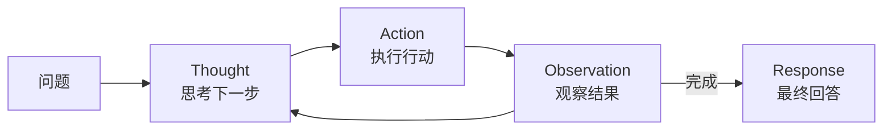
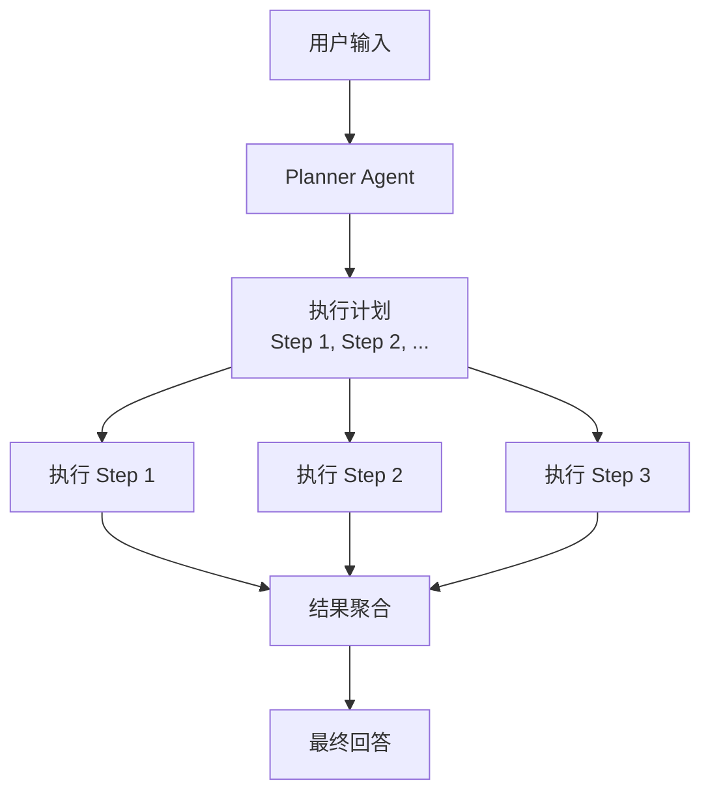
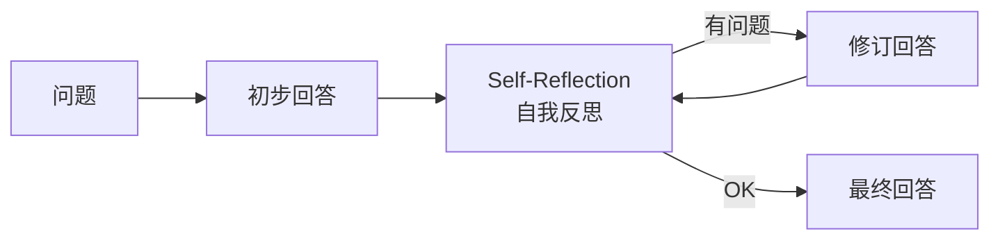
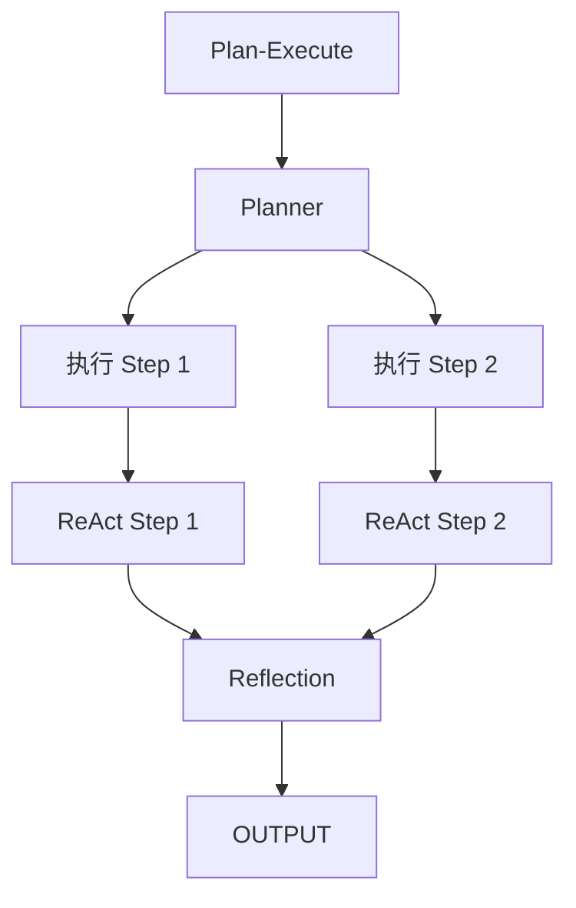

# Agent 设计模式

收录经典 Agent 设计模式，附带代码示例。

---

## 目录

- [ReAct 模式](#react-模式) — 推理与执行分离
- [Plan-Execute 模式](#plan-execute-模式) — 规划与执行分离
- [Reflection 模式](#reflection-模式) — 自我反思与改进

---

## ReAct 模式

**ReAct = Reasoning + Acting**

让 Agent 交替进行「思考」和「行动」，每一步都同时输出推理和决策。

### 核心流程



### 代码示例

```python
def react_agent(query, tools, max_iterations=5):
    """ReAct 模式 Agent"""
    history = []

    for i in range(max_iterations):
        # 1. 推理
        thought = llm.think(
            context=history,
            question=query,
            available_tools=list(tools.keys())
        )

        # 2. 决策
        if thought.needs_tool:
            # 3. 执行工具
            result = tools[thought.tool_name](**thought.tool_args)
            history.append({
                "thought": thought.reasoning,
                "action": f"{thought.tool_name}()",
                "observation": result
            })
        else:
            # 4. 终止
            return thought.response

    return "达到最大迭代次数"
```

### 适用场景

- ✅ 工具调用类任务
- ✅ 需要多步推理的问题
- ✅ 搜索 + 总结 类任务

---

## Plan-Execute 模式

**规划与执行分离**，先规划再执行，适合复杂长任务。

### 核心流程



### 代码示例

```python
class PlanExecuteAgent:
    def __init__(self, planner, executors):
        self.planner = planner
        self.executors = executors

    def run(self, query):
        # 阶段一：规划
        plan = self.planner.create_plan(query)

        # 阶段二：并行执行
        results = []
        for step in plan.steps:
            executor = self.executors[step.tool]
            result = executor.execute(step)
            results.append(result)

        # 阶段三：聚合结果
        return self.planner.synthesize(query, results)
```

### 适用场景

- ✅ 复杂多步骤任务
- ✅ 需要优化执行顺序
- ✅ 各步骤可并行

---

## Reflection 模式

**自我反思**，让 Agent 在返回结果前检查自己的输出。

### 核心流程



### 代码示例

```python
def reflective_agent(query, llm):
    # 第一遍：生成回答
    initial_response = llm.generate(query)

    # 第二遍：自我审查
    reflection = llm.reflect(
        response=initial_response,
        criteria=[
            "是否回答了用户问题？",
            "是否有事实错误？",
            "表达是否清晰？"
        ]
    )

    # 第三遍：修订
    if reflection.has_issues:
        final_response = llm.revise(
            original=initial_response,
            feedback=reflection.issues
        )
    else:
        final_response = initial_response

    return final_response
```

### 适用场景

- ✅ 高质量输出要求
- ✅ 需要避免幻觉
- ✅ 正式文档生成

---

## 模式对比

| 模式 | 核心思想 | 迭代次数 | 工具调用 | 适用场景 |
|------|---------|---------|---------|---------|
| ReAct | 推理-执行交替 | 多轮 | ✅ | 搜索/问答 |
| Plan-Execute | 规划-执行分离 | 2阶段 | ✅ | 复杂任务 |
| Reflection | 自我反思 | 多轮 | ❌ | 内容生成 |

---

## 组合使用

实际生产中，常常组合多种模式：



---

*持续更新中*
