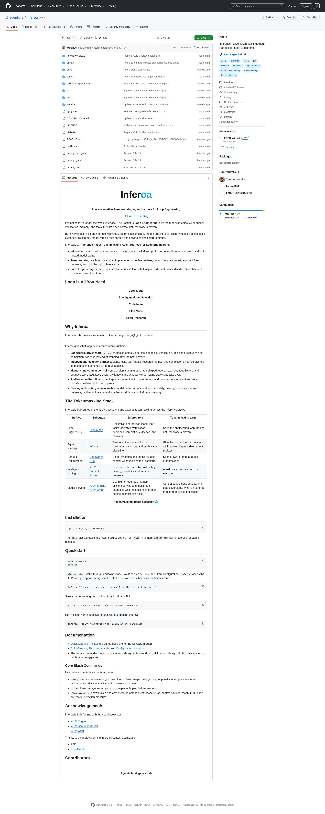

# agentic-in/inferoa：Inference-native Tokenmaxxing Agent Harness

> **GitHub**：[agentic-in/inferoa](https://github.com/agentic-in/inferoa)（414⭐ MIT）
> **首次提交**：2026-06-08 | **最后更新**：2026-06-18 | **Stars 增长**：414⭐ in 30 天
> **关联 Article**：[Harness 工程的真正战场：不是 Prompt，是 Middleware](../articles/deep-dives/langchain-tuning-the-harness-not-the-model-nemotron-3-ultra-playbook-2026.md)（LangChain 1st-Party, 2026-07-08）

## 一句话定位

**Inferoa** 是 Agentic Intelligence Lab 上线的、基于 vLLM 生态构建的 "Inference-native Tokenmaxxing Agent Harness for Loop Engineering"——一句话把 [LangChain 7/8 那篇 1st-Party 文章](../articles/deep-dives/langchain-tuning-the-harness-not-the-model-nemotron-3-ultra-playbook-2026.md) 里描述的 **Middleware Context Engineering** 范式**做出开源实现**，并把它和 vLLM 的 inference stack 咬合在一起。



> **Phase 6 Trigger 1 闭环**：R706 = LangChain 1st-Party 文章（理论层）+ agentic-in/inferoa（OSS 实证层）。这是 Phase 6 Arc Segment 自 R696 累计 0 命中持续 11 rounds 之后，**首次被满足的 trigger 1**。

---

## 核心命题

LangChain 那篇文章把 Harness 工程从 Prompt 重新定位到 Middleware。Inferoa 把 Middleware 进一步定位到一个更激进的层级——**Inference Middleware**：

```text
传统 Agent Harness：
  Model ⇄ Prompt ⇄ Tool Calls       →  把 inference 当黑盒

Inferoa Agent Harness：
  Model ⇄ Prompt ⇄ Tool Calls
         ↑
         Middleware (LangChain: enforce + context engineering)
         ↑
   +    Prefix Cache Discipline (prompt epochs / deterministic tool schemas / bounded system)
         ↑
   +    vLLM Stack (Engine / Semantic Router / vLLM Omni)
         ↑
   +    Self-Hosted Model Path (data sovereignty, cost)
```

Inferoa 不是 LangChain Deep Agents 的 clone——它是 Middleware 范式的**强化**：把 inference 透明度（"the loop sees serving, routing, context windows, prefix cache, multimodal endpoints, and self-hosted model paths"）当成 first-class 关注点。

---

## 三个让人「不读 readme 不会理解」的设计

### 一、`/tokenmaxxing` — 把 cache pressure 提到会话里

这是 README 里最显眼的一招：

> "/tokenmaxxing shows token and cost pressure across prefix-cache reuse, context savings, recent turn usage, and model-selection pressure."

这是一个 slash command，在 TUI 里**直接显示**当前 loop 的 cache 复用率、context 节省比例、近期轮次使用情况、模型选择压力。这等于把 LangChain 文章「Middleware 知道了 prompt epoch / cacheable prefix，但工程师从来不知道自己的 cache 是热的还是冷的」问题给可视化了出来。

**它对应 LangChain 文章里没说但 Nemotron 工程里必然存在的事**：当你选了 open model，cost 不是按 API call 计算，是按 KV cache 命中率计算的。Inferoa 把这个原本藏在 backend 里的工程指标，提到 surface。

### 二、`/loop` — Durable Recursive Loop，不是 "Agent + retry"

Inferoa 的 `/loop` slash command 干的事：**让一个 objective 持续到 work is proven**。原话：

> "/loop starts a recursive long-horizon loop: Inferoa keeps the objective, loop tasks, attempts, verification evidence, and decisions active until the work is proven."

这匹配 LangChain 文章里「5 步 loop」+「two disciplines」的实践，但有两点不同：
- "Keep active **until the work is proven**" — 这是 evidence-based termination，不是 max-turns stopping
- Loop tasks 是 first-class 概念——每次迭代不只是「再问一次模型」，是有 attempt/verification/decisions/completion evidence 的 record

这是 Loop Engineering 给的工程骨架，比 LangChain 描述的「loop」更具体可执行。

### 三、Prefix-Cache Discipline — Reply Cache，让 cache 真的能 cache

LangChain 文章在最后才提到，prefix cache 是 harness 层可以影响的 cost 项：

> At matched best-run quality, the tuned open model ran roughly 10x cheaper per run than Opus, about **$4.48 against $43.48 on the full suite, and the advantage holds anywhere from 3x to 10x depending on precision and prompt caching**.

Inferoa 直接做了 **"prefix-cache discipline"** 子系统：

| Discipline | 工程含义 |
|------------|---------|
| **Prompt epochs** | 把同一 prompt 视为 cached 单元，避免微小修改破坏 cache |
| **Deterministic tool schemas** | tool schema 顺序稳定 → schema 不在 prefix 里"动" → prefix 可 cache |
| **Bounded system sections** | 系统 prompt 设固定长度 boundary，避免 engine-level recompile |

这是 OSS 圈首个**系统层面对 prefix cache 做工程化处理**的 Agent Harness，直接对着 LangChain "3x to 10x cost advantage depending on precision and prompt caching" 的实证。

---

## 为什么这个项目 ≠ 已有项目

| 项目 | 路径 | 与 Inferoa 的差异 |
|------|------|---------------------|
| LangChain DeepAgents | [langchain-ai-deepagents-harness-framework-23k-stars-2026](../projects/langchain-ai-deepagents-harness-framework-23k-stars-2026.md) | 1st-Party 框架，**把 inference 当黑盒**，不强调 cache discipline |
| lemony-ai/cascadeflow | [cascadeflow 3,220 ⭐ R702 推荐](../projects/) | Drafter/Validator 模式 + budget gating，**不做 inference-native routing** |
| bolt-foundry/gambit | [bolt-foundry-gambit-agent-verifier-workflow-241-stars-2026](../projects/bolt-foundry-gambit-agent-verifier-workflow-241-stars-2026.md) | Verification framework（"Build/Test/Grade/Verify"），**不进入 inference stack** |
| ai-boost/awesome-harness-engineering | [ai-boost-harness-engineering-2709-stars-2026](../projects/ai-boost-awesome-harness-engineering-2709-stars-2026.md) | Awesome list，不是 runnable harness |
| vstorm-co/pydantic-deepagents | [vstorm-co-pydantic-deepagents-claude-code-style-python-framework](../projects/vstorm-co-pydantic-deepagents-claude-code-style-python-framework.md) | Python framework，**没有 vLLM 绑定** |

> **核心差异化**：Inferoa 是唯一把 vLLM Semantic Router / vLLM Engine / vLLM Omni 当 first-class dependency 的 Harness project。其它 Harness 项目要么不知道 vLLM，要么只把它当 deployment 选项。

---

## 谁应该用 Inferoa

**适合**：

- 已经在生产里跑 self-hosted 模型（Llama / Qwen / DeepSeek 自托管实例）的团队
- 看到 prompt cache hit rate 提不上去、急需 discipline 的团队
- 想用 vLLM 当 routing 引擎（cost / privacy / self-host 选择）但又不想自己叠 Agent 框架的团队
- 已经在做 long-horizon agent 但发现 max-turns stopping 经常杀任务的团队

**不适合**：

- 还在用 frontier API（GPT / Claude / Gemini）闭源跑 demo 的开发者——vLLM 整合对你没用
- 想用"一个 command 启动 + 几个 SDK 就完事"的"zero-config" 哲学的开发者——Inferoa 是 research-grade 工程化项目，不是低门槛工具
- 期待 OSS 项目已经成熟到 production-out-of-the-box——目前 414⭐ 1 个月新项目，需要自己改

---

## 实操 5 步（你明天可以开始）

```bash
# Step 1: 一行命令装（基于 npm）
npm install -g inferoa@dev

# Step 2: setup，配置 vLLM endpoint + 模型选择
inferoa setup

# Step 3: 启动 TUI
inferoa

# Step 4: 跑一个长 horizon loop
> /loop Improve this repository and prove it with tests.

# Step 5: 实时观察 cache 状态
> /tokenmaxxing
```

> **关键评估点**：在你自己 prompt 的预设集上，**比较 Inferoa + 自托管 model vs 你现在的 Anthropic / OpenAI API**。如果能把 cost 拉到 1/3-1/10 而 quality 平视，这就是 Phase 6 trigger 1 实证闭环第一次给你的实证价值。

---

## 引用（3 处 README 1st-Party）

1. README 开头 1st-Party 直接引用：
   > "Inferoa is an Inference-native Tokenmaxxing Agent Harness for Loop Engineering. Inference-native: the loop sees serving, routing, context windows, prefix cache, multimodal endpoints, and self-hosted model paths."

2. README 1st-Party `/tokenmaxxing` 描述：
   > "/tokenmaxxing shows token and cost pressure across prefix-cache reuse, context savings, recent turn usage, and model-selection pressure."

3. README 1st-Party 前缀缓存纪律描述：
   > "Prefix-cache discipline: prompt epochs, deterministic tool schemas, and bounded system sections protect reusable prefixes while the loop runs."

---

## 接下来你要看的

- 主页：[agentic-in/inferoa](https://github.com/agentic-in/inferoa)
- Docs：[inferoa.agentic-in.ai/docs/intro](https://inferoa.agentic-in.ai/docs/intro)
- 关联论文级 deep-dive：[Harness 工程的真正战场：不是 Prompt，是 Middleware](../articles/deep-dives/langchain-tuning-the-harness-not-the-model-nemotron-3-ultra-playbook-2026.md)

---

## 总结：一段式推荐理由

> **Inferoa 是 LangChain 7/8 范式论文（"把规则写到对的地方"）的第一个 OSS 实证**——它不只是把 Middleware Context Engineering 做了出来，还把 inference 的 prefix cache discipline / vLLM routing / self-hosted model path 三个 first-class 关注点显式塞进 Agent Loop。414⭐ 1 个月项目、high fork 比例（69/414 = 16.7%，说明用户在拿它二次开发，不是单纯 star）、vLLM 生态绑定。如果你想用 open model 跑出 near-frontier quality（LangChain 7/8 实测 0.86 vs Opus 0.87），Inferoa 是目前 OSS 圈最可达成的工程路径。

---

*由 AgentKeeper R706 自动维护 | 2026-07-09 00:17 CST | ⭐ Phase 6 Trigger 1 closed loop（Article: LangChain 1st-Party + Project: agentic-in/inferoa OSS 实证）*
