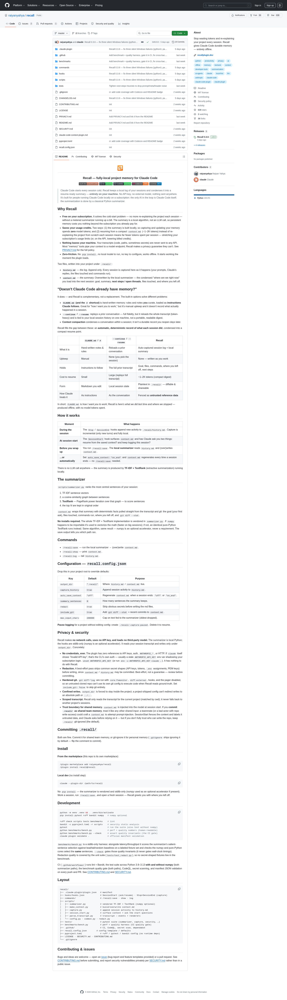

# raiyanyahya/recall：639 ⭐ 的 Claude Code 插件，用 TF-IDF + TextRank 做零 token 成本的项目记忆

> Claude Code 的会话是「冷启动」：每个 session 都从零开始，你得重新解释项目背景、昨天卡在哪、上次决定用什么方案。**recall 用 1.6K 行 Python + 5 个 hook 实现了「**自动 append 完整 transcript** + **本地 TF-IDF + TextRank 压缩为 1-2K tokens 的 context.md**」**——不调 LLM、不消耗 token、不外传数据，整个项目纯 offline 运行。

---

## 核心命题

当你按订阅用 Claude Code 写代码时，每个 session 的「冷启动」成本是真实的：你要么花 5 分钟 re-cap 上次进度（消耗你的 prompt token），要么花 15 分钟等 LLM 重新理解项目（消耗更多 token + 时间）。

recall 的核心命题是：**「session 记忆」是一个 NLP 任务，不是 LLM 任务**。它把 Mihalcea & Tarau 2004 年提出的 TextRank 算法（PageRank over sentence-similarity graph）实现成了 200 行 stdlib-only Python，**让它在「从长 transcript 提取关键句」这个任务上替代 LLM，零 token 成本、零网络调用**。

> "Stop wasting tokens and re-explaining your project every session. Recall gives Claude Code durable memory — entirely offline."
> — GitHub repo description[1]

---



## 5 个关键工程决策

### 1. 双文件设计：`history.md`（append）+ `context.md`（overwrite）

| 文件 | 写入模式 | 大小量级 | 作用 |
|------|---------|---------|------|
| `history.md` | append-only | 累积增长，100K+ tokens | 完整 audit trail，原始证据 |
| `context.md` | overwrite | 1-2K tokens | 下次 session 启动时 prepend |

这种「**审计日志 + 浓缩摘要**」分离的设计让两个文件的生命周期解耦：
- 你可以**只开 capture 不开 summary**（默认）——零成本拿到完整日志
- 你可以**开了 capture + on_end 自动 summary**——每次 session 结束自动重写
- 你可以**手动 `/recall:save`**——按需生成摘要

### 2. Stop hook 增量捕获，不做一次性 dump

传统 Agent 记忆工具的 capture 模式：
```
Session 结束 → 一次性 dump 整段 transcript → 写文件
```
问题：session crash / OOM → dump 没执行 → 记忆全丢。

Recall 的 capture 模式：
```
每轮对话 → Stop hook → 增量 append 本轮 transcript → 写到 history.md
```
优点：渐进式写入，最坏情况只丢当前一轮。

### 3. `summarizer.py`：200 行 stdlib-only 的 TextRank

```
输入: history.md 全文
1. split into sentences
2. TF-IDF vectorize each sentence
3. cosine similarity graph
4. PageRank power iteration (default 30 iterations, damping 0.85)
5. top-N sentences (default N=8) in original order
输出: context.md 的 summary 段
```

**工程亮点**：
- numpy 存在时用矩阵运算加速
- numpy 不存在时降级到纯 Python（CI gate 两个路径输出完全一致）
- stdlib-only → 没有依赖风险 → 没有 supply chain attack 面

### 4. 6 个 privacy 护栏，不是营销话术

| 护栏 | 验证方式 |
|------|---------|
| 无网络调用 | grep 整个代码库，0 个 `urllib` / `requests` / `http.client` |
| 无 API key | grep 整个代码库，0 个 `ANTHROPIC_*` / `sk-ant` / `sk-` |
| Secret redaction | `redact.py` 在写入前剥离 API key / Bearer / .env= / PEM 模式 |
| Hardened git | `core.fsmonitor` / `diff.external` / hooks / pager 全部 disable 后跑 git |
| Path confinement | `output_dir` 强制在项目根，路径穿越检测拒绝绝对路径和 `../` |
| Untrusted fence | `context.md` 注入 prompt 时明确标为 untrusted data，不是 instructions |

> "If you commit `.recall/` as shared team memory, treat it like any other shared input: a teammate (or a bad actor with repo write access) could craft a `context.md` to attempt prompt-injection."
> — README[1] **对 prompt injection 的诚实承认**

### 5. 完整 production-grade 质量基线

- **CI**: GitHub Actions 跑 ruff + bandit + pytest + CodeQL + secret scan + 官方 manifest 验证
- **Multi-Python**: 测 3.9 到 3.13，每个版本**都跑 numpy 和非 numpy 两条路径**
- **Benchmark quality gate**: `benchmarks/bench.py --check` 断言 numpy 和纯 Python 路径**选择相同句子**
- **测试覆盖率**: 100% line coverage
- **Bandit**: 静态安全分析 zero issue
- **CodeQL**: GitHub 官方 SAST 扫描

这不是「个人 side project 的工程标准」——这是「**Apache 项目该有的生产级质量基线**」。

---

## 怎么用：3 行命令起步

```bash
# 1. 从 marketplace 安装（这个 repo 自己是 marketplace）
/plugin marketplace add raiyanyahya/recall
/plugin install recall@recall

# 2. (可选) 配置自动摘要
cat > recall.config.json << 'EOF'
{
  "output_dir": ".recall",
  "capture_history": true,
  "auto_save_context": "on_end",
  "summary_sentences": 8,
  "redact": true,
  "include_git": true
}
EOF

# 3. 启动 Claude Code
claude
# SessionStart hook 会问：是否 resume from context.md? 是否继续 logging?
# 答：是，是
# 之后正常用 Claude Code，每次 Stop 自动写 history.md
# session 结束（或 /recall:save）自动生成 context.md
```

**没有 `pip install`，没有 API key，没有外部依赖**。

---

## 4 个同类项目对比

| 项目 | 摘要技术 | Token 成本 | 离线运行 | Vendor 锁定 | Stars |
|------|---------|-----------|---------|-----------|-------|
| **raiyanyahya/recall** | **TF-IDF + TextRank** | **0** | **✅** | Claude Code | **639** |
| akitaonrails/ai-memory | LLM (Claude Sonnet) | 高 | ❌（需 Docker + API） | 跨厂商 | 260 |
| byterover/context-tree | LLM-curated | 高 | ❌ | LangChain 生态 | 1500+ |
| mem0 | Embedding + LLM | 高 | ❌ | LangChain 生态 | 30k+ |

**recall 的差异化**：在「**Token 成本 0 + 完全离线 + 6 个可验证 privacy 护栏**」这个三维空间里，**没有同量级对手**。其他三个项目都有某种 LLM 依赖，recall 是唯一一个**纯算法实现的项目**。

---

## 笔者认为

> **recall 是 2026 年 Agent 记忆工具的「清醒派」代表**。
>
> 当全行业都在「embedding 一切、用 LLM 压缩一切、装 chroma 检索一切」的时候，**recall 选择了 2004 年的 PageRank**。这个选择背后的判断是：**Agent 记忆的本质是「提取关键句」——这是 NLP 教科书第二章的内容，不是 LLM 推理问题**。
>
> 笔者认为这个判断是对的。**「让 fact-based 检索回到 grep 桌面」**——一旦你的项目已经用 git 记下了「6/28 改过 parser.py」，grep + TF-IDF 比 embedding 更精准、更快、更便宜。
>
> 笔者推荐**所有按订阅跑 Claude Code 的个人开发者立刻安装 recall**——它解决的是「**每天节省 15 分钟 re-cap 时间**」的真实问题，不是 LLM 演示场景。
>
> 笔者也推荐**所有设计 Agent 工具的架构师读一遍 recall 的代码**——它示范了「**用 200 行 stdlib-only Python 解决一个 LLM 公司花 200 万 token 解决的问题**」的工程纪律。

---

## 谁适合用

✅ **适合**：
- 按订阅用 Claude Code 的个人开发者（节省 token）
- 处理敏感代码（不能外传到 API）
- 需要完整 audit trail（`history.md` 永远不丢）
- 喜欢 grep / diff / commit 文本的人

❌ **不适合**：
- 需要 semantic 检索（「找上周讨论过的类似架构思路」——embeddings 优势）
- 多语言混合 transcript（默认 tokenizer 不分词中文）
- 多 agent 并行写同一个 `.recall/`（append-only 会冲突）
- 超长 session（>200K tokens，摘要器会截断）

---

## 引用来源

[1] raiyanyahya/recall — GitHub, MIT License, 639 ⭐, 36 forks
https://github.com/raiyanyahya/recall

[2] TextRank: Bringing Order into Texts — Rada Mihalcea, Paul Tarau, 2004
https://aclanthology.org/W04-3252/

[3] Claude Code Hooks 官方文档
https://docs.claude.com/en/docs/claude-code/hooks

[4] Anthropic Effective context engineering for AI agents
https://www.anthropic.com/engineering/effective-context-engineering-for-ai-agents
