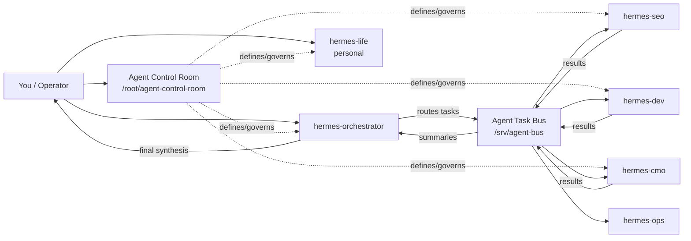

# Hermes Agent Control Room：面向多 Agent 系统的控制平面设计范式

> 来源：[shannhk/hermes-agent-control-room](https://github.com/shannhk/hermes-agent-control-room)  
> Stars：380（2026-05-19）  
> 语言：Shell  
> 标签：`multi-agent` `orchestration` `control-plane` `hermes`

---

## 核心命题

大多数人在运行多个 Agent 时，得到的是"一堆不相连的 bot"。Control Room 范式认为：应该先建立控制平面，再把 Agent 插入其中——就像先建操作系统，再跑应用程序。

> "The Agent Control Room is a sidecar repo/folder that documents and governs your Hermes agents. It is **not** an agent itself."

---

## 一、Control Room 是什么

Control Room 是一个**旁路控制平面**（side control plane），不是 Agent 本身，而是：

- 系统地图（system map）
- 操作手册（operating manual）
- 注册表（registry）
- Runbook 库（runbook library）
- 恢复笔记本（recovery notebook）

它的存在形式是一个 repo/文件夹，存放所有 Agent 的文档、规则、配置、备份。

### 与 Agent 的关系

```
Control Room = side control plane（定义了每个 Agent 的职责和规则）
Orchestrator = optional front door（可选的管理 Agent）
Specialists  = 各司其职的 Hermes Agent（有各自的工具集）
Task Bus     = 交接台（orchestrator 和 specialists 之间的任务流转）
```

---

## 二、演进路径：单体 → 专业团队 → 自动化

Control Room 设计了一套等级架构，支持从简单到复杂的演进：

```
one agent → direct specialists → orchestrator → automated agent team
```

### Level 1：Control Room + 单体 Agent

建立 Control Room，注册一个 Hermes Agent。不需要 orchestrator 或 task bus。

适用场景：
- 个人 Hermes Agent
- VPS 配置文档
- Docker 迁移规划
- Runbooks 和 secret maps 组织

### Level 2：直接专业 Agent

添加多个角色型 Hermes Agent，直接与它们对话：`hermes-life`、`hermes-seo`、`hermes-dev`、`hermes-cmo`。

### Level 3：Orchestrator 模式

加入一个 orchestrator 作为前门，接收用户请求，委派给 specialists，结果汇总返回。

### Level 4：自动化 Agent 团队

在手动流程稳定运行后，将决策和委派流程自动化。

---

## 三、架构图：Task Bus 模式



### Task Bus 的作用

Task Bus 是 `inbox / working / outbox / archive` 的集合，存在于 `/srv/agent-bus`。Orchestrator 将任务路由到 Bus，specialists 从 Bus 取任务，完成后结果回到 Bus，Bus 汇总给 Orchestrator。

---

## 四、访问路径：三种工作模式

Control Room 设计了三种访问路径，用户可以选择：

```text
Control path（控制路径）：
  You → Agent Control Room
  （直接编辑 docs / rules）

Direct path（直接路径）：
  You → hermes-seo
  You → hermes-dev
  You → hermes-cmo
  （直接与专业 Agent 对话）

Orchestrated path（编排路径）：
  You → hermes-orchestrator → Task Bus → Specialists → You
  （通过 orchestrator 委派一切）
```

---

## 五、与现有框架的定位差异

| 维度 | Control Room | 传统 Multi-Agent 框架 |
|------|-------------|----------------------|
| 核心抽象 | 控制平面（文档/规则/注册表） | Agent 之间的消息传递 |
| 演进方式 | 渐进式（先单体再团队再自动化） | 通常需要事先设计完整架构 |
| 关注点 | 治理（governance）和运营（operations） | 通信协议和任务分发 |
| Agent 类型 | Hermes（推测为轻量级 Agent） | 通常是通用框架 |
| 适用规模 | 个人到团队级 | 偏大规模生产系统 |

---

## 六、工程要点

### 1. Task Bus 是解耦的关键

Orchestrator 不直接调用 specialists，而是通过 Task Bus 异步流转。这让 specialists 可以独立扩展，orchestrator 可以故障恢复后继续。

### 2. Control Room 作为版本化运营文档

Control Room 里存放的是关于 Agent 的元信息，不是 Agent 代码本身。这意味着 Human-in-the-loop 可以通过编辑 Control Room 来重新配置系统行为，而不需要修改 Agent 代码。

### 3. 自动化必须晚于稳定的手动流程

> "Automate only after the manual system works."

这是一个工程纪律：不要在手动流程稳定之前引入自动化，那只会固化混乱。

---

## 延伸阅读

- [Cursor Agent Harness 持续改进工程](./cursor-continually-improving-agent-harness-2026.md) — 同为 harness/control 相关主题，Cursor 关注单 Agent 内部的 harness 优化，Control Room 关注多 Agent 之间的治理结构
- [Conductor: Netflix 构建的 31K 星 durable workflow engine](../projects/conductor-oss-conductor-durable-workflow-engine-netflix-31681-stars-2026.md) — 从企业级工作流引擎角度看 Task Bus 模式的实现
- [awesome-harness-engineering](../projects/ai-boost-awesome-harness-engineering-2026.md) — 包含 Control Room 等多 Agent 治理模式的知识地图