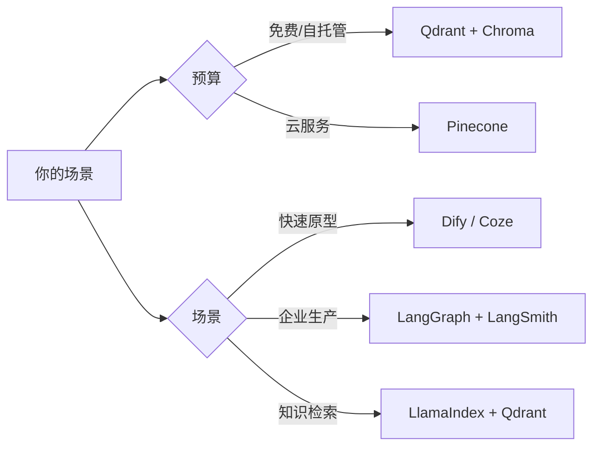

# 工具/产品汇总

> 经过筛选的工具和产品推荐。持续更新。

---

## 开发框架

| 工具 | 类型 | 链接 | 特点 |
|------|------|------|------|
| LangGraph | Agent 框架 | https://langchain-ai.github.io/langgraph/ | 状态机，Checkpointing 内置 |
| CrewAI | Agent 框架 | https://crewai.com/ | 角色协作，上手快 |
| AutoGen | Agent 框架 | https://microsoft.github.io/autogen/ | 多模型，人机协同 |
| LlamaIndex | RAG 框架 | https://www.llamaindex.ai/ | 知识检索优化 |
| Semantic Kernel | Agent 框架 | https://learn.microsoft.com/en-us/semantic-kernel/ | Microsoft 企业生态 |

---

## No-Code / Low-Code 平台

| 工具 | 类型 | 链接 | 特点 |
|------|------|------|------|
| Dify | Low-code | https://dify.ai/ | 开源，RAG + Agent 工作流 |
| Coze | No-code | https://www.coze.com/ | 字节出品，生态丰富 |
| n8n | Low-code | https://n8n.io/ | 工作流自动化 + AI 集成 |
| FastGPT | Low-code | https://fastgpt.cn/ | 中文优化，RAG 优先 |

---

## 向量数据库

| 工具 | 类型 | 链接 | 特点 |
|------|------|------|------|
| Pinecone | 云原生 | https://www.pinecone.io/ | 云优先，免运维 |
| Qdrant | 开源 | https://qdrant.tech/ | 性能强，支持本地部署 |
| Weaviate | 开源 | https://weaviate.io/ | 混合搜索能力强 |
| Chroma | 本地 | https://trychroma.com/ | 轻量，适合本地开发 |

---

## 评测工具

| 工具 | 类型 | 链接 | 特点 |
|------|------|------|------|
| DeepEval | 评测框架 | https://www.deepeval.com/ | Agent 专用指标 |
| LangSmith | 可观测性 | https://docs.smith.langchain.com/ | LangChain 原生集成 |
| W&B Weave | 实验追踪 | https://wandb.ai/weave | Agent 可观测性 |
| Openlayer | 评测平台 | https://www.openlayer.com/ | 工具调用评测 |

---

## MCP 生态

| 工具 | 类型 | 链接 | 特点 |
|------|------|------|------|
| Claude Desktop | MCP Host | Anthropic 官方 | MCP 原生支持 |
| Cursor | IDE | https://cursor.com/ | AI 编程，MCP 集成 |
| GitHub MCP Server | MCP Server | GitHub 官方 | 代码操作 |
| Slack MCP Server | MCP Server | Slack 官方 | 协作工作流 |

---

## 观测与调试

| 工具 | 类型 | 链接 | 特点 |
|------|------|------|------|
| LangSmith | 链路追踪 | LangChain 官方 | Traces 可视化 |
| Helicone | LLM 日志 | https://www.helicone.ai/ | 请求日志，成本分析 |
| PromptLayer | LLM 管理 | https://promptlayer.com/ | Prompt 版本管理 |

---

## 选型建议

---

*最后更新：2026-03-21*
